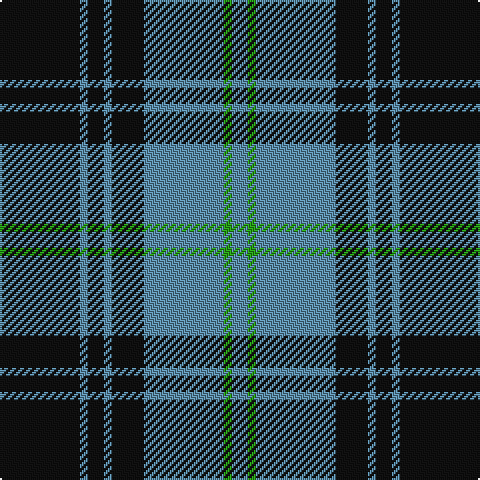

In pattern [BGBKBKBK](/stripes/bgbkbkbk/).

This was sourced from register-of-tartans.  It is a [8 stripe tartan](/stripes/stripes8/).

Original link https://www.tartanregister.gov.uk/tartanDetails.aspx?ref=3433

## Attestations

This cloth appears in 2 source records; the oldest owns this page.

- 01/01/2004 — Martin's Own (register-of-tartans, [record](https://www.tartanregister.gov.uk/tartanDetails.aspx?ref=3433))
- 2004 — Martin's Own (Personal) (tartans-authority, [record](http://www.tartansauthority.com/tartan-ferret/display/6590/))

## Register references

External register numbers recorded for this tartan.

- Scottish Register of Tartans: [3433](https://www.tartanregister.gov.uk/tartanDetails.aspx?ref=3433)
- Scottish Tartans Authority (ITI): 6590

## Thread count
K/40 B4 K8 B4 K16 B40 G4 B/8

## Palette
Each colour and its ΔE from the base-6 reference it is a variant of.

| Colour | Shade | Base | ΔE (OKLab) |
|---|---|---|---|
| B | <code style="background-color:#5C8CA8;">#5C8CA8</code> `#5C8CA8` | B <code style="background-color:#2A418A;">#2A418A</code> | 0.23 |
| G | <code style="background-color:#289C18;">#289C18</code> `#289C18` | G <code style="background-color:#006100;">#006100</code> | 0.19 |
| K | <code style="background-color:#101010;">#101010</code> `#101010` | K <code style="background-color:#000000;">#000000</code> | 0.17 |

# Sample pattern

## Nearest tartans

The nearest existing variants by ΔTartan distance.

1. [West Point Military Academy (Mil.)](/setts/s8/k10o1k2o1k4o10ly1o2~x4/) — ΔT 0.72
1. [Slanj](/setts/s10/k28b3k3b25k3b25k3b3k28m4~x2/) — ΔT 1.02
1. [West Point](/setts/s8/k13o1k1o1k4o10ly1o1~x6/) — ΔT 1.03
1. [Slanj (Corporate)](/setts/s6/m4k28b3k3b25k3~x2/) — ΔT 1.09
1. [Salem Scottish Dancers (Corporate)](/setts/s8/dt5b5dt30w4dt4b18w3dt3~x2/) — ΔT 1.11
1. [Cadence Design Systems (Corporate)](/setts/s7/k51g5r15g37k17r6g7~x2/) — ΔT 1.13
1. [Flynn](/setts/s6/o58k22o8k17r5k14~x2/) — ΔT 1.14
1. [Douglas, Grey (Vestiarium Scoticum)](/setts/s8/k10o1k2o1k4o10k1o2~x4/) — ΔT 1.14
1. [MacSween, Black (Personal)](/setts/s6/k2o6k2o6k12r1~x4/) — ΔT 1.21
1. [Indian Pipe Band (Corporate)](/setts/s6/w4k26t26k2t5w2~x2/) — ΔT 1.21

## Neighbour map

Every grey dot is one of 14299 variants placed by the first two principal components of the ΔTartan feature space (44% of its variance). Red is this tartan; blue dots are its nearest — click one to open its page.

<svg viewBox="0 0 640 380" role="img" style="max-width:100%;height:auto;border:1px solid #e0e0e0;border-radius:4px;display:block" xmlns="http://www.w3.org/2000/svg"><image href="/nn/cloud.v1.png" width="640" height="380"/><a href="/setts/s8/k10o1k2o1k4o10ly1o2~x4/"><circle cx="309.6" cy="202.1" r="4" fill="#3465a4"><title>West Point Military Academy (Mil.)</title></circle></a><a href="/setts/s10/k28b3k3b25k3b25k3b3k28m4~x2/"><circle cx="317.8" cy="213.7" r="4" fill="#3465a4"><title>Slanj</title></circle></a><a href="/setts/s8/k13o1k1o1k4o10ly1o1~x6/"><circle cx="351.6" cy="182.5" r="4" fill="#3465a4"><title>West Point</title></circle></a><a href="/setts/s6/m4k28b3k3b25k3~x2/"><circle cx="323.6" cy="227.2" r="4" fill="#3465a4"><title>Slanj (Corporate)</title></circle></a><a href="/setts/s8/dt5b5dt30w4dt4b18w3dt3~x2/"><circle cx="329.2" cy="203.2" r="4" fill="#3465a4"><title>Salem Scottish Dancers (Corporate)</title></circle></a><a href="/setts/s7/k51g5r15g37k17r6g7~x2/"><circle cx="279.2" cy="226.8" r="4" fill="#3465a4"><title>Cadence Design Systems (Corporate)</title></circle></a><a href="/setts/s6/o58k22o8k17r5k14~x2/"><circle cx="321.4" cy="214.7" r="4" fill="#3465a4"><title>Flynn</title></circle></a><a href="/setts/s8/k10o1k2o1k4o10k1o2~x4/"><circle cx="353.6" cy="221.3" r="4" fill="#3465a4"><title>Douglas, Grey (Vestiarium Scoticum)</title></circle></a><a href="/setts/s6/k2o6k2o6k12r1~x4/"><circle cx="328.1" cy="223.8" r="4" fill="#3465a4"><title>MacSween, Black (Personal)</title></circle></a><a href="/setts/s6/w4k26t26k2t5w2~x2/"><circle cx="281.2" cy="193.7" r="4" fill="#3465a4"><title>Indian Pipe Band (Corporate)</title></circle></a><circle cx="310.1" cy="208.0" r="5" fill="#c00000"/></svg>

ID: /setts/s8/k10t1k2t1k4t10g1t2~x4/
