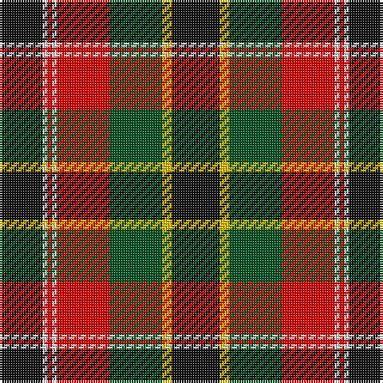

In pattern [KWRWRGYK](/patterns/kwrwrgyk/).

This was sourced from register-of-tartans.  It is a [8 stripes tartan](/stripes/stripes8/).

Original link https://www.tartanregister.gov.uk/tartanDetails.aspx?ref=4326

## Register references

External register numbers recorded for this tartan.

- Scottish Register of Tartans: [4326](https://www.tartanregister.gov.uk/tartanDetails.aspx?ref=4326)
- Scottish Tartans World Register: 1257

## Thread count
K/18 LN2 R2 LN2 R22 G22 Y4 K/20

## Palette
Each colour and its ΔE from the base-6 reference it is a variant of.

| Colour | Shade | Base | ΔE (OKLab) |
|---|---|---|---|
| G | <code style="background-color:#005020;">#005020</code> `#005020` | G <code style="background-color:#006100;">#006100</code> | 0.07 |
| K | <code style="background-color:#101010;">#101010</code> `#101010` | K <code style="background-color:#000000;">#000000</code> | 0.17 |
| LN | <code style="background-color:#E0E0E0;">#E0E0E0</code> `#E0E0E0` | W <code style="background-color:#F7F7F7;">#F7F7F7</code> | 0.07 |
| R | <code style="background-color:#DC0000;">#DC0000</code> `#DC0000` | R <code style="background-color:#CC0000;">#CC0000</code> | 0.03 |
| Y | <code style="background-color:#E8C000;">#E8C000</code> `#E8C000` | Y <code style="background-color:#F2BF00;">#F2BF00</code> | 0.02 |

# Sample pattern

## Nearest tartans

The nearest existing variants by ΔTartan distance.

1. [Unnamed No 5 Tartan Tartan Number: 1257. Earliest known date: 1870 This sett is taken from the records of Messrs Bolingbroke and Jones of Norwich, who were weavers around 1870. Some of the tartans have been adopted or modified in recent times as the copyright of the designs is now in the public domain. See products available Copyright © Blair Urquhart, Comrie, 2015](/setts/s8/k10y2g11r11w1r1w1k9~g006818-k101010-rc80000-we0e0e0-ye8c000~x2/) — ΔT 0.24
1. [Caledonian Brewery Corporate Tartan Tartan Number: 2315. Earliest known date: pre 1997 Designed by Kinloch Anderson Ltd to commemorate the opening of the new Caledonian Brewery Malting Building. See products available Copyright © Blair Urquhart, Comrie, 2015](/setts/s7/w4k13g6r16wa2r2g2~g006818-k101010-r880000-wc0c0c0-waa8ace8~x2/) — ΔT 0.78
1. [MacLachlan W](/setts/s7/r24y2ya3g16k16y2ya3~g11450d-k000000-raa0000-yaaaaaa-yaaaaa00~x2/) — ΔT 0.78
1. [MacLachlan W](/setts/s7/r24y2ya3g16k16y2ya3~g11450d-k000000-raa0000-yaaaaaa-yaaaaa00/) — ΔT 0.78
1. [Unnamed No 5](/setts/s8/k10y2g11r11w1r1w1k9~g008000-k000000-rc00000-we0e0e0-yf0c000~x2/) — ΔT 0.87
1. [Graham of Montrose Red](/setts/s9/w1k1r10g10k5w5r10k1w1~g006818-k101010-r880000-wa8ace8~x4/) — ΔT 0.89
1. [Dickie](/setts/s8/g8r2g12k6g3b6r24k4~b00008c-g146400-k000000-rc82800~x2/) — ΔT 0.91
1. [Garvock (2015)](/setts/s8/g28b3g3k10r2k10r20y4~b2888c4-g006818-k000000-rdc0000-yffe600~x2/) — ΔT 0.93
1. [Caledonian Brewery (Corporate)](/setts/s7/w4g20ga10r25b2r2ga2~b0596fa-g002814-ga005020-rdc0000-we0e0e0~x2/) — ΔT 0.99
1. [Manson Family Tartan Tartan Number: 987. Earliest known date: 1983 The official recording of the sett shows the letter G for the dark green stripe. In heraldic terms this means 'Gules' - red. The designer, Hugh Kirkwood Rankine, clearly intended dark green and this is reproduced here. See products available Copyright © Blair Urquhart, Comrie, 2015](/setts/s8/g1r9g3k3g3r1k9w1~g006818-k101010-rc80000-we0e0e0~x2/) — ΔT 1.00

## Neighbour map

Every grey dot is one of 15726 variants placed by the first two principal components of the ΔTartan feature space (44% of its variance). Red is this tartan; blue dots are its nearest — click one to open its page.

<svg viewBox="0 0 640 380" role="img" style="max-width:100%;height:auto;border:1px solid #e0e0e0;border-radius:4px;display:block" xmlns="http://www.w3.org/2000/svg"><image href="/nn/cloud.v1.png" width="640" height="380"/><a href="/setts/s8/k10y2g11r11w1r1w1k9~g006818-k101010-rc80000-we0e0e0-ye8c000~x2/"><circle cx="171.5" cy="171.9" r="4" fill="#3465a4"><title>Unnamed No 5 Tartan Tartan Number: 1257. Earliest known date: 1870 This sett is taken from the records of Messrs Bolingbroke and Jones of Norwich, who were weavers around 1870. Some of the tartans have been adopted or modified in recent times as the copyright of the designs is now in the public domain. See products available Copyright © Blair Urquhart, Comrie, 2015</title></circle></a><a href="/setts/s7/w4k13g6r16wa2r2g2~g006818-k101010-r880000-wc0c0c0-waa8ace8~x2/"><circle cx="170.2" cy="188.1" r="4" fill="#3465a4"><title>Caledonian Brewery Corporate Tartan Tartan Number: 2315. Earliest known date: pre 1997 Designed by Kinloch Anderson Ltd to commemorate the opening of the new Caledonian Brewery Malting Building. See products available Copyright © Blair Urquhart, Comrie, 2015</title></circle></a><a href="/setts/s7/r24y2ya3g16k16y2ya3~g11450d-k000000-raa0000-yaaaaaa-yaaaaa00~x2/"><circle cx="153.6" cy="162.3" r="4" fill="#3465a4"><title>MacLachlan W</title></circle></a><a href="/setts/s7/r24y2ya3g16k16y2ya3~g11450d-k000000-raa0000-yaaaaaa-yaaaaa00/"><circle cx="153.6" cy="162.3" r="4" fill="#3465a4"><title>MacLachlan W</title></circle></a><a href="/setts/s8/k10y2g11r11w1r1w1k9~g008000-k000000-rc00000-we0e0e0-yf0c000~x2/"><circle cx="153.4" cy="168.4" r="4" fill="#3465a4"><title>Unnamed No 5</title></circle></a><a href="/setts/s9/w1k1r10g10k5w5r10k1w1~g006818-k101010-r880000-wa8ace8~x4/"><circle cx="197.3" cy="172.0" r="4" fill="#3465a4"><title>Graham of Montrose Red</title></circle></a><a href="/setts/s8/g8r2g12k6g3b6r24k4~b00008c-g146400-k000000-rc82800~x2/"><circle cx="198.6" cy="182.2" r="4" fill="#3465a4"><title>Dickie</title></circle></a><a href="/setts/s8/g28b3g3k10r2k10r20y4~b2888c4-g006818-k000000-rdc0000-yffe600~x2/"><circle cx="161.6" cy="151.0" r="4" fill="#3465a4"><title>Garvock (2015)</title></circle></a><a href="/setts/s7/w4g20ga10r25b2r2ga2~b0596fa-g002814-ga005020-rdc0000-we0e0e0~x2/"><circle cx="201.5" cy="155.6" r="4" fill="#3465a4"><title>Caledonian Brewery (Corporate)</title></circle></a><a href="/setts/s8/g1r9g3k3g3r1k9w1~g006818-k101010-rc80000-we0e0e0~x2/"><circle cx="201.3" cy="193.7" r="4" fill="#3465a4"><title>Manson Family Tartan Tartan Number: 987. Earliest known date: 1983 The official recording of the sett shows the letter G for the dark green stripe. In heraldic terms this means 'Gules' - red. The designer, Hugh Kirkwood Rankine, clearly intended dark green and this is reproduced here. See products available Copyright © Blair Urquhart, Comrie, 2015</title></circle></a><circle cx="172.1" cy="171.2" r="5" fill="#c00000"/></svg>

ID: /setts/s8/k10y2g11r11w1r1w1k9~g005020-k101010-rdc0000-we0e0e0-ye8c000~x2/
