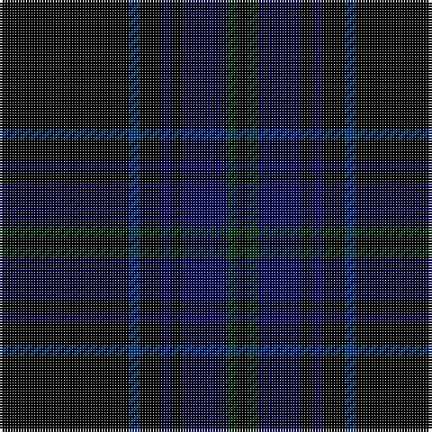

**Bands:** [KGBKBKBK](/stripes/kgbkbkbk/) · **Stripes:** [K DG DB K DB K DB K](/stripes/stripes8/) K DG DB K DB K DB K

This was sourced from register-of-tartans.  It is a [8 band tartan](/bands/bands8/).

Original link https://www.tartanregister.gov.uk/tartanDetails.aspx?ref=3718

## Attestations

This cloth appears in 2 source records; the oldest owns this page.

- 01/01/1996 — Scottish Funereal Association (register-of-tartans, [record](https://www.tartanregister.gov.uk/tartanDetails.aspx?ref=3718))
- 1996 — Scottish Funereal Association (Corp) (tartans-authority, [record](http://www.tartansauthority.com/tartan-ferret/display/5357/))

## Register references

External register numbers recorded for this tartan.

- Scottish Register of Tartans: [3718](https://www.tartanregister.gov.uk/tartanDetails.aspx?ref=3718)
- Scottish Tartans Authority (ITI): 5357

## Thread count
K/48 DB4 K8 DBa4 K4 DBa16 DG4 K/4

## Palette
Each colour and its ΔE from the base-6 reference it is a variant of.

| Colour | Shade | Base | ΔE (OKLab) |
|---|---|---|---|
| DB | <code style="background-color:#003478;">#003478</code> `#003478` | B <code style="background-color:#2A418A;">#2A418A</code> | 0.06 |
| DBa | <code style="background-color:#000050;">#000050</code> `#000050` | B <code style="background-color:#2A418A;">#2A418A</code> | 0.21 |
| DG | <code style="background-color:#003014;">#003014</code> `#003014` | G <code style="background-color:#006100;">#006100</code> | 0.17 |
| K | <code style="background-color:#000000;">#000000</code> `#000000` | K <code style="background-color:#000000;">#000000</code> | 0.00 |

# Sample pattern

## Nearest tartans

The nearest existing variants by ΔTartan distance.

1. [The Caledonian Hotel](/setts/s8/k24k3k3k3k3k18dg20r4~x2/) — ΔT 1.82
1. [Silver Thistle (Fashion)](/setts/s7/k4o2k46db20k6db3g4~x2/) — ΔT 2.08
1. [Witches' Blood, The](/setts/s10/k22n17k2n4k2n2k37n4k2r3~x2/) — ΔT 2.12
1. [Langhein, Alex (Personal)](/setts/s8/k40dg15k10r2k10lo2k10lo2~x2/) — ΔT 2.14
1. [CI (Corporate)](/setts/s9/k100dp8o4k4o4dp8k25db10o4/) — ΔT 2.15
1. [Laird (Name)](/setts/s9/k53g5k5dp13db5dp5db5dp5k5~x2/) — ΔT 2.16
1. [Silver Thistle](/setts/s12/k4o2k46db20k6db3g4~x2/) — ΔT 2.22
1. [Trotter (Personal)](/setts/s9/dt23k2dt2k2dt2k28r2k4n2~x2/) — ΔT 2.22
1. [Moon (New Maldon, Surrey)](/setts/s12/db6dg3db24k2db4k16db5dg2db23dg2k2ly2~x2/) — ΔT 2.27
1. [Nightstalker (Corporate)](/setts/s8/k1g1k8n1k1n2k1n1~x8/) — ΔT 2.28

## Neighbour map

Every grey dot is one of 14299 variants placed by the first two principal components of the ΔTartan feature space (44% of its variance). Red is this tartan; blue dots are its nearest — click one to open its page.

<svg viewBox="0 0 640 380" role="img" style="max-width:100%;height:auto;border:1px solid #e0e0e0;border-radius:4px;display:block" xmlns="http://www.w3.org/2000/svg"><image href="/nn/cloud.v1.png" width="640" height="380"/><a href="/setts/s8/k24k3k3k3k3k18dg20r4~x2/"><circle cx="464.3" cy="274.1" r="4" fill="#3465a4"><title>The Caledonian Hotel</title></circle></a><a href="/setts/s7/k4o2k46db20k6db3g4~x2/"><circle cx="474.9" cy="187.4" r="4" fill="#3465a4"><title>Silver Thistle (Fashion)</title></circle></a><a href="/setts/s10/k22n17k2n4k2n2k37n4k2r3~x2/"><circle cx="514.7" cy="206.5" r="4" fill="#3465a4"><title>Witches' Blood, The</title></circle></a><a href="/setts/s8/k40dg15k10r2k10lo2k10lo2~x2/"><circle cx="544.5" cy="212.9" r="4" fill="#3465a4"><title>Langhein, Alex (Personal)</title></circle></a><a href="/setts/s9/k100dp8o4k4o4dp8k25db10o4/"><circle cx="587.5" cy="172.9" r="4" fill="#3465a4"><title>CI (Corporate)</title></circle></a><a href="/setts/s9/k53g5k5dp13db5dp5db5dp5k5~x2/"><circle cx="415.9" cy="193.7" r="4" fill="#3465a4"><title>Laird (Name)</title></circle></a><a href="/setts/s12/k4o2k46db20k6db3g4~x2/"><circle cx="474.7" cy="172.4" r="4" fill="#3465a4"><title>Silver Thistle</title></circle></a><a href="/setts/s9/dt23k2dt2k2dt2k28r2k4n2~x2/"><circle cx="404.6" cy="198.9" r="4" fill="#3465a4"><title>Trotter (Personal)</title></circle></a><a href="/setts/s12/db6dg3db24k2db4k16db5dg2db23dg2k2ly2~x2/"><circle cx="449.3" cy="214.8" r="4" fill="#3465a4"><title>Moon (New Maldon, Surrey)</title></circle></a><a href="/setts/s8/k1g1k8n1k1n2k1n1~x8/"><circle cx="459.8" cy="237.8" r="4" fill="#3465a4"><title>Nightstalker (Corporate)</title></circle></a><circle cx="494.6" cy="228.7" r="5" fill="#c00000"/></svg>

ID: /setts/s8/k12db1k2db1k1db4dg1k1~x4/
