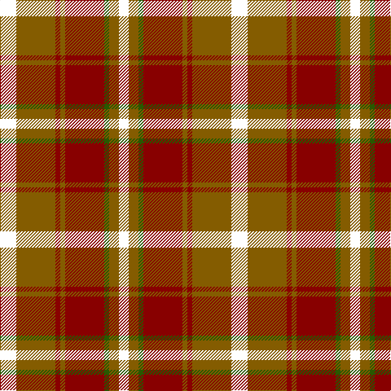

In pattern [KGGRGRGK](/patterns/kggrgrgk/).

This was sourced from register-of-tartans.  It is a [8 stripes tartan](/stripes/stripes8/).

Original link https://www.tartanregister.gov.uk/tartanDetails.aspx?ref=1065

## Thread count
E/20 T48 DR6 T6 DR48 G6 T12 E/12

## Palette
Each colour and its ΔE from the base-6 reference it is a variant of.

| Colour | Shade | Base | ΔE (OKLab) |
|---|---|---|---|
| DR | <code style="background-color:#880000;">#880000</code> `#880000` | R <code style="background-color:#C80000;">#C80000</code> | 0.14 |
| G | <code style="background-color:#285800;">#285800</code> `#285800` | G <code style="background-color:#006400;">#006400</code> | 0.04 |
| N | <code style="background-color:#3C3C3C;">#3C3C3C</code> `#3C3C3C` | B <code style="background-color:#2C4084;">#2C4084</code> | 0.12 |
| T | <code style="background-color:#845C00;">#845C00</code> `#845C00` | G <code style="background-color:#006400;">#006400</code> | 0.15 |

# Sample pattern

ID: /setts/s8/k12g12ga6r48g6r6g48k20-g845c00-ga285800-k000000-r880000/
