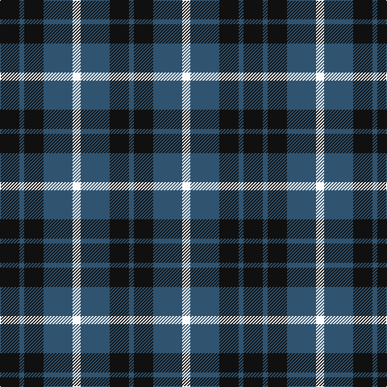

In pattern [BKBWBKBK](/stripes/bkbwbkbk/).

This was sourced from register-of-tartans.  It is a [8 stripe tartan](/stripes/stripes8/).

Original link https://www.tartanregister.gov.uk/tartanDetails.aspx?ref=1491

## Register references

External register numbers recorded for this tartan.

- Scottish Register of Tartans: [1491](https://www.tartanregister.gov.uk/tartanDetails.aspx?ref=1491)
- Scottish Tartans Authority (ITI): 1058
- Scottish Tartans World Register: 1058

## Thread count
K/24 B6 K24 B36 W10 B36 K24 B/6

## Palette
Each colour and the base-6 reference it is a variant of.

| Colour | Shade | Base |
|---|---|---|
| B | <code style="background-color:#305470;">#305470</code> `oklch(43.1% 0.063 243.4)` <small>#305470</small> | B <code style="background-color:#2A418A;">#2A418A</code> |
| K | <code style="background-color:#101010;">#101010</code> `oklch(17.3% 0.000 89.9)` <small>#101010</small> | K <code style="background-color:#000000;">#000000</code> |
| W | <code style="background-color:#FCFCFC;">#FCFCFC</code> `oklch(99.1% 0.000 89.9)` <small>#FCFCFC</small> | W <code style="background-color:#F7F7F7;">#F7F7F7</code> |

# Sample pattern

## Nearest tartans

The nearest existing variants by ΔTartan distance.

1. [Grampian Television (Corporate)](/setts/s5/k12n3k12n18w5~x2/) — ΔT 1.17
1. [Edmonstone of Duntreath](/setts/s10/g7r4g14db10g5db10w2db10g5db5~x2/) — ΔT 1.39
1. [Hamilton Green Hunting](/setts/s5/db8g2db8g15lb2~x4/) — ΔT 1.43
1. [Forbes - 1947 (Lyon Court)](/setts/s7/db1k6db6k6g6k1w1~x6/) — ΔT 1.46
1. [Unnamed, No 54](/setts/s6/db2g6db6dp5db1dp2~x2/) — ΔT 1.57
1. [Keith Clan](/setts/s8/g9b4k4b3k4b4g9k2~x4/) — ΔT 1.58
1. [Notre Dame Marching Guard](/setts/s10/g9b9k24b35dr5b35k24b9g9dr5~x2/) — ΔT 1.58
1. [Cadence Design Systems (Corporate)](/setts/s7/k51g5r15g37k17r6g7~x2/) — ΔT 1.59
1. [Keith McCormick (Personal)](/setts/s8/k1db5k4g3k1g3k6g1~x4/) — ΔT 1.60
1. [Johore Regiment (Military)](/setts/s5/db20k5db18lo26k6~x2/) — ΔT 1.61

## Neighbour map

Every grey dot is one of 14299 variants placed by the first two principal components of the ΔTartan feature space (44% of its variance). Red is this tartan; blue dots are its nearest — click one to open its page.

<svg viewBox="0 0 640 380" role="img" style="max-width:100%;height:auto;border:1px solid #e0e0e0;border-radius:4px;display:block" xmlns="http://www.w3.org/2000/svg"><image href="/nn/cloud.v1.png" width="640" height="380"/><a href="/setts/s5/k12n3k12n18w5~x2/"><circle cx="230.0" cy="280.4" r="4" fill="#3465a4"><title>Grampian Television (Corporate)</title></circle></a><a href="/setts/s10/g7r4g14db10g5db10w2db10g5db5~x2/"><circle cx="206.1" cy="246.4" r="4" fill="#3465a4"><title>Edmonstone of Duntreath</title></circle></a><a href="/setts/s5/db8g2db8g15lb2~x4/"><circle cx="282.6" cy="271.0" r="4" fill="#3465a4"><title>Hamilton Green Hunting</title></circle></a><a href="/setts/s7/db1k6db6k6g6k1w1~x6/"><circle cx="216.3" cy="253.9" r="4" fill="#3465a4"><title>Forbes - 1947 (Lyon Court)</title></circle></a><a href="/setts/s6/db2g6db6dp5db1dp2~x2/"><circle cx="207.6" cy="288.4" r="4" fill="#3465a4"><title>Unnamed, No 54</title></circle></a><a href="/setts/s8/g9b4k4b3k4b4g9k2~x4/"><circle cx="190.7" cy="282.5" r="4" fill="#3465a4"><title>Keith Clan</title></circle></a><a href="/setts/s10/g9b9k24b35dr5b35k24b9g9dr5~x2/"><circle cx="238.6" cy="222.4" r="4" fill="#3465a4"><title>Notre Dame Marching Guard</title></circle></a><a href="/setts/s7/k51g5r15g37k17r6g7~x2/"><circle cx="279.2" cy="226.8" r="4" fill="#3465a4"><title>Cadence Design Systems (Corporate)</title></circle></a><a href="/setts/s8/k1db5k4g3k1g3k6g1~x4/"><circle cx="226.3" cy="263.8" r="4" fill="#3465a4"><title>Keith McCormick (Personal)</title></circle></a><a href="/setts/s5/db20k5db18lo26k6~x2/"><circle cx="227.3" cy="274.6" r="4" fill="#3465a4"><title>Johore Regiment (Military)</title></circle></a><circle cx="258.1" cy="270.0" r="5" fill="#c00000"/></svg>

ID: /setts/s8/k12n3k12n18w5~x2/
