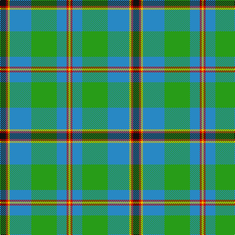

In pattern [KRYBGBRY](/patterns/krybgbry/).

This was sourced from tartans-authority.  It is a [8 stripes tartan](/stripes/stripes8/).

Original link http://www.tartansauthority.com/tartan-ferret/display/1216/

## Thread count
K/12 R4 Y4 B44 G52 B20 R4 Y/4

## Palette
Each colour and its ΔE from the base-6 reference it is a variant of.

| Colour | Shade | Base | ΔE (OKLab) |
|---|---|---|---|
| B | <code style="background-color:#2888C4;">#2888C4</code> `#2888C4` | B <code style="background-color:#2C4084;">#2C4084</code> | 0.21 |
| G | <code style="background-color:#289C18;">#289C18</code> `#289C18` | G <code style="background-color:#006400;">#006400</code> | 0.18 |
| K | <code style="background-color:#101010;">#101010</code> `#101010` | K <code style="background-color:#000000;">#000000</code> | 0.17 |
| R | <code style="background-color:#C80000;">#C80000</code> `#C80000` | R <code style="background-color:#C80000;">#C80000</code> | 0.00 |
| Y | <code style="background-color:#E8C000;">#E8C000</code> `#E8C000` | Y <code style="background-color:#E8C000;">#E8C000</code> | 0.00 |

# Sample pattern

## Nearest tartans

The nearest existing variants by ΔTartan distance.

1. [Presley of Lonmay](/setts/s7/k4w50k4b16k4g56y4-b1474b4-g408060-k101010-wc0c0c0-ye8c000/) — ΔT 0.95
1. [Gift of Life Michigan (Corporate)](/setts/s7/r4b2r2b22g32ga2w2-b2888c4-g289c18-ga003820-rc80000-wfcfcfc/) — ΔT 1.07
1. [Boucherville (Tartan de..) District Tartan Tartan Number: 2119. Earliest known date: 1990 From the notes accompanying the petition for accreditation. "Les symboles ont cette remarquable propriete de reunir en une expression imagee des notions diverses. Ils refletent l'histoire, les croyances, les idealogies et les aspirations de groupes humains habitant un territoire precis. Les tisserands, c'est nous tous....!" See products available Copyright © Blair Urquhart, Comrie, 2015](/setts/s9/g40y4r10w8g4r4g4r4b12-b2c2c80-g006818-r888888-we0e0e0-ye8c000/) — ΔT 1.10
1. [Boucherville (Tartan de..)](/setts/s9/g40y4ga10w8g4ga4g4ga4b12-b4000ff-g30a010-ga808080-we0e0e0-yf0c000/) — ΔT 1.13
1. [Gillies (House of Edgar)](/setts/s8/b64k24b24g12r12g36k4y6-b1474b4-g289c18-k101010-rc80000-ye8c000/) — ΔT 1.14
1. [Fox Hunting](/setts/s8/r8k4g72k4b36y6b36k4-b1474b4-g006818-k101010-rc80000-ye8c000/) — ΔT 1.22
1. [Bahamas](/setts/s8/b6g22w22r4g14b44y4b4-b304080-g008000-rc00000-we0e0e0-yf0c000/) — ΔT 1.22
1. [Tennessee](/setts/s10/r4b20w2ra2g2r2g12ra2g20w2-b304080-g008000-rc00000-ra802040-we0e0e0/) — ΔT 1.22
1. [Mission](/setts/s8/y8b56k4g44k8w8ga8k4-b5c8ca8-g006818-ga408060-k101010-wffe1ff-yffa500/) — ΔT 1.23
1. [Singh](/setts/s8/b6r6b72g34y4g42w4r6-b304080-g008000-rc00000-we0e0e0-yf0c000/) — ΔT 1.24

## Neighbour map

Every grey dot is one of 15726 variants placed by the first two principal components of the ΔTartan feature space (44% of its variance). Red is this tartan; blue dots are its nearest — click one to open its page.

<svg viewBox="0 0 640 380" role="img" style="max-width:100%;height:auto;border:1px solid #e0e0e0;border-radius:4px;display:block" xmlns="http://www.w3.org/2000/svg"><image href="/nn/cloud.v1.png" width="640" height="380"/><a href="/setts/s7/k4w50k4b16k4g56y4-b1474b4-g408060-k101010-wc0c0c0-ye8c000/"><circle cx="213.8" cy="151.9" r="4" fill="#3465a4"><title>Presley of Lonmay</title></circle></a><a href="/setts/s7/r4b2r2b22g32ga2w2-b2888c4-g289c18-ga003820-rc80000-wfcfcfc/"><circle cx="285.4" cy="153.0" r="4" fill="#3465a4"><title>Gift of Life Michigan (Corporate)</title></circle></a><a href="/setts/s9/g40y4r10w8g4r4g4r4b12-b2c2c80-g006818-r888888-we0e0e0-ye8c000/"><circle cx="254.7" cy="161.2" r="4" fill="#3465a4"><title>Boucherville (Tartan de..) District Tartan Tartan Number: 2119. Earliest known date: 1990 From the notes accompanying the petition for accreditation. &quot;Les symboles ont cette remarquable propriete de reunir en une expression imagee des notions diverses. Ils refletent l'histoire, les croyances, les idealogies et les aspirations de groupes humains habitant un territoire precis. Les tisserands, c'est nous tous....!&quot; See products available Copyright © Blair Urquhart, Comrie, 2015</title></circle></a><a href="/setts/s9/g40y4ga10w8g4ga4g4ga4b12-b4000ff-g30a010-ga808080-we0e0e0-yf0c000/"><circle cx="243.6" cy="155.2" r="4" fill="#3465a4"><title>Boucherville (Tartan de..)</title></circle></a><a href="/setts/s8/b64k24b24g12r12g36k4y6-b1474b4-g289c18-k101010-rc80000-ye8c000/"><circle cx="220.0" cy="167.0" r="4" fill="#3465a4"><title>Gillies (House of Edgar)</title></circle></a><a href="/setts/s8/r8k4g72k4b36y6b36k4-b1474b4-g006818-k101010-rc80000-ye8c000/"><circle cx="266.1" cy="158.3" r="4" fill="#3465a4"><title>Fox Hunting</title></circle></a><a href="/setts/s8/b6g22w22r4g14b44y4b4-b304080-g008000-rc00000-we0e0e0-yf0c000/"><circle cx="188.5" cy="165.5" r="4" fill="#3465a4"><title>Bahamas</title></circle></a><a href="/setts/s10/r4b20w2ra2g2r2g12ra2g20w2-b304080-g008000-rc00000-ra802040-we0e0e0/"><circle cx="243.5" cy="159.9" r="4" fill="#3465a4"><title>Tennessee</title></circle></a><a href="/setts/s8/y8b56k4g44k8w8ga8k4-b5c8ca8-g006818-ga408060-k101010-wffe1ff-yffa500/"><circle cx="176.4" cy="133.9" r="4" fill="#3465a4"><title>Mission</title></circle></a><a href="/setts/s8/b6r6b72g34y4g42w4r6-b304080-g008000-rc00000-we0e0e0-yf0c000/"><circle cx="277.1" cy="153.0" r="4" fill="#3465a4"><title>Singh</title></circle></a><circle cx="222.1" cy="160.5" r="5" fill="#c00000"/></svg>

ID: /setts/s8/k12r4y4b44g52b20r4y4-b2888c4-g289c18-k101010-rc80000-ye8c000/
