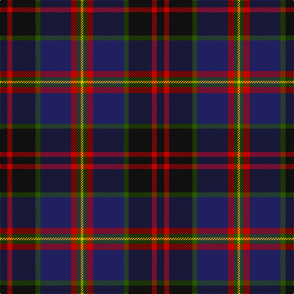

In pattern [KRKGBRGY](/patterns/krkgbrgy/).

This was sourced from tartans-authority.  It is a [8 stripes tartan](/stripes/stripes8/).

Original link http://www.tartansauthority.com/tartan-ferret/display/10974/

## Thread count
K/12 R8 K38 G8 DB50 R10 G6 Y/4

## Palette
Each colour and its ΔE from the base-6 reference it is a variant of.

| Colour | Shade | Base | ΔE (OKLab) |
|---|---|---|---|
| DB | <code style="background-color:#202060;">#202060</code> `#202060` | B <code style="background-color:#2C4084;">#2C4084</code> | 0.11 |
| G | <code style="background-color:#285800;">#285800</code> `#285800` | G <code style="background-color:#006400;">#006400</code> | 0.04 |
| K | <code style="background-color:#101010;">#101010</code> `#101010` | K <code style="background-color:#000000;">#000000</code> | 0.17 |
| R | <code style="background-color:#C80000;">#C80000</code> `#C80000` | R <code style="background-color:#C80000;">#C80000</code> | 0.00 |
| Y | <code style="background-color:#E8C000;">#E8C000</code> `#E8C000` | Y <code style="background-color:#E8C000;">#E8C000</code> | 0.00 |

# Sample pattern

## Nearest tartans

The nearest existing variants by ΔTartan distance.

1. [Bootneck 350](/setts/s8/k12r8k38g8b50r10g6y4-b141e46-g003c14-k101010-rc8002c-yffd700/) — ΔT 0.51
1. [Land's End (Unnamed Maroon)](/setts/s9/k46g4r6b14r6g4ga30r42g10-b304080-g908000-ga004010-k000030-r802040/) — ΔT 0.72
1. [Scotch House 2000 Original](/setts/s8/b44r6b4r6b4k34g36y8-b202060-g006818-k101010-rc80000-ya08858/) — ΔT 0.81
1. [KPMG (Corporate)](/setts/s10/r24y4b6k6b60k40ba12k20y4ba8-b2c2c80-ba680028-k101010-rc80000-ya08858/) — ΔT 0.88
1. [Scotch House 2000, antique](/setts/s8/b44r6b4r6b4k34ra36g8-b304080-g004010-k000000-rc00000-ra806050/) — ΔT 0.90
1. [Sandberg of Greenock (Personal)](/setts/s8/y12k48b4g20b48r4k8r4-b2c2c80-g006818-k101010-rc80000-ye8c000/) — ΔT 0.94
1. [Scotch House 2000 Antique](/setts/s8/b44r6b4r6b4k34g36ga8-b2c2c80-g604000-ga006818-k101010-rc80000/) — ΔT 0.96
1. [Sandberg](/setts/s7/r12k48g16b48r4k8r4-b2c2c80-g006818-k101010-rc80000/) — ΔT 0.98
1. [Zangenberg (Personal)](/setts/s7/b4r4b32k34g32k4y4-b780078-g285800-k101010-rc80000-ye8c000/) — ΔT 0.98
1. [Scottish Chamber Orchestra](/setts/s9/w6b40k6b4k10b4k6g30r4-b202060-g5c6428-k101010-rc80000-w98c8e8/) — ΔT 0.98

## Neighbour map

Every grey dot is one of 15726 variants placed by the first two principal components of the ΔTartan feature space (44% of its variance). Red is this tartan; blue dots are its nearest — click one to open its page.

<svg viewBox="0 0 640 380" role="img" style="max-width:100%;height:auto;border:1px solid #e0e0e0;border-radius:4px;display:block" xmlns="http://www.w3.org/2000/svg"><image href="/nn/cloud.v1.png" width="640" height="380"/><a href="/setts/s8/k12r8k38g8b50r10g6y4-b141e46-g003c14-k101010-rc8002c-yffd700/"><circle cx="216.1" cy="182.7" r="4" fill="#3465a4"><title>Bootneck 350</title></circle></a><a href="/setts/s9/k46g4r6b14r6g4ga30r42g10-b304080-g908000-ga004010-k000030-r802040/"><circle cx="166.6" cy="175.3" r="4" fill="#3465a4"><title>Land's End (Unnamed Maroon)</title></circle></a><a href="/setts/s8/b44r6b4r6b4k34g36y8-b202060-g006818-k101010-rc80000-ya08858/"><circle cx="183.6" cy="184.8" r="4" fill="#3465a4"><title>Scotch House 2000 Original</title></circle></a><a href="/setts/s10/r24y4b6k6b60k40ba12k20y4ba8-b2c2c80-ba680028-k101010-rc80000-ya08858/"><circle cx="213.0" cy="159.3" r="4" fill="#3465a4"><title>KPMG (Corporate)</title></circle></a><a href="/setts/s8/b44r6b4r6b4k34ra36g8-b304080-g004010-k000000-rc00000-ra806050/"><circle cx="163.4" cy="171.8" r="4" fill="#3465a4"><title>Scotch House 2000, antique</title></circle></a><a href="/setts/s8/y12k48b4g20b48r4k8r4-b2c2c80-g006818-k101010-rc80000-ye8c000/"><circle cx="183.5" cy="167.2" r="4" fill="#3465a4"><title>Sandberg of Greenock (Personal)</title></circle></a><a href="/setts/s8/b44r6b4r6b4k34g36ga8-b2c2c80-g604000-ga006818-k101010-rc80000/"><circle cx="208.7" cy="191.8" r="4" fill="#3465a4"><title>Scotch House 2000 Antique</title></circle></a><a href="/setts/s7/r12k48g16b48r4k8r4-b2c2c80-g006818-k101010-rc80000/"><circle cx="240.0" cy="202.4" r="4" fill="#3465a4"><title>Sandberg</title></circle></a><a href="/setts/s7/b4r4b32k34g32k4y4-b780078-g285800-k101010-rc80000-ye8c000/"><circle cx="168.9" cy="192.4" r="4" fill="#3465a4"><title>Zangenberg (Personal)</title></circle></a><a href="/setts/s9/w6b40k6b4k10b4k6g30r4-b202060-g5c6428-k101010-rc80000-w98c8e8/"><circle cx="222.0" cy="172.8" r="4" fill="#3465a4"><title>Scottish Chamber Orchestra</title></circle></a><circle cx="207.6" cy="176.6" r="5" fill="#c00000"/></svg>

ID: /setts/s8/k12r8k38g8b50r10g6y4-b202060-g285800-k101010-rc80000-ye8c000/
