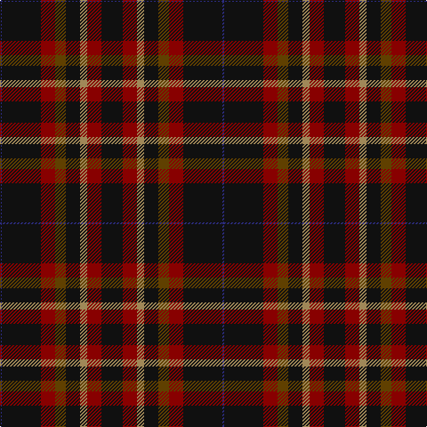

**Bands:** [KRYKGRKB](/stripes/krykgrkb/) · **Stripes:** [K R LO K DY R K DB](/stripes/stripes8/) K R LO K DY R K DB

This was sourced from tartans-authority.  It is a [8 band tartan](/bands/bands8/).

Original link http://www.tartansauthority.com/tartan-ferret/display/8046/

## Thread count
K/24 DR16 LT8 K16 T12 DR16 K44 DB/2

## Palette
Each colour and its ΔE from the base-6 reference it is a variant of.

| Colour | Shade | Base | ΔE (OKLab) |
|---|---|---|---|
| DB | <code style="background-color:#2C2C80;">#2C2C80</code> `#2C2C80` | B <code style="background-color:#2A418A;">#2A418A</code> | 0.06 |
| DR | <code style="background-color:#880000;">#880000</code> `#880000` | R <code style="background-color:#CC0000;">#CC0000</code> | 0.15 |
| K | <code style="background-color:#101010;">#101010</code> `#101010` | K <code style="background-color:#000000;">#000000</code> | 0.17 |
| LT | <code style="background-color:#A08858;">#A08858</code> `#A08858` | Y <code style="background-color:#F2BF00;">#F2BF00</code> | 0.21 |
| T | <code style="background-color:#604000;">#604000</code> `#604000` | G <code style="background-color:#006100;">#006100</code> | 0.14 |

# Sample pattern

## Nearest tartans

The nearest existing variants by ΔTartan distance.

1. [Moggach (Strathspey)](/setts/s11/k4n4k4n18k9r4k9o1n18dt2k3~x2/) — ΔT 1.54
1. [Moggach (Strathspey)](/setts/s11/k4n4k4n18k9r2k9lg1n18t2k3~x2/) — ΔT 1.59
1. [Laois](/setts/s9/dr20db2dr5db5k18g5dr5g2dr15~x2/) — ΔT 1.68
1. [Duchess of York Family Tartan Tartan Number: 607. Earliest known date: 1941 Found in sample books. See products available Copyright © Blair Urquhart, Comrie, 2015](/setts/s9/db1dr9g5dr1k5dr1g5dr9w1~x2/) — ΔT 1.76
1. [Tartan for London, A (Fashion)](/setts/s7/r30dg18lr3dg18r20lb3g3~x2/) — ΔT 1.76
1. [Joe Strummer Commemorative](/setts/s7/k3dy3y6k12y1dy2dy2~x4/) — ΔT 1.78
1. [Lossiemouth/Hersbruck](/setts/s6/dg26k3dg12k10dp15w2~x2/) — ΔT 1.80
1. [Grass of Rasunda (2009), The](/setts/s7/k14dg7k2y8k4lo2k1~x4/) — ΔT 1.80
1. [Stewart of Bute Hunting](/setts/s10/dr22g11k2g4k2g6k16dr40dr2lb6~x2/) — ΔT 1.82
1. [MacWilliam Htg](/setts/s7/dg2dy32dy12k10r1db16r2~x2/) — ΔT 1.89

## Neighbour map

Every grey dot is one of 14299 variants placed by the first two principal components of the ΔTartan feature space (44% of its variance). Red is this tartan; blue dots are its nearest — click one to open its page.

<svg viewBox="0 0 640 380" role="img" style="max-width:100%;height:auto;border:1px solid #e0e0e0;border-radius:4px;display:block" xmlns="http://www.w3.org/2000/svg"><image href="/nn/cloud.v1.png" width="640" height="380"/><a href="/setts/s11/k4n4k4n18k9r4k9o1n18dt2k3~x2/"><circle cx="319.7" cy="171.4" r="4" fill="#3465a4"><title>Moggach (Strathspey)</title></circle></a><a href="/setts/s11/k4n4k4n18k9r2k9lg1n18t2k3~x2/"><circle cx="339.5" cy="172.5" r="4" fill="#3465a4"><title>Moggach (Strathspey)</title></circle></a><a href="/setts/s9/dr20db2dr5db5k18g5dr5g2dr15~x2/"><circle cx="326.6" cy="220.5" r="4" fill="#3465a4"><title>Laois</title></circle></a><a href="/setts/s9/db1dr9g5dr1k5dr1g5dr9w1~x2/"><circle cx="284.0" cy="209.6" r="4" fill="#3465a4"><title>Duchess of York Family Tartan Tartan Number: 607. Earliest known date: 1941 Found in sample books. See products available Copyright © Blair Urquhart, Comrie, 2015</title></circle></a><a href="/setts/s7/r30dg18lr3dg18r20lb3g3~x2/"><circle cx="309.4" cy="216.0" r="4" fill="#3465a4"><title>Tartan for London, A (Fashion)</title></circle></a><a href="/setts/s7/k3dy3y6k12y1dy2dy2~x4/"><circle cx="284.9" cy="206.1" r="4" fill="#3465a4"><title>Joe Strummer Commemorative</title></circle></a><a href="/setts/s6/dg26k3dg12k10dp15w2~x2/"><circle cx="302.0" cy="228.7" r="4" fill="#3465a4"><title>Lossiemouth/Hersbruck</title></circle></a><a href="/setts/s7/k14dg7k2y8k4lo2k1~x4/"><circle cx="320.9" cy="221.0" r="4" fill="#3465a4"><title>Grass of Rasunda (2009), The</title></circle></a><a href="/setts/s10/dr22g11k2g4k2g6k16dr40dr2lb6~x2/"><circle cx="363.1" cy="160.3" r="4" fill="#3465a4"><title>Stewart of Bute Hunting</title></circle></a><a href="/setts/s7/dg2dy32dy12k10r1db16r2~x2/"><circle cx="412.7" cy="178.6" r="4" fill="#3465a4"><title>MacWilliam Htg</title></circle></a><circle cx="362.5" cy="195.6" r="5" fill="#c00000"/></svg>

ID: /setts/s8/k12r8lo4k8dy6r8k22db1~x2/
