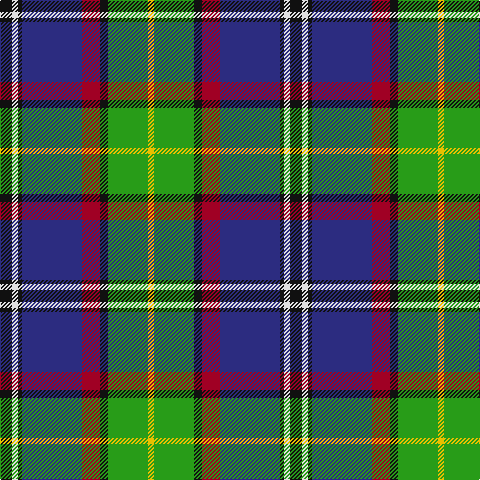

In pattern [KWKBRKGY](/patterns/kwkbrkgy/).

This was sourced from tartans-authority.  It is a [8 stripes tartan](/stripes/stripes8/).

Original link http://www.tartansauthority.com/tartan-ferret/display/3930/

## Attestations

This cloth appears in 3 source records; the oldest owns this page.

- 2002 — Minnesota (District) (tartans-authority, [record](http://www.tartansauthority.com/tartan-ferret/display/3930/))
- undated — Minnesota (register-of-tartans, [record](https://www.tartanregister.gov.uk/tartanDetails.aspx?ref=5089))
- undated — Minnesota American District Tartan Tartan Number: 3930. Earliest known date: 2002 Official State tartan designed by Mark Osweiler of St Paul, MN, USA. See products available Copyright © Blair Urquhart, Comrie, 2015 (house-of-tartan, [record](http://www.house-of-tartan.scotland.net/house/TartanViewjs.asp?colr=Def&tnam=3930))

## Thread count
K/12 LN6 K4 DB60 DR18 K8 G40 Y/6

## Palette
Each colour and its ΔE from the base-6 reference it is a variant of.

| Colour | Shade | Base | ΔE (OKLab) |
|---|---|---|---|
| DB | <code style="background-color:#2C2C80;">#2C2C80</code> `#2C2C80` | B <code style="background-color:#2C4084;">#2C4084</code> | 0.05 |
| DR | <code style="background-color:#A00024;">#A00024</code> `#A00024` | R <code style="background-color:#C80000;">#C80000</code> | 0.09 |
| G | <code style="background-color:#289C18;">#289C18</code> `#289C18` | G <code style="background-color:#006400;">#006400</code> | 0.18 |
| K | <code style="background-color:#101010;">#101010</code> `#101010` | K <code style="background-color:#000000;">#000000</code> | 0.17 |
| LN | <code style="background-color:#E0E0E0;">#E0E0E0</code> `#E0E0E0` | W <code style="background-color:#F4F4F0;">#F4F4F0</code> | 0.06 |
| Y | <code style="background-color:#E8C000;">#E8C000</code> `#E8C000` | Y <code style="background-color:#E8C000;">#E8C000</code> | 0.00 |

# Sample pattern

## Nearest tartans

The nearest existing variants by ΔTartan distance.

1. [Federated Women's Institutes of](/setts/s9/r8k4y8g12y16g12b48k4w8-b003478-g007800-k000000-r8c0000-wc8c8c8-yc88c00/) — ΔT 0.55
1. [Souza Nery](/setts/s7/y8g44r6k34r6b74w6-b304080-g008000-k000000-rc00020-we0e0e0-yf0c000/) — ΔT 0.70
1. [St Columba](/setts/s8/b60ba5w4r12g42bb12ba5bb12-b000050-ba5480b0-bb800080-g008000-r906030-we0e0e0/) — ΔT 0.77
1. [Souza Nery (Personal)](/setts/s7/y8g44r6k34r6b74w6-b2c2c80-g006818-k101010-rc8002c-we0e0e0-yfccc00/) — ΔT 0.78
1. [Dunedin (USA) (District)](/setts/s9/w6b50k6r6k6r16g42k6k4-b2888c4-g006818-k101010-rc80000-wfcfcfc/) — ΔT 0.81
1. [Kleto, Susan (Personal)](/setts/s9/w2b32y2r6y2g12ga4g12w2-b2c2c80-g006818-ga289c18-ra00000-wfcfcfc-yfccc00/) — ΔT 0.83
1. [Loch Awe](/setts/s9/b6k4r6g40k48ba40r6k4y6-b778899-ba0000cd-g008b00-k101010-rff0000-yffe600/) — ΔT 0.84
1. [Bergen Scottish](/setts/s7/b10w6r24g74k24ba42w4-b2c2c80-ba202060-g006818-k101010-rc80000-wf8f8f8/) — ΔT 0.84
1. [Froben, Christian (Personal)](/setts/s8/k4w4k16y16b48g26k6r2-b202060-g006818-k101010-r880000-wfcfcfc-yfccc00/) — ΔT 0.85
1. [Ogilvie of Inverquharity or Ohio](/setts/s9/b64w24r32b12y4g4ya12b4g40-b1c0070-g006818-rc80000-we0e0e0-yd09800-ya48a4c0/) — ΔT 0.85

## Neighbour map

Every grey dot is one of 15726 variants placed by the first two principal components of the ΔTartan feature space (44% of its variance). Red is this tartan; blue dots are its nearest — click one to open its page.

<svg viewBox="0 0 640 380" role="img" style="max-width:100%;height:auto;border:1px solid #e0e0e0;border-radius:4px;display:block" xmlns="http://www.w3.org/2000/svg"><image href="/nn/cloud.v1.png" width="640" height="380"/><a href="/setts/s9/r8k4y8g12y16g12b48k4w8-b003478-g007800-k000000-r8c0000-wc8c8c8-yc88c00/"><circle cx="137.0" cy="135.6" r="4" fill="#3465a4"><title>Federated Women's Institutes of</title></circle></a><a href="/setts/s7/y8g44r6k34r6b74w6-b304080-g008000-k000000-rc00020-we0e0e0-yf0c000/"><circle cx="152.1" cy="145.9" r="4" fill="#3465a4"><title>Souza Nery</title></circle></a><a href="/setts/s8/b60ba5w4r12g42bb12ba5bb12-b000050-ba5480b0-bb800080-g008000-r906030-we0e0e0/"><circle cx="160.8" cy="135.1" r="4" fill="#3465a4"><title>St Columba</title></circle></a><a href="/setts/s7/y8g44r6k34r6b74w6-b2c2c80-g006818-k101010-rc8002c-we0e0e0-yfccc00/"><circle cx="171.3" cy="153.0" r="4" fill="#3465a4"><title>Souza Nery (Personal)</title></circle></a><a href="/setts/s9/w6b50k6r6k6r16g42k6k4-b2888c4-g006818-k101010-rc80000-wfcfcfc/"><circle cx="134.8" cy="129.3" r="4" fill="#3465a4"><title>Dunedin (USA) (District)</title></circle></a><a href="/setts/s9/w2b32y2r6y2g12ga4g12w2-b2c2c80-g006818-ga289c18-ra00000-wfcfcfc-yfccc00/"><circle cx="193.4" cy="118.9" r="4" fill="#3465a4"><title>Kleto, Susan (Personal)</title></circle></a><a href="/setts/s9/b6k4r6g40k48ba40r6k4y6-b778899-ba0000cd-g008b00-k101010-rff0000-yffe600/"><circle cx="114.5" cy="133.0" r="4" fill="#3465a4"><title>Loch Awe</title></circle></a><a href="/setts/s7/b10w6r24g74k24ba42w4-b2c2c80-ba202060-g006818-k101010-rc80000-wf8f8f8/"><circle cx="165.2" cy="143.9" r="4" fill="#3465a4"><title>Bergen Scottish</title></circle></a><a href="/setts/s8/k4w4k16y16b48g26k6r2-b202060-g006818-k101010-r880000-wfcfcfc-yfccc00/"><circle cx="162.0" cy="116.9" r="4" fill="#3465a4"><title>Froben, Christian (Personal)</title></circle></a><a href="/setts/s9/b64w24r32b12y4g4ya12b4g40-b1c0070-g006818-rc80000-we0e0e0-yd09800-ya48a4c0/"><circle cx="143.3" cy="125.0" r="4" fill="#3465a4"><title>Ogilvie of Inverquharity or Ohio</title></circle></a><circle cx="149.5" cy="131.5" r="5" fill="#c00000"/></svg>

ID: /setts/s8/k12w6k4b60r18k8g40y6-b2c2c80-g289c18-k101010-ra00024-we0e0e0-ye8c000/
