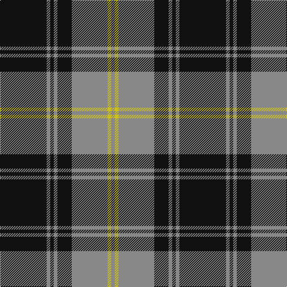

**Bands:** [KRKRKRYR](/stripes/krkrkryr/) · **Stripes:** [K O K O K O LY O](/stripes/stripes8/) K O K O K O LY O

This was sourced from register-of-tartans.  It is a [8 band tartan](/bands/bands8/).

Original link https://www.tartanregister.gov.uk/tartanDetails.aspx?ref=4604

## Also known as

This cloth is also recorded under:

- West Point Regimental

## Attestations

This cloth appears in 2 source records; the oldest owns this page.

- 01/01/1985 — West Point (register-of-tartans, [record](https://www.tartanregister.gov.uk/tartanDetails.aspx?ref=4604))
- undated — West Point Regimental Tartan Tartan Number: 1130. Earliest known date: 1986 Wemyss means cave and probably originates from the caves beneath MacDuff castle. There is a long and interesting article on the family of Wemyss in William Anderson's 'The Scottish Nation' published by A Fullarton in 1874. See products available Copyright © Blair Urquhart, Comrie, 2015 (house-of-tartan, [record](http://www.house-of-tartan.scotland.net/house/TartanViewjs.asp?colr=Def&tnam=1130))

## Register references

External register numbers recorded for this tartan.

- Scottish Register of Tartans: [4604](https://www.tartanregister.gov.uk/tartanDetails.aspx?ref=4604)
- Scottish Tartans Authority (ITI): 1130
- Scottish Tartans World Register: 1130

## Variants

Other setts woven to the same stripe pattern.

- [West Point Military Academy (Mil.)](/setts/s8/k10o1k2o1k4o10ly1o2~x4/)

## Thread count
K/78 N6 K6 N6 K24 N60 Y6 N/6

## Palette
Each colour and its ΔE from the base-6 reference it is a variant of.

| Colour | Shade | Base | ΔE (OKLab) |
|---|---|---|---|
| K | <code style="background-color:#101010;">#101010</code> `#101010` | K <code style="background-color:#000000;">#000000</code> | 0.17 |
| N | <code style="background-color:#888888;">#888888</code> `#888888` | R <code style="background-color:#CC0000;">#CC0000</code> | 0.24 |
| Y | <code style="background-color:#CCC018;">#CCC018</code> `#CCC018` | Y <code style="background-color:#F2BF00;">#F2BF00</code> | 0.06 |

# Sample pattern

## Nearest tartans

The nearest existing variants by ΔTartan distance.

1. [Moffat (1984)](/setts/s7/k39o3k3o3k14o28r3~x2/) — ΔT 0.60
1. [West Point Military Academy (Mil.)](/setts/s8/k10o1k2o1k4o10ly1o2~x4/) — ΔT 0.76
1. [Korner-Macpherson (Personal)](/setts/s7/y5r3y35k28y4k11y2~x2/) — ΔT 0.84
1. [DDB Canada (Fashion)](/setts/s7/k1o2k7o11k18ly2k1~x2/) — ΔT 0.98
1. [Martin's Own](/setts/s8/k10t1k2t1k4t10g1t2~x4/) — ΔT 1.03
1. [Watertown Library Assoc. (Corporate)](/setts/s8/k4y2k27y2k8y31k2y4~x2/) — ΔT 1.07
1. [Corrie](/setts/s8/dt14o1dt1o1dt6o14w1o1~x4/) — ΔT 1.09
1. [Douglas, Grey (Vestiarium Scoticum)](/setts/s8/k10o1k2o1k4o10k1o2~x4/) — ΔT 1.09
1. [West Point](/setts/s8/k13y1k1y1k4y10ly1y1~x6/) — ΔT 1.12
1. [Dunfermline Athletic (2008) (Corp)](/setts/s7/k11w1k1w1k4o8r1~x8/) — ΔT 1.12

## Neighbour map

Every grey dot is one of 14299 variants placed by the first two principal components of the ΔTartan feature space (44% of its variance). Red is this tartan; blue dots are its nearest — click one to open its page.

<svg viewBox="0 0 640 380" role="img" style="max-width:100%;height:auto;border:1px solid #e0e0e0;border-radius:4px;display:block" xmlns="http://www.w3.org/2000/svg"><image href="/nn/cloud.v1.png" width="640" height="380"/><a href="/setts/s7/k39o3k3o3k14o28r3~x2/"><circle cx="372.9" cy="198.0" r="4" fill="#3465a4"><title>Moffat (1984)</title></circle></a><a href="/setts/s8/k10o1k2o1k4o10ly1o2~x4/"><circle cx="309.6" cy="202.1" r="4" fill="#3465a4"><title>West Point Military Academy (Mil.)</title></circle></a><a href="/setts/s7/y5r3y35k28y4k11y2~x2/"><circle cx="347.6" cy="187.8" r="4" fill="#3465a4"><title>Korner-Macpherson (Personal)</title></circle></a><a href="/setts/s7/k1o2k7o11k18ly2k1~x2/"><circle cx="395.5" cy="187.5" r="4" fill="#3465a4"><title>DDB Canada (Fashion)</title></circle></a><a href="/setts/s8/k10t1k2t1k4t10g1t2~x4/"><circle cx="310.1" cy="208.0" r="4" fill="#3465a4"><title>Martin's Own</title></circle></a><a href="/setts/s8/k4y2k27y2k8y31k2y4~x2/"><circle cx="361.9" cy="193.0" r="4" fill="#3465a4"><title>Watertown Library Assoc. (Corporate)</title></circle></a><a href="/setts/s8/dt14o1dt1o1dt6o14w1o1~x4/"><circle cx="325.7" cy="166.1" r="4" fill="#3465a4"><title>Corrie</title></circle></a><a href="/setts/s8/k10o1k2o1k4o10k1o2~x4/"><circle cx="353.6" cy="221.3" r="4" fill="#3465a4"><title>Douglas, Grey (Vestiarium Scoticum)</title></circle></a><a href="/setts/s8/k13y1k1y1k4y10ly1y1~x6/"><circle cx="337.8" cy="180.5" r="4" fill="#3465a4"><title>West Point</title></circle></a><a href="/setts/s7/k11w1k1w1k4o8r1~x8/"><circle cx="311.8" cy="182.6" r="4" fill="#3465a4"><title>Dunfermline Athletic (2008) (Corp)</title></circle></a><circle cx="351.6" cy="182.5" r="5" fill="#c00000"/></svg>

ID: /setts/s8/k13o1k1o1k4o10ly1o1~x6/
