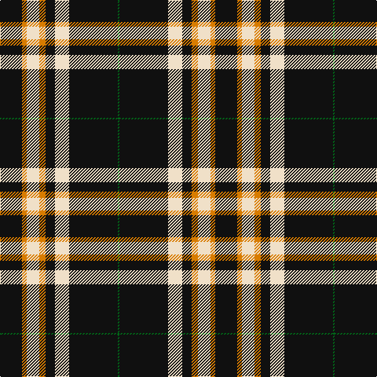

**Bands:** [KYWYKWKG](/stripes/kywykwkg/) · **Stripes:** [K LO W LO K W K G](/stripes/stripes8/) K LO W LO K W K G

This was sourced from register-of-tartans.  It is a [8 band tartan](/bands/bands8/).

Original link https://www.tartanregister.gov.uk/tartanDetails.aspx?ref=10996

## Attestations

This cloth appears in 2 source records; the oldest owns this page.

- 13/11/2013 — Entrepreneurial Spark (register-of-tartans, [record](https://www.tartanregister.gov.uk/tartanDetails.aspx?ref=10996))
- 2014 — Entrepreneurial Spark (tartans-authority, [record](http://www.tartansauthority.com/tartan-ferret/display/10996/))

## Register references

External register numbers recorded for this tartan.

- Scottish Register of Tartans: [10996](https://www.tartanregister.gov.uk/tartanDetails.aspx?ref=10996)

## Thread count
K/28 O6 W16 O8 K12 W18 K62 G/2

## Palette
Each colour and its ΔE from the base-6 reference it is a variant of.

| Colour | Shade | Base | ΔE (OKLab) |
|---|---|---|---|
| G | <code style="background-color:#006818;">#006818</code> `#006818` | G <code style="background-color:#006100;">#006100</code> | 0.02 |
| K | <code style="background-color:#101010;">#101010</code> `#101010` | K <code style="background-color:#000000;">#000000</code> | 0.17 |
| O | <code style="background-color:#D87C00;">#D87C00</code> `#D87C00` | Y <code style="background-color:#F2BF00;">#F2BF00</code> | 0.17 |
| W | <code style="background-color:#F0E0C8;">#F0E0C8</code> `#F0E0C8` | W <code style="background-color:#F7F7F7;">#F7F7F7</code> | 0.07 |

# Sample pattern

## Nearest tartans

The nearest existing variants by ΔTartan distance.

1. [Ashers of Nairn](/setts/s10/ly2k3w3k44ly4k22lb22w3k3ly2/) — ΔT 1.08
1. [Pride of Scotland Royal fashion Tartan Tartan Number: 5586. Earliest known date: See products available Copyright © Blair Urquhart, Comrie, 2015](/setts/s11/k7lr2w2lr2k13lr2k2b1lr13k26b2~x2/) — ΔT 1.15
1. [Livingston Football Club (2001)](/setts/s6/w4k24ly5k10ly12r1~x2/) — ΔT 1.28
1. [MacPherson Dress](/setts/s7/lr3r1lr30k20lr3k9ly1~x2/) — ΔT 1.28
1. [MacPherson Dress](/setts/s7/lr3r1lr30k20lr3k9ly1/) — ΔT 1.28
1. [Newcastle](/setts/s10/w8k1db2k4ly2k2ly2k24w8k2~x2/) — ΔT 1.32
1. [St. Piran Cornish Flag](/setts/s8/w5k20w10k1r2~x2/) — ΔT 1.37
1. [Moonlight Glen (Fashion)](/setts/s9/w3lr1k3w10k10w6lr4k40lr3~x2/) — ΔT 1.38
1. [University of Cincinnati](/setts/s8/k66w1r8k14w14k6r11w8~x2/) — ΔT 1.40
1. [Colbert Check (Fashion)](/setts/s8/k62w10ly10k4w18k4lo3w4/) — ΔT 1.41

## Neighbour map

Every grey dot is one of 14299 variants placed by the first two principal components of the ΔTartan feature space (44% of its variance). Red is this tartan; blue dots are its nearest — click one to open its page.

<svg viewBox="0 0 640 380" role="img" style="max-width:100%;height:auto;border:1px solid #e0e0e0;border-radius:4px;display:block" xmlns="http://www.w3.org/2000/svg"><image href="/nn/cloud.v1.png" width="640" height="380"/><a href="/setts/s10/ly2k3w3k44ly4k22lb22w3k3ly2/"><circle cx="372.4" cy="121.6" r="4" fill="#3465a4"><title>Ashers of Nairn</title></circle></a><a href="/setts/s11/k7lr2w2lr2k13lr2k2b1lr13k26b2~x2/"><circle cx="389.5" cy="125.7" r="4" fill="#3465a4"><title>Pride of Scotland Royal fashion Tartan Tartan Number: 5586. Earliest known date: See products available Copyright © Blair Urquhart, Comrie, 2015</title></circle></a><a href="/setts/s6/w4k24ly5k10ly12r1~x2/"><circle cx="325.9" cy="165.4" r="4" fill="#3465a4"><title>Livingston Football Club (2001)</title></circle></a><a href="/setts/s7/lr3r1lr30k20lr3k9ly1~x2/"><circle cx="329.3" cy="131.5" r="4" fill="#3465a4"><title>MacPherson Dress</title></circle></a><a href="/setts/s7/lr3r1lr30k20lr3k9ly1/"><circle cx="329.3" cy="131.5" r="4" fill="#3465a4"><title>MacPherson Dress</title></circle></a><a href="/setts/s10/w8k1db2k4ly2k2ly2k24w8k2~x2/"><circle cx="331.6" cy="115.5" r="4" fill="#3465a4"><title>Newcastle</title></circle></a><a href="/setts/s8/w5k20w10k1r2~x2/"><circle cx="344.7" cy="170.9" r="4" fill="#3465a4"><title>St. Piran Cornish Flag</title></circle></a><a href="/setts/s9/w3lr1k3w10k10w6lr4k40lr3~x2/"><circle cx="416.3" cy="117.3" r="4" fill="#3465a4"><title>Moonlight Glen (Fashion)</title></circle></a><a href="/setts/s8/k66w1r8k14w14k6r11w8~x2/"><circle cx="433.3" cy="118.1" r="4" fill="#3465a4"><title>University of Cincinnati</title></circle></a><a href="/setts/s8/k62w10ly10k4w18k4lo3w4/"><circle cx="339.6" cy="123.5" r="4" fill="#3465a4"><title>Colbert Check (Fashion)</title></circle></a><circle cx="379.9" cy="138.6" r="5" fill="#c00000"/></svg>

ID: /setts/s8/k14lo3w8lo4k6w9k31g1~x2/
