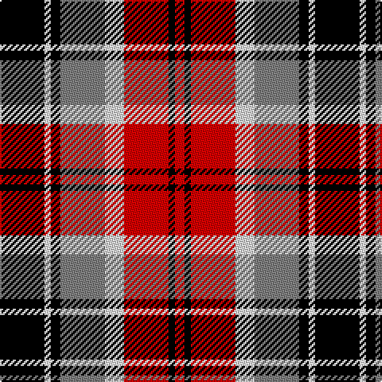

In pattern [KWKGWRKR](/patterns/kwkgwrkr/).

This was sourced from register-of-tartans.  It is a [8 stripes tartan](/stripes/stripes8/).

Original link https://www.tartanregister.gov.uk/tartanDetails.aspx?ref=11206

## Thread count
K/28 W4 K6 N28 LN12 R28 K4 R/6

## Palette
Each colour and its ΔE from the base-6 reference it is a variant of.

| Colour | Shade | Base | ΔE (OKLab) |
|---|---|---|---|
| K | <code style="background-color:#000000;">#000000</code> `#000000` | K <code style="background-color:#000000;">#000000</code> | 0.00 |
| LN | <code style="background-color:#E0E0E0;">#E0E0E0</code> `#E0E0E0` | W <code style="background-color:#F7F7F7;">#F7F7F7</code> | 0.07 |
| N | <code style="background-color:#808080;">#808080</code> `#808080` | G <code style="background-color:#006100;">#006100</code> | 0.23 |
| R | <code style="background-color:#DC0000;">#DC0000</code> `#DC0000` | R <code style="background-color:#CC0000;">#CC0000</code> | 0.03 |
| W | <code style="background-color:#FFFFFF;">#FFFFFF</code> `#FFFFFF` | W <code style="background-color:#F7F7F7;">#F7F7F7</code> | 0.02 |

# Sample pattern

## Nearest tartans

The nearest existing variants by ΔTartan distance.

1. [Raytheon](/setts/s8/k14w2k3r14wa6ra14k2ra3~k101010-r888888-rac80000-wfcfcfc-wac0c0c0~x2/) — ΔT 0.72
1. [Al Suwaidi of Abu Dhabi (Personal)](/setts/s8/w2r7g7k7r2g2k2w1~g005020-k101010-rdc0000-wffffff~x5/) — ΔT 1.22
1. [Cumming LO](/setts/s9/r4w1r4g10y1k10w4k2w4~g004c00-k000000-rc80000-wd0d0d0-yffc800/) — ΔT 1.23
1. [Sir George, Etienne-Cartier](/setts/s10/r4g6y3g12k14b5r20b5k4b2~b304080-g008000-k000000-rc00000-yf0c000~x2/) — ΔT 1.26
1. [Wilson's, No 83](/setts/s8/b14w2r3w2r15g18y3k14~b800080-g008000-k000000-rc00000-we0e0e0-yf0c000~x2/) — ΔT 1.30
1. [Unidentified 25](/setts/s10/r4g7y3g12k16b5r20b5k4b2~b5480b0-g008000-k000000-rc00000-yf0c000~x2/) — ΔT 1.30
1. [Holden Brown (Corporate)](/setts/s8/w13k3w3k3w3k15g18r3~g604000-k101010-rc80000-we8ccb8~x2/) — ΔT 1.35
1. [Glasgow](/setts/s7/g20r3ga3r15w19g3b2~b3c82af-g002814-ga808080-rdc0000-we0e0e0~x2/) — ΔT 1.36
1. [Montrose](/setts/s9/w2k2r14g15k8w7r14k2w2~g004c00-k000000-rc80000-wd0d0d0/) — ΔT 1.36
1. [Dutch Dress](/setts/s6/r2w12g1k12ra12k1~g789484-k101010-rc80000-ra98481c-we0e0e0~x2/) — ΔT 1.39

## Neighbour map

Every grey dot is one of 15726 variants placed by the first two principal components of the ΔTartan feature space (44% of its variance). Red is this tartan; blue dots are its nearest — click one to open its page.

<svg viewBox="0 0 640 380" role="img" style="max-width:100%;height:auto;border:1px solid #e0e0e0;border-radius:4px;display:block" xmlns="http://www.w3.org/2000/svg"><image href="/nn/cloud.v1.png" width="640" height="380"/><a href="/setts/s8/k14w2k3r14wa6ra14k2ra3~k101010-r888888-rac80000-wfcfcfc-wac0c0c0~x2/"><circle cx="105.8" cy="180.7" r="4" fill="#3465a4"><title>Raytheon</title></circle></a><a href="/setts/s8/w2r7g7k7r2g2k2w1~g005020-k101010-rdc0000-wffffff~x5/"><circle cx="109.3" cy="205.9" r="4" fill="#3465a4"><title>Al Suwaidi of Abu Dhabi (Personal)</title></circle></a><a href="/setts/s9/r4w1r4g10y1k10w4k2w4~g004c00-k000000-rc80000-wd0d0d0-yffc800/"><circle cx="77.8" cy="165.0" r="4" fill="#3465a4"><title>Cumming LO</title></circle></a><a href="/setts/s10/r4g6y3g12k14b5r20b5k4b2~b304080-g008000-k000000-rc00000-yf0c000~x2/"><circle cx="100.2" cy="164.0" r="4" fill="#3465a4"><title>Sir George, Etienne-Cartier</title></circle></a><a href="/setts/s8/b14w2r3w2r15g18y3k14~b800080-g008000-k000000-rc00000-we0e0e0-yf0c000~x2/"><circle cx="46.0" cy="154.6" r="4" fill="#3465a4"><title>Wilson's, No 83</title></circle></a><a href="/setts/s10/r4g7y3g12k16b5r20b5k4b2~b5480b0-g008000-k000000-rc00000-yf0c000~x2/"><circle cx="91.7" cy="161.9" r="4" fill="#3465a4"><title>Unidentified 25</title></circle></a><a href="/setts/s8/w13k3w3k3w3k15g18r3~g604000-k101010-rc80000-we8ccb8~x2/"><circle cx="130.5" cy="198.6" r="4" fill="#3465a4"><title>Holden Brown (Corporate)</title></circle></a><a href="/setts/s7/g20r3ga3r15w19g3b2~b3c82af-g002814-ga808080-rdc0000-we0e0e0~x2/"><circle cx="132.7" cy="161.1" r="4" fill="#3465a4"><title>Glasgow</title></circle></a><a href="/setts/s9/w2k2r14g15k8w7r14k2w2~g004c00-k000000-rc80000-wd0d0d0/"><circle cx="157.6" cy="188.2" r="4" fill="#3465a4"><title>Montrose</title></circle></a><a href="/setts/s6/r2w12g1k12ra12k1~g789484-k101010-rc80000-ra98481c-we0e0e0~x2/"><circle cx="130.1" cy="165.2" r="4" fill="#3465a4"><title>Dutch Dress</title></circle></a><circle cx="89.9" cy="175.7" r="5" fill="#c00000"/></svg>

ID: /setts/s8/k14w2k3g14wa6r14k2r3~g808080-k000000-rdc0000-wffffff-wae0e0e0~x2/
