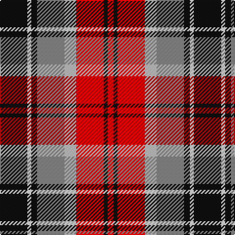

In pattern [KWKRWRKR](/patterns/kwkrwrkr/).

This was sourced from tartans-authority.  It is a [8 stripes tartan](/stripes/stripes8/).

Original link http://www.tartansauthority.com/tartan-ferret/display/11206/

## Thread count
K/28 W4 K6 Na28 N12 R28 K4 R/6

## Palette
Each colour and its ΔE from the base-6 reference it is a variant of.

| Colour | Shade | Base | ΔE (OKLab) |
|---|---|---|---|
| K | <code style="background-color:#101010;">#101010</code> `#101010` | K <code style="background-color:#000000;">#000000</code> | 0.17 |
| N | <code style="background-color:#C0C0C0;">#C0C0C0</code> `#C0C0C0` | W <code style="background-color:#F7F7F7;">#F7F7F7</code> | 0.17 |
| Na | <code style="background-color:#888888;">#888888</code> `#888888` | R <code style="background-color:#CC0000;">#CC0000</code> | 0.24 |
| R | <code style="background-color:#C80000;">#C80000</code> `#C80000` | R <code style="background-color:#CC0000;">#CC0000</code> | 0.01 |
| W | <code style="background-color:#FCFCFC;">#FCFCFC</code> `#FCFCFC` | W <code style="background-color:#F7F7F7;">#F7F7F7</code> | 0.01 |

# Sample pattern

## Nearest tartans

The nearest existing variants by ΔTartan distance.

1. [Raytheon](/setts/s8/k14w2k3g14wa6r14k2r3~g808080-k000000-rdc0000-wffffff-wae0e0e0~x2/) — ΔT 0.72
1. [Strathblane](/setts/s8/r6w2k4g12k4w2r6ra3~g604000-k101010-r888888-rac80000-we0e0e0~x2/) — ΔT 1.05
1. [Unidentified #9](/setts/s10/r4g7y3g12k16b5r20b5k4b2~b3c82af-g005020-k101010-rdc0000-ye8c000~x2/) — ΔT 1.09
1. [Glasgow](/setts/s7/g20r3ga3r15w19g3b2~b3c82af-g002814-ga808080-rdc0000-we0e0e0~x2/) — ΔT 1.12
1. [Al Suwaidi of Abu Dhabi (Personal)](/setts/s8/w2r7g7k7r2g2k2w1~g005020-k101010-rdc0000-wffffff~x5/) — ΔT 1.17
1. [Glengarry Highland Games](/setts/s12/r20g3r3g13r6k10b14w3r3w3b14k12~b2c2c80-g006818-k101010-rc80000-wfcfcfc~x2/) — ΔT 1.22
1. [Glasgow](/setts/s7/g20r3ga3r15w19g3b2~b5480b0-g003000-ga808080-rc00000-we0e0e0~x2/) — ΔT 1.22
1. [Etienne-Carter, Sir George](/setts/s10/r4g6y3g12k14b5r20b5k4b2~b2c2c80-g006818-k101010-rc80000-ye8c000~x2/) — ΔT 1.22
1. [Khosla, Sarah and Jatin (Personal)](/setts/s9/r4b10ra18y3ra3y5rb8b9w4~b1c1c1c-rb458ac-raa00048-rbe87878-wf8f4d0-yf8e38c~x2/) — ΔT 1.23
1. [Unidentified No 14](/setts/s9/r22b6ba10y4r4w4g22ba8y3~b3c82af-ba2c4084-g005020-rdc0000-we0e0e0-ye8c000/) — ΔT 1.23

## Neighbour map

Every grey dot is one of 15726 variants placed by the first two principal components of the ΔTartan feature space (44% of its variance). Red is this tartan; blue dots are its nearest — click one to open its page.

<svg viewBox="0 0 640 380" role="img" style="max-width:100%;height:auto;border:1px solid #e0e0e0;border-radius:4px;display:block" xmlns="http://www.w3.org/2000/svg"><image href="/nn/cloud.v1.png" width="640" height="380"/><a href="/setts/s8/k14w2k3g14wa6r14k2r3~g808080-k000000-rdc0000-wffffff-wae0e0e0~x2/"><circle cx="89.9" cy="175.7" r="4" fill="#3465a4"><title>Raytheon</title></circle></a><a href="/setts/s8/r6w2k4g12k4w2r6ra3~g604000-k101010-r888888-rac80000-we0e0e0~x2/"><circle cx="85.3" cy="205.1" r="4" fill="#3465a4"><title>Strathblane</title></circle></a><a href="/setts/s10/r4g7y3g12k16b5r20b5k4b2~b3c82af-g005020-k101010-rdc0000-ye8c000~x2/"><circle cx="112.2" cy="167.0" r="4" fill="#3465a4"><title>Unidentified #9</title></circle></a><a href="/setts/s7/g20r3ga3r15w19g3b2~b3c82af-g002814-ga808080-rdc0000-we0e0e0~x2/"><circle cx="132.7" cy="161.1" r="4" fill="#3465a4"><title>Glasgow</title></circle></a><a href="/setts/s8/w2r7g7k7r2g2k2w1~g005020-k101010-rdc0000-wffffff~x5/"><circle cx="109.3" cy="205.9" r="4" fill="#3465a4"><title>Al Suwaidi of Abu Dhabi (Personal)</title></circle></a><a href="/setts/s12/r20g3r3g13r6k10b14w3r3w3b14k12~b2c2c80-g006818-k101010-rc80000-wfcfcfc~x2/"><circle cx="79.3" cy="180.5" r="4" fill="#3465a4"><title>Glengarry Highland Games</title></circle></a><a href="/setts/s7/g20r3ga3r15w19g3b2~b5480b0-g003000-ga808080-rc00000-we0e0e0~x2/"><circle cx="134.0" cy="163.4" r="4" fill="#3465a4"><title>Glasgow</title></circle></a><a href="/setts/s10/r4g6y3g12k14b5r20b5k4b2~b2c2c80-g006818-k101010-rc80000-ye8c000~x2/"><circle cx="122.5" cy="170.7" r="4" fill="#3465a4"><title>Etienne-Carter, Sir George</title></circle></a><a href="/setts/s9/r4b10ra18y3ra3y5rb8b9w4~b1c1c1c-rb458ac-raa00048-rbe87878-wf8f4d0-yf8e38c~x2/"><circle cx="60.6" cy="167.5" r="4" fill="#3465a4"><title>Khosla, Sarah and Jatin (Personal)</title></circle></a><a href="/setts/s9/r22b6ba10y4r4w4g22ba8y3~b3c82af-ba2c4084-g005020-rdc0000-we0e0e0-ye8c000/"><circle cx="85.7" cy="159.6" r="4" fill="#3465a4"><title>Unidentified No 14</title></circle></a><circle cx="105.8" cy="180.7" r="5" fill="#c00000"/></svg>

ID: /setts/s8/k14w2k3r14wa6ra14k2ra3~k101010-r888888-rac80000-wfcfcfc-wac0c0c0~x2/
