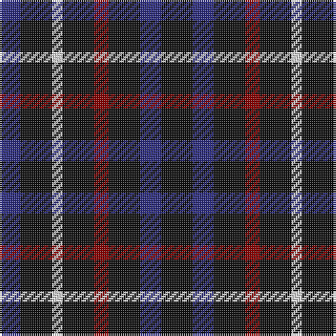

In pattern [BKWKRKBK](/patterns/bkwkrkbk/).

This was sourced from tartans-authority.  It is a [8 stripes tartan](/stripes/stripes8/).

Original link http://www.tartansauthority.com/tartan-ferret/display/8509/

## Thread count
DB/10 K15 LN5 K15 DR7 K15 DB10 K/15

## Palette
Each colour and its ΔE from the base-6 reference it is a variant of.

| Colour | Shade | Base | ΔE (OKLab) |
|---|---|---|---|
| DB | <code style="background-color:#2C2C80;">#2C2C80</code> `#2C2C80` | B <code style="background-color:#2A418A;">#2A418A</code> | 0.06 |
| DR | <code style="background-color:#880000;">#880000</code> `#880000` | R <code style="background-color:#CC0000;">#CC0000</code> | 0.15 |
| K | <code style="background-color:#101010;">#101010</code> `#101010` | K <code style="background-color:#000000;">#000000</code> | 0.17 |
| LN | <code style="background-color:#E0E0E0;">#E0E0E0</code> `#E0E0E0` | W <code style="background-color:#F7F7F7;">#F7F7F7</code> | 0.07 |

# Sample pattern

## Nearest tartans

The nearest existing variants by ΔTartan distance.

1. [Daks (Black)](/setts/s5/g6k12ga8k12r6-g808080-ga604000-k101010-rb03000/) — ΔT 2.14
1. [Justus (Personal)](/setts/s7/b12k48r12k12y12k48b12-b1c0070-k101010-r880000-yd09800/) — ΔT 2.15
1. [Justus Family Tartan Tartan Number: 2100. Earliest known date: 1990 Submitted as the Justus family sett but awaits the approval of the proposed Justus Family Society of North America. Sample supplied in 9 tpi. See products available Copyright © Blair Urquhart, Comrie, 2015](/setts/s7/b6k24r6k6y6k24b6-b2c2c80-k101010-rc80000-ye8c000/) — ΔT 2.20
1. [North Carolina State University - Pack Plaid](/setts/s12/w30b50r20w10b50w14b32k18b34k20b46r18-b1c1c1c-k000000-rc80000-wffffff/) — ΔT 2.35
1. [Grampian Television](/setts/s8/k24b6k24b36w10b36k24b6-b305470-k101010-wfcfcfc/) — ΔT 2.38
1. [Process Safety Solutions Ltd](/setts/s10/r8k22b16g4b16k26g4k26r10k4-b5c5c5c-g003820-k101010-rc80000/) — ΔT 2.40
1. [Wilson's No.228 #2](/setts/s6/b16k22g18k22b16ba4-b780078-ba5c8ca8-g285800-k101010/) — ΔT 2.44
1. [Process Safety Solutions Ltd](/setts/s10/r8k22b16g4b16k26g4k26r10k4-b646464-g004028-k101010-r960028/) — ΔT 2.44
1. [Davidson of Tulloch Clan Tartan Tartan Number: 1360. Earliest known date: 1984 The Davidsons or Clan Dhai maintained a constant battle for precedence within Clan Chattan. The Davidsons of Tulloch in Ross-shire are one of the main branches of the Davidson family. See products available Copyright © Blair Urquhart, Comrie, 2015](/setts/s5/r6b35k36b36w6-b2c2c80-k101010-rc80000-we0e0e0/) — ΔT 2.44
1. [Millar (Kirkcaldy) (Personal)](/setts/s9/b40r16w16r16b40y8r8y8b40-b003c64-rc80000-wc49cd8-ye8c000/) — ΔT 2.47

## Neighbour map

Every grey dot is one of 15726 variants placed by the first two principal components of the ΔTartan feature space (44% of its variance). Red is this tartan; blue dots are its nearest — click one to open its page.

<svg viewBox="0 0 640 380" role="img" style="max-width:100%;height:auto;border:1px solid #e0e0e0;border-radius:4px;display:block" xmlns="http://www.w3.org/2000/svg"><image href="/nn/cloud.v1.png" width="640" height="380"/><a href="/setts/s5/g6k12ga8k12r6-g808080-ga604000-k101010-rb03000/"><circle cx="186.3" cy="347.0" r="4" fill="#3465a4"><title>Daks (Black)</title></circle></a><a href="/setts/s7/b12k48r12k12y12k48b12-b1c0070-k101010-r880000-yd09800/"><circle cx="361.2" cy="268.2" r="4" fill="#3465a4"><title>Justus (Personal)</title></circle></a><a href="/setts/s7/b6k24r6k6y6k24b6-b2c2c80-k101010-rc80000-ye8c000/"><circle cx="335.9" cy="255.4" r="4" fill="#3465a4"><title>Justus Family Tartan Tartan Number: 2100. Earliest known date: 1990 Submitted as the Justus family sett but awaits the approval of the proposed Justus Family Society of North America. Sample supplied in 9 tpi. See products available Copyright © Blair Urquhart, Comrie, 2015</title></circle></a><a href="/setts/s12/w30b50r20w10b50w14b32k18b34k20b46r18-b1c1c1c-k000000-rc80000-wffffff/"><circle cx="219.1" cy="232.1" r="4" fill="#3465a4"><title>North Carolina State University - Pack Plaid</title></circle></a><a href="/setts/s8/k24b6k24b36w10b36k24b6-b305470-k101010-wfcfcfc/"><circle cx="256.8" cy="268.5" r="4" fill="#3465a4"><title>Grampian Television</title></circle></a><a href="/setts/s10/r8k22b16g4b16k26g4k26r10k4-b5c5c5c-g003820-k101010-rc80000/"><circle cx="283.4" cy="240.2" r="4" fill="#3465a4"><title>Process Safety Solutions Ltd</title></circle></a><a href="/setts/s6/b16k22g18k22b16ba4-b780078-ba5c8ca8-g285800-k101010/"><circle cx="193.5" cy="295.6" r="4" fill="#3465a4"><title>Wilson's No.228 #2</title></circle></a><a href="/setts/s10/r8k22b16g4b16k26g4k26r10k4-b646464-g004028-k101010-r960028/"><circle cx="292.7" cy="245.4" r="4" fill="#3465a4"><title>Process Safety Solutions Ltd</title></circle></a><a href="/setts/s5/r6b35k36b36w6-b2c2c80-k101010-rc80000-we0e0e0/"><circle cx="304.6" cy="271.4" r="4" fill="#3465a4"><title>Davidson of Tulloch Clan Tartan Tartan Number: 1360. Earliest known date: 1984 The Davidsons or Clan Dhai maintained a constant battle for precedence within Clan Chattan. The Davidsons of Tulloch in Ross-shire are one of the main branches of the Davidson family. See products available Copyright © Blair Urquhart, Comrie, 2015</title></circle></a><a href="/setts/s9/b40r16w16r16b40y8r8y8b40-b003c64-rc80000-wc49cd8-ye8c000/"><circle cx="275.5" cy="233.0" r="4" fill="#3465a4"><title>Millar (Kirkcaldy) (Personal)</title></circle></a><circle cx="263.3" cy="315.4" r="5" fill="#c00000"/></svg>

ID: /setts/s8/k15b10k15r7k15w5k15b10-b2c2c80-k101010-r880000-we0e0e0/
