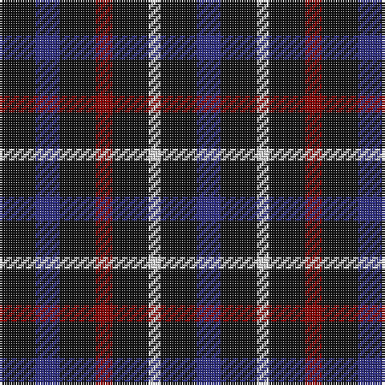

This page is one **sett** — a single exact thread-count. It belongs to the [tartan](/tartans/k15db10k15r7k15w5k15db10/)
(the same proportion at any scale), whose colour order is pattern [BKWKRKBK](/stripes/bkwkrkbk/).

Sourced from tartans-authority.  It is a [8 stripe tartan](/stripes/stripes8/).

Original link http://www.tartansauthority.com/tartan-ferret/display/8509/

## Thread count
K/15 DB10 K15 DR7 K15 LN5 K15 DB/10

## Palette

Palette: <strong>Tartan Register</strong>
<table><thead><tr><th>Colour</th><th>Threads</th><th>Shade</th><th>Base</th><th>OKLCh</th></tr></thead><tbody><tr><td>K/</td><td style="text-align:right;font-variant-numeric:tabular-nums">15</td><td><code style="background-color:#101010;">#101010</code> <small style="color:#888">#101010</small></td><td>K <code style="background-color:#000000;">#000000</code></td><td><small style="color:#888">oklch(17.3% 0.000 89.9)</small></td></tr><tr><td>DB</td><td style="text-align:right;font-variant-numeric:tabular-nums">10</td><td><code style="background-color:#2C2C80;">#2C2C80</code> <small style="color:#888">#2C2C80</small></td><td>B <code style="background-color:#2A418A;">#2A418A</code></td><td><small style="color:#888">oklch(35.0% 0.138 276.6)</small></td></tr><tr><td>K</td><td style="text-align:right;font-variant-numeric:tabular-nums">15</td><td><code style="background-color:#101010;">#101010</code> <small style="color:#888">#101010</small></td><td>K <code style="background-color:#000000;">#000000</code></td><td><small style="color:#888">oklch(17.3% 0.000 89.9)</small></td></tr><tr><td>DR</td><td style="text-align:right;font-variant-numeric:tabular-nums">7</td><td><code style="background-color:#880000;">#880000</code> <small style="color:#888">#880000</small></td><td>R <code style="background-color:#CC0000;">#CC0000</code></td><td><small style="color:#888">oklch(39.4% 0.162 29.2)</small></td></tr><tr><td>K</td><td style="text-align:right;font-variant-numeric:tabular-nums">15</td><td><code style="background-color:#101010;">#101010</code> <small style="color:#888">#101010</small></td><td>K <code style="background-color:#000000;">#000000</code></td><td><small style="color:#888">oklch(17.3% 0.000 89.9)</small></td></tr><tr><td>LN</td><td style="text-align:right;font-variant-numeric:tabular-nums">5</td><td><code style="background-color:#E0E0E0;">#E0E0E0</code> <small style="color:#888">#E0E0E0</small></td><td>W <code style="background-color:#F7F7F7;">#F7F7F7</code></td><td><small style="color:#888">oklch(90.7% 0.000 89.9)</small></td></tr><tr><td>K</td><td style="text-align:right;font-variant-numeric:tabular-nums">15</td><td><code style="background-color:#101010;">#101010</code> <small style="color:#888">#101010</small></td><td>K <code style="background-color:#000000;">#000000</code></td><td><small style="color:#888">oklch(17.3% 0.000 89.9)</small></td></tr><tr><td>DB/</td><td style="text-align:right;font-variant-numeric:tabular-nums">10</td><td><code style="background-color:#2C2C80;">#2C2C80</code> <small style="color:#888">#2C2C80</small></td><td>B <code style="background-color:#2A418A;">#2A418A</code></td><td><small style="color:#888">oklch(35.0% 0.138 276.6)</small></td></tr></tbody></table>

# Sample pattern

## Nearest tartans

The nearest existing variants by ΔTartan distance, with this tartan at the top so the swatches line up against it.

ΔTartan

Tartan

Sett

—

<a href="/ttd/edit/#slug=k15db10k15r7k15w5k15db10">Millarkie, Will (Personal)</a> <a class="nn-out" href="/setts/s8/k15db10k15r7k15w5k15db10/" title="open its dictionary page">↗</a>

2.14

<a href="/ttd/edit/#slug=r3k6dy4k6y3~x2">Daks (Black)</a> <a class="nn-out" href="/setts/s5/r3k6dy4k6y3~x2/" title="open its dictionary page">↗</a>

2.16

<a href="/ttd/edit/#slug=db1k4r1k1lo1k4db1~x12">Justus (Personal)</a> <a class="nn-out" href="/setts/s7/db1k4r1k1lo1k4db1~x12/" title="open its dictionary page">↗</a>

2.21

<a href="/ttd/edit/#slug=db1k4r1k1ly1k4db1~x6">Justus Family Tartan Tartan Number: 2100. Earliest known date: 1990 Submitted as the Justus family sett but awaits the approval of the proposed Justus Family Society of North America. Sample supplied in 9 tpi. See products available Copyright © Blair Urquhart, Comrie, 2015</a> <a class="nn-out" href="/setts/s7/db1k4r1k1ly1k4db1~x6/" title="open its dictionary page">↗</a>

2.37

<a href="/ttd/edit/#slug=w15dt25r10w5dt25w7dt16k9dt17k10dt23r9~x2">North Carolina State University - Pack Plaid</a> <a class="nn-out" href="/setts/s12/w15dt25r10w5dt25w7dt16k9dt17k10dt23r9~x2/" title="open its dictionary page">↗</a>

2.39

<a href="/setts/s8/k12n3k12n18w5~x2/">Grampian Television</a>

2.43

<a href="/ttd/edit/#slug=dp8k11dg9k11dp8t2~x2">Wilson's No.228 #2</a> <a class="nn-out" href="/setts/s6/dp8k11dg9k11dp8t2~x2/" title="open its dictionary page">↗</a>

2.45

<a href="/ttd/edit/#slug=r4k11n8dg2n8k13dg2k13r5k2~x2">Process Safety Solutions Ltd</a> <a class="nn-out" href="/setts/s10/r4k11n8dg2n8k13dg2k13r5k2~x2/" title="open its dictionary page">↗</a>

2.48

<a href="/ttd/edit/#slug=dt5r2lp2r2dt5ly1r1ly1dt5~x8">Millar (Kirkcaldy) (Personal)</a> <a class="nn-out" href="/setts/s9/dt5r2lp2r2dt5ly1r1ly1dt5~x8/" title="open its dictionary page">↗</a>

2.49

<a href="/ttd/edit/#slug=k8db8k2db2w2k5db5r2~x5">Lexington Fire Department</a> <a class="nn-out" href="/setts/s8/k8db8k2db2w2k5db5r2~x5/" title="open its dictionary page">↗</a>

2.49

<a href="/ttd/edit/#slug=dt5dt5dt9b5dt5b5~x2">Charles Rennie Mackintosh</a> <a class="nn-out" href="/setts/s6/dt5dt5dt9b5dt5b5~x2/" title="open its dictionary page">↗</a>

## Neighbour map

Every grey dot is one of 14299 variants placed by the first two principal components of the ΔTartan feature space (44% of its variance). Red is this tartan; blue dots are its nearest — click one to open its page.

<svg viewBox="0 0 640 380" role="img" style="max-width:100%;height:auto;border:1px solid #e0e0e0;border-radius:4px;display:block" xmlns="http://www.w3.org/2000/svg"><image href="/nn/cloud.v1.png" width="640" height="380"/><a href="/setts/s5/r3k6dy4k6y3~x2/"><circle cx="184.9" cy="348.2" r="4" fill="#3465a4"><title>Daks (Black)</title></circle></a><a href="/setts/s7/db1k4r1k1lo1k4db1~x12/"><circle cx="361.5" cy="270.9" r="4" fill="#3465a4"><title>Justus (Personal)</title></circle></a><a href="/setts/s7/db1k4r1k1ly1k4db1~x6/"><circle cx="336.0" cy="255.8" r="4" fill="#3465a4"><title>Justus Family Tartan Tartan Number: 2100. Earliest known date: 1990 Submitted as the Justus family sett but awaits the approval of the proposed Justus Family Society of North America. Sample supplied in 9 tpi. See products available Copyright © Blair Urquhart, Comrie, 2015</title></circle></a><a href="/setts/s12/w15dt25r10w5dt25w7dt16k9dt17k10dt23r9~x2/"><circle cx="219.2" cy="230.2" r="4" fill="#3465a4"><title>North Carolina State University - Pack Plaid</title></circle></a><a href="/setts/s8/k12n3k12n18w5~x2/"><circle cx="258.1" cy="270.0" r="4" fill="#3465a4"><title>Grampian Television</title></circle></a><a href="/setts/s6/dp8k11dg9k11dp8t2~x2/"><circle cx="194.2" cy="298.3" r="4" fill="#3465a4"><title>Wilson's No.228 #2</title></circle></a><a href="/setts/s10/r4k11n8dg2n8k13dg2k13r5k2~x2/"><circle cx="294.1" cy="249.4" r="4" fill="#3465a4"><title>Process Safety Solutions Ltd</title></circle></a><a href="/setts/s9/dt5r2lp2r2dt5ly1r1ly1dt5~x8/"><circle cx="275.9" cy="232.8" r="4" fill="#3465a4"><title>Millar (Kirkcaldy) (Personal)</title></circle></a><a href="/setts/s8/k8db8k2db2w2k5db5r2~x5/"><circle cx="201.8" cy="268.7" r="4" fill="#3465a4"><title>Lexington Fire Department</title></circle></a><a href="/setts/s6/dt5dt5dt9b5dt5b5~x2/"><circle cx="243.8" cy="366.0" r="4" fill="#3465a4"><title>Charles Rennie Mackintosh</title></circle></a><circle cx="262.7" cy="317.1" r="5" fill="#c00000"/></svg>

ID: /setts/s8/k15db10k15r7k15w5k15db10/
