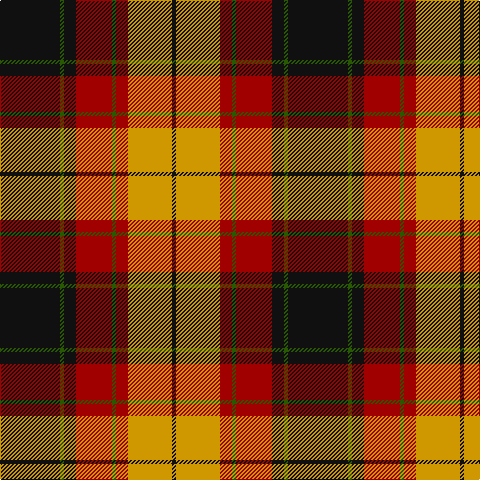

In pattern [KGKRGRYK](/stripes/kgkrgryk/).

This was sourced from register-of-tartans.  It is a [8 stripe tartan](/stripes/stripes8/).

Original link https://www.tartanregister.gov.uk/tartanDetails.aspx?ref=1863

## Attestations

This cloth appears in 2 source records; the oldest owns this page.

- 01/01/1972 — Island of Innis, The (register-of-tartans, [record](https://www.tartanregister.gov.uk/tartanDetails.aspx?ref=1863))
- pre 1972 — Island of Innis, The (Fashion) (tartans-authority, [record](http://www.tartansauthority.com/tartan-ferret/display/5279/))

## Register references

External register numbers recorded for this tartan.

- Scottish Register of Tartans: [1863](https://www.tartanregister.gov.uk/tartanDetails.aspx?ref=1863)
- Scottish Tartans Authority (ITI): 5279

## Thread count
K/60 G4 K12 DR36 G4 DR12 DY44 K/4

## Palette
Each colour and its ΔE from the base-6 reference it is a variant of.

| Colour | Shade | Base | ΔE (OKLab) |
|---|---|---|---|
| DR | <code style="background-color:#A00000;">#A00000</code> `#A00000` | R <code style="background-color:#CC0000;">#CC0000</code> | 0.09 |
| DY | <code style="background-color:#D09800;">#D09800</code> `#D09800` | Y <code style="background-color:#F2BF00;">#F2BF00</code> | 0.12 |
| G | <code style="background-color:#285800;">#285800</code> `#285800` | G <code style="background-color:#006100;">#006100</code> | 0.03 |
| K | <code style="background-color:#101010;">#101010</code> `#101010` | K <code style="background-color:#000000;">#000000</code> | 0.17 |

# Sample pattern

## Nearest tartans

The nearest existing variants by ΔTartan distance.

1. [MacNaughton](/setts/s9/k1db1r16g16k12db8r16db1k1~x2/) — ΔT 0.52
1. [Montrose](/setts/s9/db1k1r12g12k6db5r12k1db1~x2/) — ΔT 0.64
1. [Dickie](/setts/s8/g8r2g12k6g3db6r24k4~x2/) — ΔT 0.69
1. [MacNaughten](/setts/s9/k1b1r16dg16k12b8r16b1k1~x2/) — ΔT 0.83
1. [MacNaughton](/setts/s9/k1lb1r16dg16k12lb8r16lb1k1~x2/) — ΔT 0.83
1. [Scott Hunting Clan Tartan Tartan Number: 1546. Earliest known date: 1906 Also known as Green Scott, this tartan is generally available today. The Chief of the Scotts is His Grace the 9th Duke of Buccleuch and 10th of Queensberry who lives in Selkirk in the borders region of Scotland. See products available Copyright © Blair Urquhart, Comrie, 2015](/setts/s8/r3dr14g8r2g2w2g2r1~x2/) — ΔT 0.84
1. [Blackstock Red (Dress)](/setts/s7/ly2dg7k6r11k1r1ly2~x4/) — ΔT 0.84
1. [Private SA Club](/setts/s8/k3r8k3r8lo19r7dt36r3~x2/) — ΔT 0.85
1. [Longford County Crest (Fashion)](/setts/s8/k44lo9k3lo8lo16lo15lo6k7~x2/) — ΔT 0.89
1. [MacDuff](/setts/s7/r4k2r24k6db6g16r3~x2/) — ΔT 0.91

## Neighbour map

Every grey dot is one of 14299 variants placed by the first two principal components of the ΔTartan feature space (44% of its variance). Red is this tartan; blue dots are its nearest — click one to open its page.

<svg viewBox="0 0 640 380" role="img" style="max-width:100%;height:auto;border:1px solid #e0e0e0;border-radius:4px;display:block" xmlns="http://www.w3.org/2000/svg"><image href="/nn/cloud.v1.png" width="640" height="380"/><a href="/setts/s9/k1db1r16g16k12db8r16db1k1~x2/"><circle cx="219.0" cy="159.2" r="4" fill="#3465a4"><title>MacNaughton</title></circle></a><a href="/setts/s9/db1k1r12g12k6db5r12k1db1~x2/"><circle cx="227.0" cy="168.9" r="4" fill="#3465a4"><title>Montrose</title></circle></a><a href="/setts/s8/g8r2g12k6g3db6r24k4~x2/"><circle cx="200.7" cy="180.3" r="4" fill="#3465a4"><title>Dickie</title></circle></a><a href="/setts/s9/k1b1r16dg16k12b8r16b1k1~x2/"><circle cx="231.7" cy="167.4" r="4" fill="#3465a4"><title>MacNaughten</title></circle></a><a href="/setts/s9/k1lb1r16dg16k12lb8r16lb1k1~x2/"><circle cx="208.7" cy="149.7" r="4" fill="#3465a4"><title>MacNaughton</title></circle></a><a href="/setts/s8/r3dr14g8r2g2w2g2r1~x2/"><circle cx="246.1" cy="171.1" r="4" fill="#3465a4"><title>Scott Hunting Clan Tartan Tartan Number: 1546. Earliest known date: 1906 Also known as Green Scott, this tartan is generally available today. The Chief of the Scotts is His Grace the 9th Duke of Buccleuch and 10th of Queensberry who lives in Selkirk in the borders region of Scotland. See products available Copyright © Blair Urquhart, Comrie, 2015</title></circle></a><a href="/setts/s7/ly2dg7k6r11k1r1ly2~x4/"><circle cx="188.5" cy="182.8" r="4" fill="#3465a4"><title>Blackstock Red (Dress)</title></circle></a><a href="/setts/s8/k3r8k3r8lo19r7dt36r3~x2/"><circle cx="229.6" cy="173.0" r="4" fill="#3465a4"><title>Private SA Club</title></circle></a><a href="/setts/s8/k44lo9k3lo8lo16lo15lo6k7~x2/"><circle cx="212.7" cy="165.8" r="4" fill="#3465a4"><title>Longford County Crest (Fashion)</title></circle></a><a href="/setts/s7/r4k2r24k6db6g16r3~x2/"><circle cx="261.2" cy="178.3" r="4" fill="#3465a4"><title>MacDuff</title></circle></a><circle cx="233.6" cy="162.8" r="5" fill="#c00000"/></svg>

ID: /setts/s8/k15dg1k3r9dg1r3lo11k1~x4/
