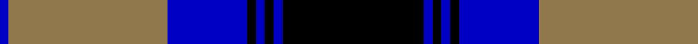

In pattern [BRBKBKBK](/patterns/brbkbkbk/).

This was sourced from tartans-authority.  It is a [8 stripes tartan](/stripes/stripes8/).

Original link http://www.tartansauthority.com/tartan-ferret/display/5326/

## Thread count
B/4 LT72 B36 K4 B4 K4 B4 K/64

## Palette
Each colour and its ΔE from the base-6 reference it is a variant of.

| Colour | Shade | Base | ΔE (OKLab) |
|---|---|---|---|
| B | <code style="background-color:#0000C4;">#0000C4</code> `#0000C4` | B <code style="background-color:#2A418A;">#2A418A</code> | 0.14 |
| K | <code style="background-color:#000000;">#000000</code> `#000000` | K <code style="background-color:#000000;">#000000</code> | 0.00 |
| LT | <code style="background-color:#90784C;">#90784C</code> `#90784C` | R <code style="background-color:#CC0000;">#CC0000</code> | 0.19 |

# Sample pattern

## Nearest tartans

The nearest existing variants by ΔTartan distance.

1. [Hakkarain (Personal)](/setts/s6/k37w18ka37r2ka2r2x2~k000040-ka101010-rc80000-we0e0e0/) — ΔT 1.18
1. [Napier](/setts/s11/k4y2k2y2k2y4k2y2k4b12y1x2~b000052-k000000-yaaaaaa/) — ΔT 1.24
1. [Napier](/setts/s11/k2w2k2w2k2w4k2w2k4b12w1x2~b000064-k000000-wd0d0d0/) — ΔT 1.27
1. [Meoni (Personal)](/setts/s7/b1g1b18g12k18r1k1x2~b2c2c80-g006818-k000000-rc80000/) — ΔT 1.37
1. [Hebridean Old](/setts/s9/b2k2b18ba1k13ba1g16b3k2x2~b304080-ba8080d0-g008000-k000000/) — ΔT 1.38
1. [Rangers F.C.](/setts/s11/r3g14k12b40k12g2k2g2k2g7r3x2~b304080-g30a010-k000000-rc00020/) — ΔT 1.45
1. [Scottish Knights Templar, of M.T.S. International](/setts/s9/r3b20k6w5k4w3k2r1b2x2~b304080-k000000-rc00000-we0e0e0/) — ΔT 1.45
1. [Napier](/setts/s11/k4w2k2w2k2w4k2w2k4b12w1x2~b304080-k000000-we0e0e0/) — ΔT 1.47
1. [Hebridean Old](/setts/s8/b2k2b18k13b1g16b1k2x2~b5480b0-g008000-k000000/) — ΔT 1.50
1. [Kerr, hunting](/setts/s10/g14k2g2k2g3k10b16k1b2k2x2~b304080-g008000-k000000/) — ΔT 1.51

## Neighbour map

Every grey dot is one of 15726 variants placed by the first two principal components of the ΔTartan feature space (44% of its variance). Red is this tartan; blue dots are its nearest — click one to open its page.

<svg viewBox="0 0 640 380" role="img" style="max-width:100%;height:auto;border:1px solid #e0e0e0;border-radius:4px;display:block" xmlns="http://www.w3.org/2000/svg"><image href="/nn/cloud.v1.png" width="640" height="380"/><a href="/setts/s6/k37w18ka37r2ka2r2x2~k000040-ka101010-rc80000-we0e0e0/"><circle cx="219.8" cy="173.9" r="4" fill="#3465a4"><title>Hakkarain (Personal)</title></circle></a><a href="/setts/s11/k4y2k2y2k2y4k2y2k4b12y1x2~b000052-k000000-yaaaaaa/"><circle cx="190.0" cy="187.0" r="4" fill="#3465a4"><title>Napier</title></circle></a><a href="/setts/s11/k2w2k2w2k2w4k2w2k4b12w1x2~b000064-k000000-wd0d0d0/"><circle cx="171.9" cy="176.4" r="4" fill="#3465a4"><title>Napier</title></circle></a><a href="/setts/s7/b1g1b18g12k18r1k1x2~b2c2c80-g006818-k000000-rc80000/"><circle cx="228.1" cy="176.4" r="4" fill="#3465a4"><title>Meoni (Personal)</title></circle></a><a href="/setts/s9/b2k2b18ba1k13ba1g16b3k2x2~b304080-ba8080d0-g008000-k000000/"><circle cx="216.5" cy="159.5" r="4" fill="#3465a4"><title>Hebridean Old</title></circle></a><a href="/setts/s11/r3g14k12b40k12g2k2g2k2g7r3x2~b304080-g30a010-k000000-rc00020/"><circle cx="217.9" cy="130.3" r="4" fill="#3465a4"><title>Rangers F.C.</title></circle></a><a href="/setts/s9/r3b20k6w5k4w3k2r1b2x2~b304080-k000000-rc00000-we0e0e0/"><circle cx="241.3" cy="138.9" r="4" fill="#3465a4"><title>Scottish Knights Templar, of M.T.S. International</title></circle></a><a href="/setts/s11/k4w2k2w2k2w4k2w2k4b12w1x2~b304080-k000000-we0e0e0/"><circle cx="178.7" cy="176.6" r="4" fill="#3465a4"><title>Napier</title></circle></a><a href="/setts/s8/b2k2b18k13b1g16b1k2x2~b5480b0-g008000-k000000/"><circle cx="227.8" cy="176.0" r="4" fill="#3465a4"><title>Hebridean Old</title></circle></a><a href="/setts/s10/g14k2g2k2g3k10b16k1b2k2x2~b304080-g008000-k000000/"><circle cx="213.1" cy="178.1" r="4" fill="#3465a4"><title>Kerr, hunting</title></circle></a><circle cx="236.4" cy="166.4" r="5" fill="#c00000"/></svg>

ID: /setts/s8/k16b1k1b1k1b9r18b1x4~b0000c4-k000000-r90784c/
