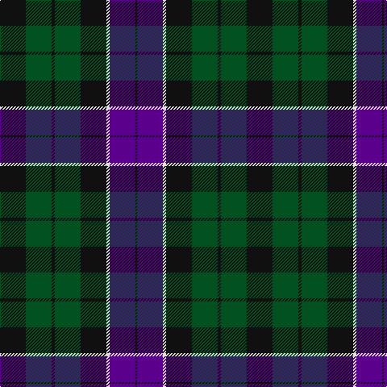

In pattern [KBWKGKGK](/patterns/kbwkgkgk/).

This was sourced from register-of-tartans.  It is a [8 stripes tartan](/stripes/stripes8/).

Original link https://www.tartanregister.gov.uk/tartanDetails.aspx?ref=4237

## Register references

External register numbers recorded for this tartan.

- Scottish Register of Tartans: [4237](https://www.tartanregister.gov.uk/tartanDetails.aspx?ref=4237)
- Scottish Tartans World Register: 1074

## Thread count
K/32 G32 K4 G32 K32 LN4 P32 K/2

## Palette
Each colour and its ΔE from the base-6 reference it is a variant of.

| Colour | Shade | Base | ΔE (OKLab) |
|---|---|---|---|
| G | <code style="background-color:#005020;">#005020</code> `#005020` | G <code style="background-color:#006100;">#006100</code> | 0.07 |
| K | <code style="background-color:#101010;">#101010</code> `#101010` | K <code style="background-color:#000000;">#000000</code> | 0.17 |
| LN | <code style="background-color:#E0E0E0;">#E0E0E0</code> `#E0E0E0` | W <code style="background-color:#F7F7F7;">#F7F7F7</code> | 0.07 |
| P | <code style="background-color:#5A008C;">#5A008C</code> `#5A008C` | B <code style="background-color:#2A418A;">#2A418A</code> | 0.13 |

# Sample pattern

## Nearest tartans

The nearest existing variants by ΔTartan distance.

1. [Mowat (Clans Originaux)](/setts/s7/b24k3b5k23y2k11g22~b2c2c80-g006818-k101010-ye8c000~x2/) — ΔT 0.67
1. [National Galleries of Scotland](/setts/s7/k7g22k22b6r2b15r2~b1c0070-g006818-k101010-rc80000~x2/) — ΔT 0.88
1. [Dundas #2](/setts/s7/k4b16k12g12r1g2k2~b2c2c80-g006818-k101010-rc80000~x2/) — ΔT 0.89
1. [National Galleries of Scotland Corporate Tartan Tartan Number: 2050. Earliest known date: November 1991 Based on the Black Watch or Government tartan. The three claret stripes represent the three galleries and the colour is that of William Playfair's original colour scheme for the National Gallery. See products available Copyright © Blair Urquhart, Comrie, 2015](/setts/s7/k7g22k22b6r2b15r2~b202060-g006818-k101010-rc80000~x2/) — ΔT 0.92
1. [Mowat](/setts/s7/b26k1b2k18y2g16k16~b2c2c80-g006818-k101010-ye8c000~x2/) — ΔT 1.03
1. [Gunn](/setts/s6/g2b12g1k12g12r2~b1c0070-g006400-k101010-rc80000~x2/) — ΔT 1.06
1. [Swallow Hotels (Corporate)](/setts/s9/k4g21k10r2k10b21k4b4k4~b2c2c80-g408060-k101010-rc80000~x2/) — ΔT 1.06
1. [Argyll Campbell](/setts/s10/k3b17k20g18w4g18k20b18k2b2~b2c4084-g005020-k101010-we0e0e0~x2/) — ΔT 1.09
1. [Blair Clan Tartan Tartan Number: 416. Earliest known date: pre 1963 Described by MacKinlay as a "Modern family sett". See products available Copyright © Blair Urquhart, Comrie, 2015](/setts/s7/b3r1b10k8g10r1g3~b2c2c80-g006818-k101010-rc80000~x4/) — ΔT 1.10
1. [Granger/Grainger (Personal)](/setts/s10/g27k21b12k4b40k4b12k21g27w4~b2c2c80-g006818-k101010-we0e0e0~x2/) — ΔT 1.12

## Neighbour map

Every grey dot is one of 15726 variants placed by the first two principal components of the ΔTartan feature space (44% of its variance). Red is this tartan; blue dots are its nearest — click one to open its page.

<svg viewBox="0 0 640 380" role="img" style="max-width:100%;height:auto;border:1px solid #e0e0e0;border-radius:4px;display:block" xmlns="http://www.w3.org/2000/svg"><image href="/nn/cloud.v1.png" width="640" height="380"/><a href="/setts/s7/b24k3b5k23y2k11g22~b2c2c80-g006818-k101010-ye8c000~x2/"><circle cx="235.3" cy="226.9" r="4" fill="#3465a4"><title>Mowat (Clans Originaux)</title></circle></a><a href="/setts/s7/k7g22k22b6r2b15r2~b1c0070-g006818-k101010-rc80000~x2/"><circle cx="215.2" cy="224.7" r="4" fill="#3465a4"><title>National Galleries of Scotland</title></circle></a><a href="/setts/s7/k4b16k12g12r1g2k2~b2c2c80-g006818-k101010-rc80000~x2/"><circle cx="245.5" cy="210.6" r="4" fill="#3465a4"><title>Dundas #2</title></circle></a><a href="/setts/s7/k7g22k22b6r2b15r2~b202060-g006818-k101010-rc80000~x2/"><circle cx="226.7" cy="228.9" r="4" fill="#3465a4"><title>National Galleries of Scotland Corporate Tartan Tartan Number: 2050. Earliest known date: November 1991 Based on the Black Watch or Government tartan. The three claret stripes represent the three galleries and the colour is that of William Playfair's original colour scheme for the National Gallery. See products available Copyright © Blair Urquhart, Comrie, 2015</title></circle></a><a href="/setts/s7/b26k1b2k18y2g16k16~b2c2c80-g006818-k101010-ye8c000~x2/"><circle cx="283.9" cy="194.1" r="4" fill="#3465a4"><title>Mowat</title></circle></a><a href="/setts/s6/g2b12g1k12g12r2~b1c0070-g006400-k101010-rc80000~x2/"><circle cx="213.2" cy="226.2" r="4" fill="#3465a4"><title>Gunn</title></circle></a><a href="/setts/s9/k4g21k10r2k10b21k4b4k4~b2c2c80-g408060-k101010-rc80000~x2/"><circle cx="221.6" cy="209.5" r="4" fill="#3465a4"><title>Swallow Hotels (Corporate)</title></circle></a><a href="/setts/s10/k3b17k20g18w4g18k20b18k2b2~b2c4084-g005020-k101010-we0e0e0~x2/"><circle cx="199.7" cy="227.7" r="4" fill="#3465a4"><title>Argyll Campbell</title></circle></a><a href="/setts/s7/b3r1b10k8g10r1g3~b2c2c80-g006818-k101010-rc80000~x4/"><circle cx="207.5" cy="229.0" r="4" fill="#3465a4"><title>Blair Clan Tartan Tartan Number: 416. Earliest known date: pre 1963 Described by MacKinlay as a &quot;Modern family sett&quot;. See products available Copyright © Blair Urquhart, Comrie, 2015</title></circle></a><a href="/setts/s10/g27k21b12k4b40k4b12k21g27w4~b2c2c80-g006818-k101010-we0e0e0~x2/"><circle cx="193.9" cy="219.4" r="4" fill="#3465a4"><title>Granger/Grainger (Personal)</title></circle></a><circle cx="246.3" cy="217.4" r="5" fill="#c00000"/></svg>

ID: /setts/s8/k16g16k2g16k16w2b16k1~b5a008c-g005020-k101010-we0e0e0~x2/
