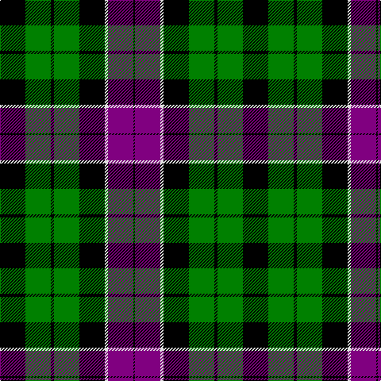

This page is one **sett** — a single exact thread-count. It belongs to the [tartan](/tartans/k16g16k2g16k16ln2p16k1/)
(the same proportion at any scale), whose colour order is pattern [KBWKGKGK](/stripes/kbwkgkgk/).

Sourced from weddslist.  It is a [8 stripe tartan](/stripes/stripes8/).

Original link http://www.weddslist.com/cgi-bin/tartans/pg.pl?source=sts

## Also known as

This cloth is also recorded under:

- Unidentified #36
- Unnamed No 33

2 attestations — the source records this cloth was collapsed from (oldest owns this page)

<ul>
<li>undated — Unnamed 6 (weddslist, <a href="http://www.weddslist.com/cgi-bin/tartans/pg.pl?source=sts">record</a>)</li>
<li>undated — Unnamed No 33 (weddslist, <a href="http://www.weddslist.com/cgi-bin/tartans/pg.pl?source=sts">record</a>)</li>
</ul>

## Thread count
K/32 G32 K4 G32 K32 LN4 P32 K/2

## Palette
Each colour and the base-6 reference it is a variant of.

| Colour | Shade | Base |
|---|---|---|
| G | <code style="background-color:#008000;">#008000</code> `oklch(52.0% 0.177 142.5)` <small>#008000</small> | G <code style="background-color:#006100;">#006100</code> |
| K | <code style="background-color:#000000;">#000000</code> `oklch(0.0% 0.000 0.0)` <small>#000000</small> | K <code style="background-color:#000000;">#000000</code> |
| LN | <code style="background-color:#E0E0E0;">#E0E0E0</code> `oklch(90.7% 0.000 89.9)` <small>#E0E0E0</small> | W <code style="background-color:#F7F7F7;">#F7F7F7</code> |
| P | <code style="background-color:#800080;">#800080</code> `oklch(42.1% 0.193 328.4)` <small>#800080</small> | B <code style="background-color:#2A418A;">#2A418A</code> |

# Sample pattern

## Nearest tartans

The nearest existing variants by ΔTartan distance, with this tartan at the top so the swatches line up against it.

ΔTartan

Tartan

Sett

—

<a href="/ttd/edit/#slug=k16g16k2g16k16w2p16k1~x2">Unnamed 6</a> <a class="nn-out" href="/setts/s8/k16g16k2g16k16w2p16k1~x2/" title="open its dictionary page">↗</a>

0.91

<a href="/ttd/edit/#slug=db48k6db10k46ly4k22g43">Mowat</a> <a class="nn-out" href="/setts/s7/db48k6db10k46ly4k22g43/" title="open its dictionary page">↗</a>

1.00

<a href="/ttd/edit/#slug=g21w2g4k17p14k3~x2">Wilson's No 158</a> <a class="nn-out" href="/setts/s6/g21w2g4k17p14k3~x2/" title="open its dictionary page">↗</a>

1.02

<a href="/ttd/edit/#slug=g21ly2g4k16p14k3~x2">Wilson's, No 160</a> <a class="nn-out" href="/setts/s6/g21ly2g4k16p14k3~x2/" title="open its dictionary page">↗</a>

1.08

<a href="/ttd/edit/#slug=o2k14o1k14o14ly2~x2">United Distillers (Corporate)</a> <a class="nn-out" href="/setts/s6/o2k14o1k14o14ly2~x2/" title="open its dictionary page">↗</a>

1.13

<a href="/ttd/edit/#slug=g18t2g4k14p12k3~x2">Wilson's, No 150 &quot;Coburg&quot;</a> <a class="nn-out" href="/setts/s6/g18t2g4k14p12k3~x2/" title="open its dictionary page">↗</a>

1.16

<a href="/ttd/edit/#slug=k3db17k20g18w4g18k20db18k2db2~x2">Argyll, Campbell</a> <a class="nn-out" href="/setts/s10/k3db17k20g18w4g18k20db18k2db2~x2/" title="open its dictionary page">↗</a>

1.19

<a href="/ttd/edit/#slug=dp16w2k16g16k2g16k16g16k2g16k16w2dp16k1~x2">Norwich No.033</a> <a class="nn-out" href="/setts/s14/dp16w2k16g16k2g16k16g16k2g16k16w2dp16k1~x2/" title="open its dictionary page">↗</a>

1.19

<a href="/ttd/edit/#slug=db9k9db9r2k18g12r2g4r2g4~x2">Newlands</a> <a class="nn-out" href="/setts/s10/db9k9db9r2k18g12r2g4r2g4~x2/" title="open its dictionary page">↗</a>

1.22

<a href="/setts/s8/db10k6t1g6k1~x2/">Unnamed, No 115</a>

1.22

<a href="/ttd/edit/#slug=dg21lb2dg4k17dp14k3">Graham W</a> <a class="nn-out" href="/setts/s6/dg21lb2dg4k17dp14k3/" title="open its dictionary page">↗</a>

## Neighbour map

Every grey dot is one of 14299 variants placed by the first two principal components of the ΔTartan feature space (44% of its variance). Red is this tartan; blue dots are its nearest — click one to open its page.

<svg viewBox="0 0 640 380" role="img" style="max-width:100%;height:auto;border:1px solid #e0e0e0;border-radius:4px;display:block" xmlns="http://www.w3.org/2000/svg"><image href="/nn/cloud.v1.png" width="640" height="380"/><a href="/setts/s7/db48k6db10k46ly4k22g43/"><circle cx="192.7" cy="210.3" r="4" fill="#3465a4"><title>Mowat</title></circle></a><a href="/setts/s6/g21w2g4k17p14k3~x2/"><circle cx="182.0" cy="208.3" r="4" fill="#3465a4"><title>Wilson's No 158</title></circle></a><a href="/setts/s6/g21ly2g4k16p14k3~x2/"><circle cx="185.1" cy="208.6" r="4" fill="#3465a4"><title>Wilson's, No 160</title></circle></a><a href="/setts/s6/o2k14o1k14o14ly2~x2/"><circle cx="179.9" cy="192.8" r="4" fill="#3465a4"><title>United Distillers (Corporate)</title></circle></a><a href="/setts/s6/g18t2g4k14p12k3~x2/"><circle cx="177.0" cy="220.1" r="4" fill="#3465a4"><title>Wilson's, No 150 &quot;Coburg&quot;</title></circle></a><a href="/setts/s10/k3db17k20g18w4g18k20db18k2db2~x2/"><circle cx="145.6" cy="206.3" r="4" fill="#3465a4"><title>Argyll, Campbell</title></circle></a><a href="/setts/s14/dp16w2k16g16k2g16k16g16k2g16k16w2dp16k1~x2/"><circle cx="184.2" cy="175.4" r="4" fill="#3465a4"><title>Norwich No.033</title></circle></a><a href="/setts/s10/db9k9db9r2k18g12r2g4r2g4~x2/"><circle cx="149.9" cy="201.9" r="4" fill="#3465a4"><title>Newlands</title></circle></a><a href="/setts/s8/db10k6t1g6k1~x2/"><circle cx="146.4" cy="214.8" r="4" fill="#3465a4"><title>Unnamed, No 115</title></circle></a><a href="/setts/s6/dg21lb2dg4k17dp14k3/"><circle cx="200.8" cy="222.2" r="4" fill="#3465a4"><title>Graham W</title></circle></a><circle cx="192.6" cy="193.2" r="5" fill="#c00000"/></svg>

ID: /setts/s8/k16g16k2g16k16w2p16k1~x2/
