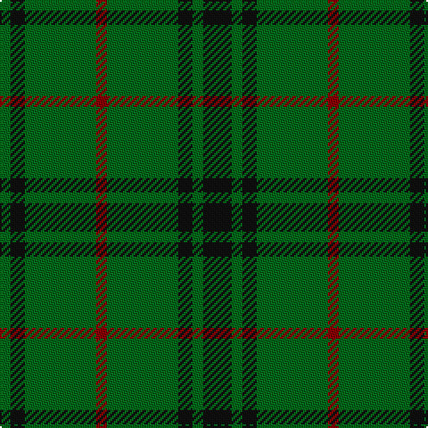

In pattern [GKGRGKGK](/patterns/gkgrgkgk/).

This was sourced from tartans-authority.  It is a [8 stripes tartan](/stripes/stripes8/).

Original link http://www.tartansauthority.com/tartan-ferret/display/1088/

## Thread count
G/6 K8 G40 DR6 G40 K8 G6 K/16

## Palette
Each colour and its ΔE from the base-6 reference it is a variant of.

| Colour | Shade | Base | ΔE (OKLab) |
|---|---|---|---|
| DR | <code style="background-color:#880000;">#880000</code> `#880000` | R <code style="background-color:#CC0000;">#CC0000</code> | 0.15 |
| G | <code style="background-color:#006818;">#006818</code> `#006818` | G <code style="background-color:#006100;">#006100</code> | 0.02 |
| K | <code style="background-color:#101010;">#101010</code> `#101010` | K <code style="background-color:#000000;">#000000</code> | 0.17 |

# Sample pattern

## Nearest tartans

The nearest existing variants by ΔTartan distance.

1. [Crow (Name)](/setts/s8/g8b8g24b16g12b16g72y8-b2c2c80-g006818-yfccc00/) — ΔT 1.07
1. [Northcroft (Personal)](/setts/s7/g48r8g6k28g10r4g20-g006818-k101010-rc80000/) — ΔT 1.21
1. [MacArthur (Highland Society)](/setts/s6/g36y4g36k8g4k30-g006818-k101010-yd8b000/) — ΔT 1.26
1. [Leeds, University of (Dance)](/setts/s8/g68r8g8r8g8r24g40w10-g006818-ra00048-we0e0e0/) — ΔT 1.42
1. [Green Watch](/setts/s7/g40r4g4r4y8g4r4-g004c00-ra0783c-yb0b0b0/) — ΔT 1.52
1. [Highland Spring (1997)](/setts/s6/g46r6g14r6g46b14-b440044-g006818-rc80000/) — ΔT 1.54
1. [Justus Hunting (Personal)](/setts/s7/b12g48r12g12y12g48b12-b1c0070-g285800-r880000-yd09800/) — ΔT 1.58
1. [Ayrton Laoch Family Tartan Tartan Number: 1330. Earliest known date: 1982 The weaving and wearing of this tartan is 'Restricted'. This is not a legal definition and is applied by the Scottish Tartans Society irrespective of Design Patent or Copyright, in the spirit of a gentlemans agreement. Interested parties should contact the person listed under 'Source:' in this document. See products available Copyright © Blair Urquhart, Comrie, 2015](/setts/s10/r4g24y4g24b4g4b4g4b8r4-b2c2c80-g006818-rc80000-ye8c000/) — ΔT 1.59
1. [McCall, F W (Personal)](/setts/s9/g12b4r2g30r6b2g30ga12r2-b441800-g003c14-ga289c18-r9c68a4/) — ΔT 1.62
1. [Angle, Green (Fashion)](/setts/s7/y4g44k24g12y4g4y4-g285800-k101010-ybc8c00/) — ΔT 1.62

## Neighbour map

Every grey dot is one of 15726 variants placed by the first two principal components of the ΔTartan feature space (44% of its variance). Red is this tartan; blue dots are its nearest — click one to open its page.

<svg viewBox="0 0 640 380" role="img" style="max-width:100%;height:auto;border:1px solid #e0e0e0;border-radius:4px;display:block" xmlns="http://www.w3.org/2000/svg"><image href="/nn/cloud.v1.png" width="640" height="380"/><a href="/setts/s8/g8b8g24b16g12b16g72y8-b2c2c80-g006818-yfccc00/"><circle cx="438.3" cy="231.5" r="4" fill="#3465a4"><title>Crow (Name)</title></circle></a><a href="/setts/s7/g48r8g6k28g10r4g20-g006818-k101010-rc80000/"><circle cx="417.3" cy="236.4" r="4" fill="#3465a4"><title>Northcroft (Personal)</title></circle></a><a href="/setts/s6/g36y4g36k8g4k30-g006818-k101010-yd8b000/"><circle cx="385.7" cy="262.1" r="4" fill="#3465a4"><title>MacArthur (Highland Society)</title></circle></a><a href="/setts/s8/g68r8g8r8g8r24g40w10-g006818-ra00048-we0e0e0/"><circle cx="430.5" cy="224.9" r="4" fill="#3465a4"><title>Leeds, University of (Dance)</title></circle></a><a href="/setts/s7/g40r4g4r4y8g4r4-g004c00-ra0783c-yb0b0b0/"><circle cx="458.3" cy="211.4" r="4" fill="#3465a4"><title>Green Watch</title></circle></a><a href="/setts/s6/g46r6g14r6g46b14-b440044-g006818-rc80000/"><circle cx="517.1" cy="274.6" r="4" fill="#3465a4"><title>Highland Spring (1997)</title></circle></a><a href="/setts/s7/b12g48r12g12y12g48b12-b1c0070-g285800-r880000-yd09800/"><circle cx="360.1" cy="268.2" r="4" fill="#3465a4"><title>Justus Hunting (Personal)</title></circle></a><a href="/setts/s10/r4g24y4g24b4g4b4g4b8r4-b2c2c80-g006818-rc80000-ye8c000/"><circle cx="356.9" cy="216.4" r="4" fill="#3465a4"><title>Ayrton Laoch Family Tartan Tartan Number: 1330. Earliest known date: 1982 The weaving and wearing of this tartan is 'Restricted'. This is not a legal definition and is applied by the Scottish Tartans Society irrespective of Design Patent or Copyright, in the spirit of a gentlemans agreement. Interested parties should contact the person listed under 'Source:' in this document. See products available Copyright © Blair Urquhart, Comrie, 2015</title></circle></a><a href="/setts/s9/g12b4r2g30r6b2g30ga12r2-b441800-g003c14-ga289c18-r9c68a4/"><circle cx="451.2" cy="200.9" r="4" fill="#3465a4"><title>McCall, F W (Personal)</title></circle></a><a href="/setts/s7/y4g44k24g12y4g4y4-g285800-k101010-ybc8c00/"><circle cx="395.4" cy="222.6" r="4" fill="#3465a4"><title>Angle, Green (Fashion)</title></circle></a><circle cx="435.5" cy="258.9" r="5" fill="#c00000"/></svg>

ID: /setts/s8/k16g6k8g40r6g40k8g6-g006818-k101010-r880000/
