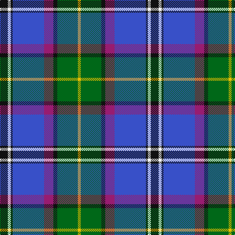

In pattern [KWKBRKGY](/patterns/kwkbrkgy/).

This was sourced from tartans-authority.  It is a [8 stripes tartan](/stripes/stripes8/).

Original link http://www.tartansauthority.com/tartan-ferret/display/5938/

## Thread count
K/16 W6 K4 B64 P19 K8 G42 Y/6

## Palette
Each colour and its ΔE from the base-6 reference it is a variant of.

| Colour | Shade | Base | ΔE (OKLab) |
|---|---|---|---|
| B | <code style="background-color:#3850C8;">#3850C8</code> `#3850C8` | B <code style="background-color:#2A418A;">#2A418A</code> | 0.11 |
| G | <code style="background-color:#006818;">#006818</code> `#006818` | G <code style="background-color:#006100;">#006100</code> | 0.02 |
| K | <code style="background-color:#101010;">#101010</code> `#101010` | K <code style="background-color:#000000;">#000000</code> | 0.17 |
| P | <code style="background-color:#981C70;">#981C70</code> `#981C70` | R <code style="background-color:#CC0000;">#CC0000</code> | 0.17 |
| W | <code style="background-color:#F8F8F8;">#F8F8F8</code> `#F8F8F8` | W <code style="background-color:#F7F7F7;">#F7F7F7</code> | 0.00 |
| Y | <code style="background-color:#E8C000;">#E8C000</code> `#E8C000` | Y <code style="background-color:#F2BF00;">#F2BF00</code> | 0.02 |

# Sample pattern

## Nearest tartans

The nearest existing variants by ΔTartan distance.

1. [Alexander of Menstry](/setts/s8/g10r4g4r18k18y18b60w10-b2c2c80-g006818-k101010-r9c68a4-wf8f8f8-ya0a0a0/) — ΔT 0.57
1. [Moran (Virgin Islands) (Personal)](/setts/s9/b6r6k10g16w4k26ba26b52w6-b2888c4-ba2c2c80-g006818-k101010-rc80000-we0e0e0/) — ΔT 0.60
1. [St Columba](/setts/s8/b60ba5w4r12g42bb12ba5bb12-b000050-ba5480b0-bb800080-g008000-r906030-we0e0e0/) — ΔT 0.63
1. [Moran (Coilessan) (Personal)](/setts/s8/b52ba26k26w4g16k10r6b6-b2888c4-ba2c2c80-g006818-k101010-rc80000-we0e0e0/) — ΔT 0.67
1. [GYL (Personal)](/setts/s10/b28r3w3r3w3r3b14k12ba38y8-b2c2c80-ba2888c4-k101010-rc80000-we0e0e0-ye8c000/) — ΔT 0.80
1. [Air Force](/setts/s11/w8b16r6b50k26g8ba58b6ba16b4r6-b304080-ba5480b0-g30a010-k000000-r802040-we0e0e0/) — ΔT 0.81
1. [Yule (Name)](/setts/s9/b2y6g28w4ba44w4bb28b6y2-b5c8ca8-ba2c2c80-bb780078-g006818-we0e0e0-ye8c000/) — ΔT 0.87
1. [Ogilvie of Inverquharity or Ohio](/setts/s9/b64w24r32b12y4g4ya12b4g40-b1c0070-g006818-rc80000-we0e0e0-yd09800-ya48a4c0/) — ΔT 0.89
1. [Ohio District Tartan Tartan Number: 651. Earliest known date: 1984 Design is based on the colours of Ohio's flag and state seal. The widths of the stripes in each colour are based on the date Ohio was admitted to the Union. The tartan first went on display at the Ohio Scottish Games in June 1983. See products available Copyright © Blair Urquhart, Comrie, 2015](/setts/s9/b32w12r16b6y2g2ba6b2g18-b2c2c80-ba2888c4-g006818-rc80000-we0e0e0-ye8c000/) — ΔT 0.90
1. [US Forces (Thurso) Regimental Tartan Tartan Number: 549. Earliest known date: 1986 Originally listed as MacNeil, this sett was identified by Ken Dalgliesh, weaver in Selkirk, in 1999. See products available Copyright © Blair Urquhart, Comrie, 2015](/setts/s7/b70r4k32y4ba50w4ba12-b202060-ba2888c4-k101010-rc80000-we0e0e0-ye8c000/) — ΔT 0.90

## Neighbour map

Every grey dot is one of 15726 variants placed by the first two principal components of the ΔTartan feature space (44% of its variance). Red is this tartan; blue dots are its nearest — click one to open its page.

<svg viewBox="0 0 640 380" role="img" style="max-width:100%;height:auto;border:1px solid #e0e0e0;border-radius:4px;display:block" xmlns="http://www.w3.org/2000/svg"><image href="/nn/cloud.v1.png" width="640" height="380"/><a href="/setts/s8/g10r4g4r18k18y18b60w10-b2c2c80-g006818-k101010-r9c68a4-wf8f8f8-ya0a0a0/"><circle cx="158.9" cy="133.2" r="4" fill="#3465a4"><title>Alexander of Menstry</title></circle></a><a href="/setts/s9/b6r6k10g16w4k26ba26b52w6-b2888c4-ba2c2c80-g006818-k101010-rc80000-we0e0e0/"><circle cx="127.6" cy="142.7" r="4" fill="#3465a4"><title>Moran (Virgin Islands) (Personal)</title></circle></a><a href="/setts/s8/b60ba5w4r12g42bb12ba5bb12-b000050-ba5480b0-bb800080-g008000-r906030-we0e0e0/"><circle cx="160.8" cy="135.1" r="4" fill="#3465a4"><title>St Columba</title></circle></a><a href="/setts/s8/b52ba26k26w4g16k10r6b6-b2888c4-ba2c2c80-g006818-k101010-rc80000-we0e0e0/"><circle cx="145.4" cy="156.3" r="4" fill="#3465a4"><title>Moran (Coilessan) (Personal)</title></circle></a><a href="/setts/s10/b28r3w3r3w3r3b14k12ba38y8-b2c2c80-ba2888c4-k101010-rc80000-we0e0e0-ye8c000/"><circle cx="138.6" cy="125.7" r="4" fill="#3465a4"><title>GYL (Personal)</title></circle></a><a href="/setts/s11/w8b16r6b50k26g8ba58b6ba16b4r6-b304080-ba5480b0-g30a010-k000000-r802040-we0e0e0/"><circle cx="155.5" cy="127.1" r="4" fill="#3465a4"><title>Air Force</title></circle></a><a href="/setts/s9/b2y6g28w4ba44w4bb28b6y2-b5c8ca8-ba2c2c80-bb780078-g006818-we0e0e0-ye8c000/"><circle cx="160.4" cy="109.4" r="4" fill="#3465a4"><title>Yule (Name)</title></circle></a><a href="/setts/s9/b64w24r32b12y4g4ya12b4g40-b1c0070-g006818-rc80000-we0e0e0-yd09800-ya48a4c0/"><circle cx="143.3" cy="125.0" r="4" fill="#3465a4"><title>Ogilvie of Inverquharity or Ohio</title></circle></a><a href="/setts/s9/b32w12r16b6y2g2ba6b2g18-b2c2c80-ba2888c4-g006818-rc80000-we0e0e0-ye8c000/"><circle cx="156.3" cy="127.4" r="4" fill="#3465a4"><title>Ohio District Tartan Tartan Number: 651. Earliest known date: 1984 Design is based on the colours of Ohio's flag and state seal. The widths of the stripes in each colour are based on the date Ohio was admitted to the Union. The tartan first went on display at the Ohio Scottish Games in June 1983. See products available Copyright © Blair Urquhart, Comrie, 2015</title></circle></a><a href="/setts/s7/b70r4k32y4ba50w4ba12-b202060-ba2888c4-k101010-rc80000-we0e0e0-ye8c000/"><circle cx="193.2" cy="143.5" r="4" fill="#3465a4"><title>US Forces (Thurso) Regimental Tartan Tartan Number: 549. Earliest known date: 1986 Originally listed as MacNeil, this sett was identified by Ken Dalgliesh, weaver in Selkirk, in 1999. See products available Copyright © Blair Urquhart, Comrie, 2015</title></circle></a><circle cx="156.2" cy="133.1" r="5" fill="#c00000"/></svg>

ID: /setts/s8/k16w6k4b64r19k8g42y6-b3850c8-g006818-k101010-r981c70-wf8f8f8-ye8c000/
