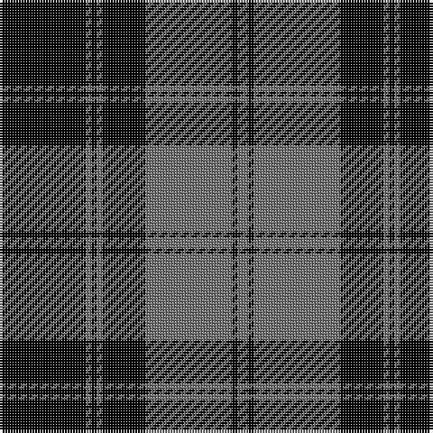

This page is one **sett** — a single exact thread-count. It belongs to the [tartan](/tartans/k16y1k1y1k8y16k1y2/)
(the same proportion at any scale), whose colour order is pattern [GKGKGKGK](/stripes/gkgkgkgk/).

Sourced from weddslist.  It is a [8 stripe tartan](/stripes/stripes8/).

Original link http://www.weddslist.com/cgi-bin/tartans/pg.pl?source=rb

3 attestations — the source records this cloth was collapsed from (oldest owns this page)

<ul>
<li>undated — Douglas VS (weddslist, <a href="http://www.weddslist.com/cgi-bin/tartans/pg.pl?source=rb">record</a>)</li>
<li>undated — Douglas VS (weddslist, <a href="http://www.weddslist.com/cgi-bin/tartans/pg.pl?source=tinsel">record</a>)</li>
<li>undated — Douglas VS (weddslist, <a href="http://www.weddslist.com/cgi-bin/tartans/pg.pl?source=x">record</a>)</li>
</ul>

## Thread count
K/32 N2 K2 N2 K16 N32 K2 N/4

## Palette

Palette: <strong>Ingles Buchan</strong> <small style="color:#888">(1 of 2 colours)</small>
<table><thead><tr><th>Colour</th><th>Threads</th><th>Shade</th><th>Base</th><th>OKLCh</th></tr></thead><tbody><tr><td>K/</td><td style="text-align:right;font-variant-numeric:tabular-nums">32</td><td><code style="background-color:#000000;">#000000</code> <small style="color:#888">#000000</small></td><td>K <code style="background-color:#000000;">#000000</code></td><td><small style="color:#888">oklch(0.0% 0.000 0.0)</small></td></tr><tr><td>N</td><td style="text-align:right;font-variant-numeric:tabular-nums">2</td><td><code style="background-color:#707070;">#707070</code> <small style="color:#888">#707070</small></td><td>G <code style="background-color:#006100;">#006100</code></td><td><small style="color:#888">oklch(54.5% 0.000 89.9)</small></td></tr><tr><td>K</td><td style="text-align:right;font-variant-numeric:tabular-nums">2</td><td><code style="background-color:#000000;">#000000</code> <small style="color:#888">#000000</small></td><td>K <code style="background-color:#000000;">#000000</code></td><td><small style="color:#888">oklch(0.0% 0.000 0.0)</small></td></tr><tr><td>N</td><td style="text-align:right;font-variant-numeric:tabular-nums">2</td><td><code style="background-color:#707070;">#707070</code> <small style="color:#888">#707070</small></td><td>G <code style="background-color:#006100;">#006100</code></td><td><small style="color:#888">oklch(54.5% 0.000 89.9)</small></td></tr><tr><td>K</td><td style="text-align:right;font-variant-numeric:tabular-nums">16</td><td><code style="background-color:#000000;">#000000</code> <small style="color:#888">#000000</small></td><td>K <code style="background-color:#000000;">#000000</code></td><td><small style="color:#888">oklch(0.0% 0.000 0.0)</small></td></tr><tr><td>N</td><td style="text-align:right;font-variant-numeric:tabular-nums">32</td><td><code style="background-color:#707070;">#707070</code> <small style="color:#888">#707070</small></td><td>G <code style="background-color:#006100;">#006100</code></td><td><small style="color:#888">oklch(54.5% 0.000 89.9)</small></td></tr><tr><td>K</td><td style="text-align:right;font-variant-numeric:tabular-nums">2</td><td><code style="background-color:#000000;">#000000</code> <small style="color:#888">#000000</small></td><td>K <code style="background-color:#000000;">#000000</code></td><td><small style="color:#888">oklch(0.0% 0.000 0.0)</small></td></tr><tr><td>N/</td><td style="text-align:right;font-variant-numeric:tabular-nums">4</td><td><code style="background-color:#707070;">#707070</code> <small style="color:#888">#707070</small></td><td>G <code style="background-color:#006100;">#006100</code></td><td><small style="color:#888">oklch(54.5% 0.000 89.9)</small></td></tr></tbody></table>

# Sample pattern

## Nearest tartans

The nearest existing variants by ΔTartan distance, with this tartan at the top so the swatches line up against it.

ΔTartan

Tartan

Sett

—

<a href="/ttd/edit/#slug=k16y1k1y1k8y16k1y2~x2">Douglas VS</a> <a class="nn-out" href="/setts/s8/k16y1k1y1k8y16k1y2~x2/" title="open its dictionary page">↗</a>

1.02

<a href="/ttd/edit/#slug=k13y1k1y1k4y10ly1y1~x6">West Point</a> <a class="nn-out" href="/setts/s8/k13y1k1y1k4y10ly1y1~x6/" title="open its dictionary page">↗</a>

1.03

<a href="/ttd/edit/#slug=k39y3k3y3k14y28r3~x2">Moffat</a> <a class="nn-out" href="/setts/s7/k39y3k3y3k14y28r3~x2/" title="open its dictionary page">↗</a>

1.08

<a href="/ttd/edit/#slug=k24o11k5o5k1o2~x4">Black Isle Corporate Tartan Tartan Number: 6183. Earliest known date: 15/07/2003 Designed for Black Isle Pewter Limited by Robert Howarth Guibal of Black Isle Pewter. Threadcount taken from a Marton Mills swatch book. See products available Copyright © Blair Urquhart, Comrie, 2015</a> <a class="nn-out" href="/setts/s6/k24o11k5o5k1o2~x4/" title="open its dictionary page">↗</a>

1.20

<a href="/ttd/edit/#slug=n34k7n12k40n3k4lt3~x2">TACC</a> <a class="nn-out" href="/setts/s7/n34k7n12k40n3k4lt3~x2/" title="open its dictionary page">↗</a>

1.21

<a href="/ttd/edit/#slug=k9lr1k2lr1k4lr9k1lr2~x4">Douglas, Grey Clan/Family Tartan Tartan Number: 7211. Earliest known date: 01/01/1842 The design comes from the Vestiarium Scoticum (1842). The authors, the Sobieski Stuart brothers, enjoyed a popular following among the Scottish gentry in the early Victorian era, and in the spirit of the times, added mystery, romance and some spurious historical documentation to the subject of tartan. Of the better known tartans, the book offers some minor variation, but in other cases it provides the only recorded version of many tartans in use today. (Estimated threadcount; Original STA ref: 1127) See products available Copyright © Blair Urquhart, Comrie, 2015</a> <a class="nn-out" href="/setts/s8/k9lr1k2lr1k4lr9k1lr2~x4/" title="open its dictionary page">↗</a>

1.45

<a href="/ttd/edit/#slug=k4w14k2w4k8w3k30w2k4w4~x2">Kinloch Anderson Black and White</a> <a class="nn-out" href="/setts/s10/k4w14k2w4k8w3k30w2k4w4~x2/" title="open its dictionary page">↗</a>

1.49

<a href="/ttd/edit/#slug=k1o2k7o11k18ly2k1~x2">DDB Canada (Fashion)</a> <a class="nn-out" href="/setts/s7/k1o2k7o11k18ly2k1~x2/" title="open its dictionary page">↗</a>

1.50

<a href="/ttd/edit/#slug=k39o3k3o3k14o28r3~x2">Moffat (1984)</a> <a class="nn-out" href="/setts/s7/k39o3k3o3k14o28r3~x2/" title="open its dictionary page">↗</a>

1.54

<a href="/ttd/edit/#slug=k10o1k2o1k4o10k1o2~x4">Douglas, Grey (Vestiarium Scoticum)</a> <a class="nn-out" href="/setts/s8/k10o1k2o1k4o10k1o2~x4/" title="open its dictionary page">↗</a>

1.55

<a href="/ttd/edit/#slug=k4y2k27y2k8y31k2y4~x2">Watertown Library Assoc. (Corporate)</a> <a class="nn-out" href="/setts/s8/k4y2k27y2k8y31k2y4~x2/" title="open its dictionary page">↗</a>

## Neighbour map

Every grey dot is one of 14359 variants placed by the first two principal components of the ΔTartan feature space (44% of its variance). Red is this tartan; blue dots are its nearest — click one to open its page.

<svg viewBox="0 0 640 380" role="img" style="max-width:100%;height:auto;border:1px solid #e0e0e0;border-radius:4px;display:block" xmlns="http://www.w3.org/2000/svg"><image href="/nn/cloud.v1.png" width="640" height="380"/><a href="/setts/s8/k13y1k1y1k4y10ly1y1~x6/"><circle cx="337.2" cy="181.5" r="4" fill="#3465a4"><title>West Point</title></circle></a><a href="/setts/s7/k39y3k3y3k14y28r3~x2/"><circle cx="356.9" cy="197.0" r="4" fill="#3465a4"><title>Moffat</title></circle></a><a href="/setts/s6/k24o11k5o5k1o2~x4/"><circle cx="411.6" cy="200.5" r="4" fill="#3465a4"><title>Black Isle Corporate Tartan Tartan Number: 6183. Earliest known date: 15/07/2003 Designed for Black Isle Pewter Limited by Robert Howarth Guibal of Black Isle Pewter. Threadcount taken from a Marton Mills swatch book. See products available Copyright © Blair Urquhart, Comrie, 2015</title></circle></a><a href="/setts/s7/n34k7n12k40n3k4lt3~x2/"><circle cx="314.4" cy="199.8" r="4" fill="#3465a4"><title>TACC</title></circle></a><a href="/setts/s8/k9lr1k2lr1k4lr9k1lr2~x4/"><circle cx="326.6" cy="224.6" r="4" fill="#3465a4"><title>Douglas, Grey Clan/Family Tartan Tartan Number: 7211. Earliest known date: 01/01/1842 The design comes from the Vestiarium Scoticum (1842). The authors, the Sobieski Stuart brothers, enjoyed a popular following among the Scottish gentry in the early Victorian era, and in the spirit of the times, added mystery, romance and some spurious historical documentation to the subject of tartan. Of the better known tartans, the book offers some minor variation, but in other cases it provides the only recorded version of many tartans in use today. (Estimated threadcount; Original STA ref: 1127) See products available Copyright © Blair Urquhart, Comrie, 2015</title></circle></a><a href="/setts/s10/k4w14k2w4k8w3k30w2k4w4~x2/"><circle cx="383.3" cy="175.7" r="4" fill="#3465a4"><title>Kinloch Anderson Black and White</title></circle></a><a href="/setts/s7/k1o2k7o11k18ly2k1~x2/"><circle cx="394.7" cy="188.3" r="4" fill="#3465a4"><title>DDB Canada (Fashion)</title></circle></a><a href="/setts/s7/k39o3k3o3k14o28r3~x2/"><circle cx="372.2" cy="198.9" r="4" fill="#3465a4"><title>Moffat (1984)</title></circle></a><a href="/setts/s8/k10o1k2o1k4o10k1o2~x4/"><circle cx="353.0" cy="222.3" r="4" fill="#3465a4"><title>Douglas, Grey (Vestiarium Scoticum)</title></circle></a><a href="/setts/s8/k4y2k27y2k8y31k2y4~x2/"><circle cx="361.3" cy="193.9" r="4" fill="#3465a4"><title>Watertown Library Assoc. (Corporate)</title></circle></a><circle cx="379.8" cy="197.9" r="5" fill="#c00000"/></svg>

ID: /setts/s8/k16y1k1y1k8y16k1y2~x2/
