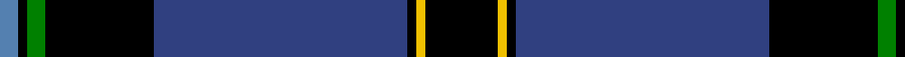
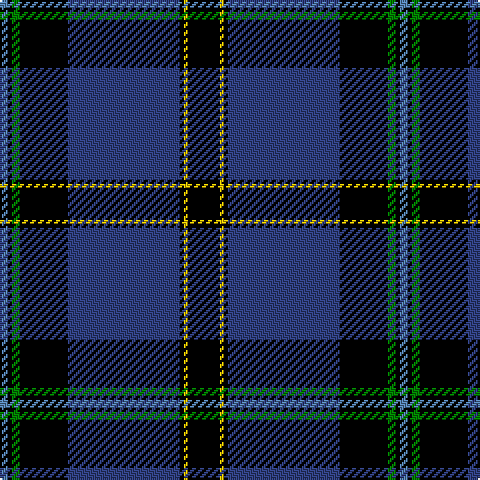

In pattern [BKGKBKYK](/patterns/bkgkbkyk/).

This was sourced from weddslist.  It is a [8 stripes tartan](/stripes/stripes8/).

Original link http://www.weddslist.com/cgi-bin/tartans/pg.pl?source=sts

## Thread count
Ba/4 K2 G4 K24 B56 K2 Y2 K/16

## Palette
Each colour and its ΔE from the base-6 reference it is a variant of.

| Colour | Shade | Base | ΔE (OKLab) |
|---|---|---|---|
| B | <code style="background-color:#304080;">#304080</code> `#304080` | B <code style="background-color:#2A418A;">#2A418A</code> | 0.02 |
| Ba | <code style="background-color:#5480B0;">#5480B0</code> `#5480B0` | B <code style="background-color:#2A418A;">#2A418A</code> | 0.19 |
| G | <code style="background-color:#008000;">#008000</code> `#008000` | G <code style="background-color:#006100;">#006100</code> | 0.10 |
| K | <code style="background-color:#000000;">#000000</code> `#000000` | K <code style="background-color:#000000;">#000000</code> | 0.00 |
| Y | <code style="background-color:#F0C000;">#F0C000</code> `#F0C000` | Y <code style="background-color:#F2BF00;">#F2BF00</code> | 0.00 |

# Sample pattern

## Nearest tartans

The nearest existing variants by ΔTartan distance.

1. [Dunlop](/setts/s8/k6r2k60w2b56r2b2w6-b304080-k000000-rc00000-we0e0e0/) — ΔT 1.03
1. [Binder Wedding (Personal)](/setts/s8/g2b2k2b60k60w4b10y2-b2c4084-g649848-k101010-wffffff-yffe600/) — ΔT 1.07
1. [Hill (Name)](/setts/s9/w6b4y2b4y2b62k56r4k4-b2c2c80-k101010-rc80000-we0e0e0-ye8c000/) — ΔT 1.07
1. [Tartan Day SA](/setts/s8/w4k80g44y6g4r6g4w4-g004600-k000037-rbd0000-wffffff-yffa000/) — ΔT 1.08
1. [Fuller of Hopewell (Personal)](/setts/s7/k4w4k72b80w4r4y4-b2c2c80-k101010-rc80050-wf8f8f8-yec8048/) — ΔT 1.15
1. [Niagara Region](/setts/s12/w8k4w4k56b8k4b4r2k26r2g26r4-b1c4c60-g003c28-k00002c-rc80000-we0e0e0/) — ΔT 1.15
1. [Genet, Edmond Charles 'Citizen' (Personal)](/setts/s7/r8k18g18ka80r4ka4w4-g285800-k101010-ka000028-rdc0000-wf8f8f8/) — ΔT 1.18
1. [Home, or Hume](/setts/s8/k56r2k4r2k16b48g4b6-b304080-g008000-k000000-rc00000/) — ΔT 1.22
1. [MacLaurin, of Brioch](/setts/s7/b72k20g6r6g12k2y4-b304080-g008000-k000000-rc00000-yf0c000/) — ΔT 1.24
1. [Italian American](/setts/s9/r4k2w6k2b40k80g10w6r3-b0d3b6d-g004b11-k101010-r92130d-wffffff/) — ΔT 1.25

## Neighbour map

Every grey dot is one of 15726 variants placed by the first two principal components of the ΔTartan feature space (44% of its variance). Red is this tartan; blue dots are its nearest — click one to open its page.

<svg viewBox="0 0 640 380" role="img" style="max-width:100%;height:auto;border:1px solid #e0e0e0;border-radius:4px;display:block" xmlns="http://www.w3.org/2000/svg"><image href="/nn/cloud.v1.png" width="640" height="380"/><a href="/setts/s8/k6r2k60w2b56r2b2w6-b304080-k000000-rc00000-we0e0e0/"><circle cx="324.5" cy="125.4" r="4" fill="#3465a4"><title>Dunlop</title></circle></a><a href="/setts/s8/g2b2k2b60k60w4b10y2-b2c4084-g649848-k101010-wffffff-yffe600/"><circle cx="353.2" cy="123.2" r="4" fill="#3465a4"><title>Binder Wedding (Personal)</title></circle></a><a href="/setts/s9/w6b4y2b4y2b62k56r4k4-b2c2c80-k101010-rc80000-we0e0e0-ye8c000/"><circle cx="332.2" cy="109.8" r="4" fill="#3465a4"><title>Hill (Name)</title></circle></a><a href="/setts/s8/w4k80g44y6g4r6g4w4-g004600-k000037-rbd0000-wffffff-yffa000/"><circle cx="297.5" cy="126.2" r="4" fill="#3465a4"><title>Tartan Day SA</title></circle></a><a href="/setts/s7/k4w4k72b80w4r4y4-b2c2c80-k101010-rc80050-wf8f8f8-yec8048/"><circle cx="308.5" cy="140.8" r="4" fill="#3465a4"><title>Fuller of Hopewell (Personal)</title></circle></a><a href="/setts/s12/w8k4w4k56b8k4b4r2k26r2g26r4-b1c4c60-g003c28-k00002c-rc80000-we0e0e0/"><circle cx="334.3" cy="107.8" r="4" fill="#3465a4"><title>Niagara Region</title></circle></a><a href="/setts/s7/r8k18g18ka80r4ka4w4-g285800-k101010-ka000028-rdc0000-wf8f8f8/"><circle cx="354.2" cy="143.9" r="4" fill="#3465a4"><title>Genet, Edmond Charles 'Citizen' (Personal)</title></circle></a><a href="/setts/s8/k56r2k4r2k16b48g4b6-b304080-g008000-k000000-rc00000/"><circle cx="364.1" cy="149.9" r="4" fill="#3465a4"><title>Home, or Hume</title></circle></a><a href="/setts/s7/b72k20g6r6g12k2y4-b304080-g008000-k000000-rc00000-yf0c000/"><circle cx="348.6" cy="113.5" r="4" fill="#3465a4"><title>MacLaurin, of Brioch</title></circle></a><a href="/setts/s9/r4k2w6k2b40k80g10w6r3-b0d3b6d-g004b11-k101010-r92130d-wffffff/"><circle cx="336.1" cy="94.1" r="4" fill="#3465a4"><title>Italian American</title></circle></a><circle cx="315.2" cy="123.1" r="5" fill="#c00000"/></svg>

ID: /setts/s8/k16y2k2b56k24g4k2ba4-b304080-ba5480b0-g008000-k000000-yf0c000/
