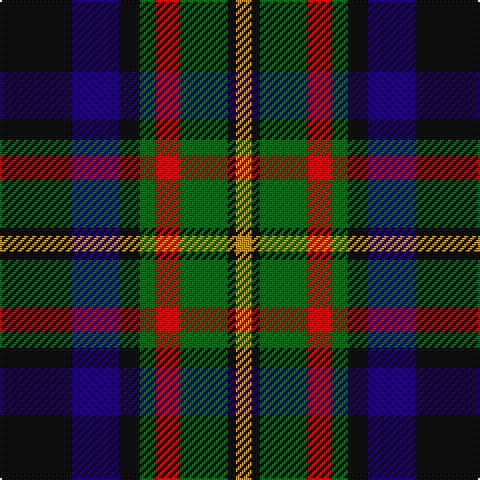

In pattern [KBKGRGKY](/stripes/kbkgrgky/).

This was sourced from register-of-tartans.  It is a [8 stripe tartan](/stripes/stripes8/).

Original link https://www.tartanregister.gov.uk/tartanDetails.aspx?ref=2620

## Attestations

This cloth appears in 2 source records; the oldest owns this page.

- 01/01/2002 — MacLeish (register-of-tartans, [record](https://www.tartanregister.gov.uk/tartanDetails.aspx?ref=2620))
- pre 2002 — MacLeish (Clan) (tartans-authority, [record](http://www.tartansauthority.com/tartan-ferret/display/5689/))

## Register references

External register numbers recorded for this tartan.

- Scottish Register of Tartans: [2620](https://www.tartanregister.gov.uk/tartanDetails.aspx?ref=2620)
- Scottish Tartans Authority (ITI): 5689

## Thread count
K/36 DB24 K10 G8 R12 G24 K4 DY/8

## Palette
Each colour and its ΔE from the base-6 reference it is a variant of.

| Colour | Shade | Base | ΔE (OKLab) |
|---|---|---|---|
| DB | <code style="background-color:#1C0070;">#1C0070</code> `#1C0070` | B <code style="background-color:#2A418A;">#2A418A</code> | 0.14 |
| DY | <code style="background-color:#BC8C00;">#BC8C00</code> `#BC8C00` | Y <code style="background-color:#F2BF00;">#F2BF00</code> | 0.16 |
| G | <code style="background-color:#006818;">#006818</code> `#006818` | G <code style="background-color:#006100;">#006100</code> | 0.02 |
| K | <code style="background-color:#101010;">#101010</code> `#101010` | K <code style="background-color:#000000;">#000000</code> | 0.17 |
| R | <code style="background-color:#C80000;">#C80000</code> `#C80000` | R <code style="background-color:#CC0000;">#CC0000</code> | 0.01 |

# Sample pattern

## Nearest tartans

The nearest existing variants by ΔTartan distance.

1. [Scottish Tartan Society](/setts/s9/db20k10lo3k7r4k7lo3k8g20~x2/) — ΔT 0.65
1. [Williamson/Smart (Personal)](/setts/s8/db10o3db10r3k21g20k15r3~x2/) — ΔT 0.71
1. [Rose Hunting](/setts/s6/k4w1g10k10db10r2~x4/) — ΔT 0.79
1. [Rose Hunting Clan Tartan Tartan Number: 1226. Earliest known date: 1831 First recorded in James Logan's, 'The Scottish Gael' in 1831. See products available Copyright © Blair Urquhart, Comrie, 2015](/setts/s6/k4w1g10k10db10r2~x2/) — ΔT 0.82
1. [Brodie Hunting](/setts/s7/r2k8lo1k8g8t8r2~x4/) — ΔT 0.85
1. [Wilson's No.176](/setts/s8/k8t3g13dp12ly2~x2/) — ΔT 0.90
1. [Campbell of Cawdor Clan Tartan Tartan Number: 2. Earliest known date: 1798 Campbell of Cawdor is one of Wilson's variations based on the military sett. It was originally a numbered pattern, acquiring the name 'Argyle' in 1798 and 'Argylle' in 1819. It is not until W. and A. Smith's work of 1850 that the full title is given, 'Campbell of Cawdor'. This sett is authorized by the present Clan Chief, MacCailien Mor. See products available Copyright © Blair Urquhart, Comrie, 2015](/setts/s7/r2k1db8k8g8k1y2~x2/) — ΔT 0.93
1. [MacLaren #2](/setts/s7/dp9k7dg5r4dg7k1ly1~x2/) — ΔT 0.93
1. [MacKean Green (Personal)](/setts/s8/k4db8k4db8r2g10k1w2~x2/) — ΔT 0.94
1. [Unidentified No 79](/setts/s6/r5dg18ly2k14t5k4~x2/) — ΔT 0.95

## Neighbour map

Every grey dot is one of 14299 variants placed by the first two principal components of the ΔTartan feature space (44% of its variance). Red is this tartan; blue dots are its nearest — click one to open its page.

<svg viewBox="0 0 640 380" role="img" style="max-width:100%;height:auto;border:1px solid #e0e0e0;border-radius:4px;display:block" xmlns="http://www.w3.org/2000/svg"><image href="/nn/cloud.v1.png" width="640" height="380"/><a href="/setts/s9/db20k10lo3k7r4k7lo3k8g20~x2/"><circle cx="149.1" cy="217.1" r="4" fill="#3465a4"><title>Scottish Tartan Society</title></circle></a><a href="/setts/s8/db10o3db10r3k21g20k15r3~x2/"><circle cx="173.0" cy="224.2" r="4" fill="#3465a4"><title>Williamson/Smart (Personal)</title></circle></a><a href="/setts/s6/k4w1g10k10db10r2~x4/"><circle cx="166.4" cy="223.2" r="4" fill="#3465a4"><title>Rose Hunting</title></circle></a><a href="/setts/s6/k4w1g10k10db10r2~x2/"><circle cx="170.6" cy="225.3" r="4" fill="#3465a4"><title>Rose Hunting Clan Tartan Tartan Number: 1226. Earliest known date: 1831 First recorded in James Logan's, 'The Scottish Gael' in 1831. See products available Copyright © Blair Urquhart, Comrie, 2015</title></circle></a><a href="/setts/s7/r2k8lo1k8g8t8r2~x4/"><circle cx="155.6" cy="218.0" r="4" fill="#3465a4"><title>Brodie Hunting</title></circle></a><a href="/setts/s8/k8t3g13dp12ly2~x2/"><circle cx="150.4" cy="233.5" r="4" fill="#3465a4"><title>Wilson's No.176</title></circle></a><a href="/setts/s7/r2k1db8k8g8k1y2~x2/"><circle cx="149.5" cy="215.8" r="4" fill="#3465a4"><title>Campbell of Cawdor Clan Tartan Tartan Number: 2. Earliest known date: 1798 Campbell of Cawdor is one of Wilson's variations based on the military sett. It was originally a numbered pattern, acquiring the name 'Argyle' in 1798 and 'Argylle' in 1819. It is not until W. and A. Smith's work of 1850 that the full title is given, 'Campbell of Cawdor'. This sett is authorized by the present Clan Chief, MacCailien Mor. See products available Copyright © Blair Urquhart, Comrie, 2015</title></circle></a><a href="/setts/s7/dp9k7dg5r4dg7k1ly1~x2/"><circle cx="143.7" cy="220.9" r="4" fill="#3465a4"><title>MacLaren #2</title></circle></a><a href="/setts/s8/k4db8k4db8r2g10k1w2~x2/"><circle cx="167.5" cy="207.4" r="4" fill="#3465a4"><title>MacKean Green (Personal)</title></circle></a><a href="/setts/s6/r5dg18ly2k14t5k4~x2/"><circle cx="171.0" cy="212.9" r="4" fill="#3465a4"><title>Unidentified No 79</title></circle></a><circle cx="156.5" cy="209.9" r="5" fill="#c00000"/></svg>

ID: /setts/s8/k18db12k5g4r6g12k2lo4~x2/
