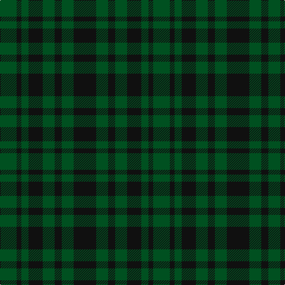

In pattern [GKGKGKGK](/patterns/gkgkgkgk/).

This was sourced from register-of-tartans.  It is a [8 stripes tartan](/stripes/stripes8/).

Original link https://www.tartanregister.gov.uk/tartanDetails.aspx?ref=2928

## Thread count
G/28 K8 G12 K24 G20 K12 G20 K/38

## Palette
Each colour and its ΔE from the base-6 reference it is a variant of.

| Colour | Shade | Base | ΔE (OKLab) |
|---|---|---|---|
| G | <code style="background-color:#005020;">#005020</code> `#005020` | G <code style="background-color:#006100;">#006100</code> | 0.07 |
| K | <code style="background-color:#101010;">#101010</code> `#101010` | K <code style="background-color:#000000;">#000000</code> | 0.17 |

# Sample pattern

## Nearest tartans

The nearest existing variants by ΔTartan distance.

1. [Unidentified No 63](/setts/s7/k3g4k1g4k3b4k1x2~b2c4084-g005020-k101010/) — ΔT 1.98
1. [Highland Grey](/setts/s6/b4g4b1g4b4g1x4~b2c2c80-g006818/) — ΔT 2.03
1. [Holman](/setts/s10/g18k10g13k9r3k9g25k16g9b3x2~b304080-g003000-k000030-rc00000/) — ΔT 2.23
1. [McCanna NW (Olympia, USA) Hunting (Personal)](/setts/s7/g1k1ga1k1ga1g4k1x14~g603311-ga006400-k101010/) — ΔT 2.30
1. [Guildry of Stirling](/setts/s10/g18k3g3k3g3k21ga2k21g21k4x2~g005014-ga3c6838-k101010/) — ΔT 2.31
1. [Unidentified #29](/setts/s5/k5g14k16b12g4x2~b080848-g005020-k101010/) — ΔT 2.32
1. [McCanna NW Htg (Personal)](/setts/s7/g1k1ga1k1ga1g4k1x10~g604000-ga285800-k101010/) — ΔT 2.36
1. [McCormick, Keith (Personal)](/setts/s8/g1k6g3k1g3k4b5k1x4~b2c2c80-g006818-k101010/) — ΔT 2.36
1. [Black Watch (variation)](/setts/s6/k5g23k18b21k33b3x2~b202060-g006818-k101010/) — ΔT 2.37
1. [Green Highland, The (Fashion)](/setts/s6/b2g15ba3b7g7b2x4~b000088-ba381c0c-g004800/) — ΔT 2.40

## Neighbour map

Every grey dot is one of 15726 variants placed by the first two principal components of the ΔTartan feature space (44% of its variance). Red is this tartan; blue dots are its nearest — click one to open its page.

<svg viewBox="0 0 640 380" role="img" style="max-width:100%;height:auto;border:1px solid #e0e0e0;border-radius:4px;display:block" xmlns="http://www.w3.org/2000/svg"><image href="/nn/cloud.v1.png" width="640" height="380"/><a href="/setts/s7/k3g4k1g4k3b4k1x2~b2c4084-g005020-k101010/"><circle cx="232.8" cy="334.8" r="4" fill="#3465a4"><title>Unidentified No 63</title></circle></a><a href="/setts/s6/b4g4b1g4b4g1x4~b2c2c80-g006818/"><circle cx="316.3" cy="346.4" r="4" fill="#3465a4"><title>Highland Grey</title></circle></a><a href="/setts/s10/g18k10g13k9r3k9g25k16g9b3x2~b304080-g003000-k000030-rc00000/"><circle cx="352.0" cy="274.8" r="4" fill="#3465a4"><title>Holman</title></circle></a><a href="/setts/s7/g1k1ga1k1ga1g4k1x14~g603311-ga006400-k101010/"><circle cx="316.2" cy="297.7" r="4" fill="#3465a4"><title>McCanna NW (Olympia, USA) Hunting (Personal)</title></circle></a><a href="/setts/s10/g18k3g3k3g3k21ga2k21g21k4x2~g005014-ga3c6838-k101010/"><circle cx="399.8" cy="251.2" r="4" fill="#3465a4"><title>Guildry of Stirling</title></circle></a><a href="/setts/s5/k5g14k16b12g4x2~b080848-g005020-k101010/"><circle cx="262.0" cy="353.2" r="4" fill="#3465a4"><title>Unidentified #29</title></circle></a><a href="/setts/s7/g1k1ga1k1ga1g4k1x10~g604000-ga285800-k101010/"><circle cx="327.4" cy="303.5" r="4" fill="#3465a4"><title>McCanna NW Htg (Personal)</title></circle></a><a href="/setts/s8/g1k6g3k1g3k4b5k1x4~b2c2c80-g006818-k101010/"><circle cx="271.2" cy="281.7" r="4" fill="#3465a4"><title>McCormick, Keith (Personal)</title></circle></a><a href="/setts/s6/k5g23k18b21k33b3x2~b202060-g006818-k101010/"><circle cx="344.2" cy="283.1" r="4" fill="#3465a4"><title>Black Watch (variation)</title></circle></a><a href="/setts/s6/b2g15ba3b7g7b2x4~b000088-ba381c0c-g004800/"><circle cx="386.5" cy="284.9" r="4" fill="#3465a4"><title>Green Highland, The (Fashion)</title></circle></a><circle cx="355.9" cy="349.1" r="5" fill="#c00000"/></svg>

ID: /setts/s8/k19g10k6g10k12g6k4g14x2~g005020-k101010/
