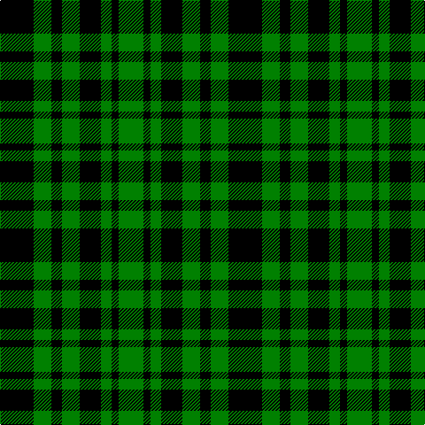

In pattern [GKGKGKGK](/stripes/gkgkgkgk/).

This was sourced from weddslist.  It is a [8 stripe tartan](/stripes/stripes8/).

Original link http://www.weddslist.com/cgi-bin/tartans/pg.pl?source=sts

## Also known as

This cloth is also recorded under:

- Menzies, Green

## Thread count
K/38 G20 K12 G20 K24 G12 K8 G/28

## Palette
Each colour and the base-6 reference it is a variant of.

| Colour | Shade | Base |
|---|---|---|
| G | <code style="background-color:#008000;">#008000</code> `oklch(52.0% 0.177 142.5)` <small>#008000</small> | G <code style="background-color:#006100;">#006100</code> |
| K | <code style="background-color:#000000;">#000000</code> `oklch(0.0% 0.000 0.0)` <small>#000000</small> | K <code style="background-color:#000000;">#000000</code> |

# Sample pattern

## Nearest tartans

The nearest existing variants by ΔTartan distance.

1. [Wallace Hunting](/setts/s6/g8k8ly1k8g8k1~x4/) — ΔT 1.54
1. [Norwich No.039 (Mackinlay)](/setts/s12/g4k4g4k1g4k4g4k1g4k4g4ly1~x2/) — ΔT 1.59
1. [Unnamed, No 63](/setts/s7/k3g4k1g4k3db4k1~x2/) — ΔT 1.97
1. [Innes, Georgina (Portrait)](/setts/s6/g7k1g7t1k6t1~x4/) — ΔT 2.10
1. [MacArthur-Fox](/setts/s5/k19g8k10g31r3/) — ΔT 2.16
1. [MacArthur](/setts/s5/k32g6k12g30ly3/) — ΔT 2.20
1. [Innes](/setts/s6/g7k1g7t1k6t1~x2/) — ΔT 2.21
1. [Keith McCormick (Personal)](/setts/s8/k1db5k4g3k1g3k6g1~x4/) — ΔT 2.23
1. [Norwich No.063](/setts/s12/db4k3g4k1g4k3g4k1g4k3db4k1~x2/) — ΔT 2.26
1. [MacArthur](/setts/s5/k9g3k3g12ly2~x4/) — ΔT 2.27

## Neighbour map

Every grey dot is one of 14299 variants placed by the first two principal components of the ΔTartan feature space (44% of its variance). Red is this tartan; blue dots are its nearest — click one to open its page.

<svg viewBox="0 0 640 380" role="img" style="max-width:100%;height:auto;border:1px solid #e0e0e0;border-radius:4px;display:block" xmlns="http://www.w3.org/2000/svg"><image href="/nn/cloud.v1.png" width="640" height="380"/><a href="/setts/s6/g8k8ly1k8g8k1~x4/"><circle cx="265.3" cy="268.1" r="4" fill="#3465a4"><title>Wallace Hunting</title></circle></a><a href="/setts/s12/g4k4g4k1g4k4g4k1g4k4g4ly1~x2/"><circle cx="252.4" cy="287.3" r="4" fill="#3465a4"><title>Norwich No.039 (Mackinlay)</title></circle></a><a href="/setts/s7/k3g4k1g4k3db4k1~x2/"><circle cx="140.2" cy="296.9" r="4" fill="#3465a4"><title>Unnamed, No 63</title></circle></a><a href="/setts/s6/g7k1g7t1k6t1~x4/"><circle cx="310.9" cy="255.7" r="4" fill="#3465a4"><title>Innes, Georgina (Portrait)</title></circle></a><a href="/setts/s5/k19g8k10g31r3/"><circle cx="294.6" cy="248.4" r="4" fill="#3465a4"><title>MacArthur-Fox</title></circle></a><a href="/setts/s5/k32g6k12g30ly3/"><circle cx="292.6" cy="244.9" r="4" fill="#3465a4"><title>MacArthur</title></circle></a><a href="/setts/s6/g7k1g7t1k6t1~x2/"><circle cx="298.4" cy="249.9" r="4" fill="#3465a4"><title>Innes</title></circle></a><a href="/setts/s8/k1db5k4g3k1g3k6g1~x4/"><circle cx="226.3" cy="263.8" r="4" fill="#3465a4"><title>Keith McCormick (Personal)</title></circle></a><a href="/setts/s12/db4k3g4k1g4k3g4k1g4k3db4k1~x2/"><circle cx="152.7" cy="284.8" r="4" fill="#3465a4"><title>Norwich No.063</title></circle></a><a href="/setts/s5/k9g3k3g12ly2~x4/"><circle cx="282.5" cy="278.4" r="4" fill="#3465a4"><title>MacArthur</title></circle></a><circle cx="245.8" cy="303.4" r="5" fill="#c00000"/></svg>

ID: /setts/s8/k19g10k6g10k12g6k4g14~x2/
