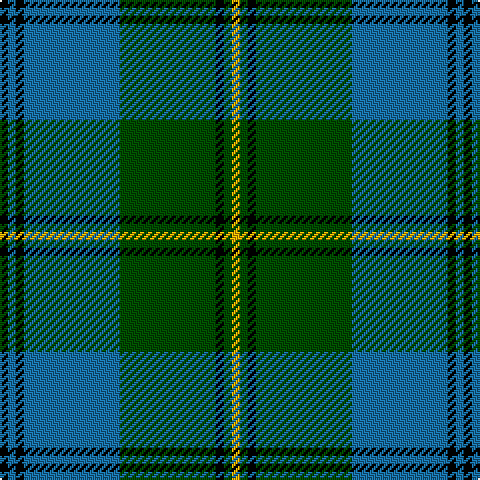

In pattern [KBKBGKGY](/patterns/kbkbgkgy/).

This was sourced from register-of-tartans.  It is a [8 stripes tartan](/stripes/stripes8/).

Original link https://www.tartanregister.gov.uk/tartanDetails.aspx?ref=5081

## Thread count
K/4 Ba4 K4 Ba48 G48 K4 G4 Y/4

## Palette
Each colour and its ΔE from the base-6 reference it is a variant of.

| Colour | Shade | Base | ΔE (OKLab) |
|---|---|---|---|
| B | <code style="background-color:#1474B4;">#1474B4</code> `#1474B4` | B <code style="background-color:#2A418A;">#2A418A</code> | 0.15 |
| Ba | <code style="background-color:#1870A4;">#1870A4</code> `#1870A4` | B <code style="background-color:#2A418A;">#2A418A</code> | 0.13 |
| DB | <code style="background-color:#00008C;">#00008C</code> `#00008C` | B <code style="background-color:#2A418A;">#2A418A</code> | 0.13 |
| DBa | <code style="background-color:#2C2C80;">#2C2C80</code> `#2C2C80` | B <code style="background-color:#2A418A;">#2A418A</code> | 0.06 |
| G | <code style="background-color:#004C00;">#004C00</code> `#004C00` | G <code style="background-color:#006100;">#006100</code> | 0.07 |
| K | <code style="background-color:#000000;">#000000</code> `#000000` | K <code style="background-color:#000000;">#000000</code> | 0.00 |
| Y | <code style="background-color:#FCB000;">#FCB000</code> `#FCB000` | Y <code style="background-color:#F2BF00;">#F2BF00</code> | 0.04 |

# Sample pattern

## Nearest tartans

The nearest existing variants by ΔTartan distance.

1. [Banff Centennial (Commemorative)](/setts/s8/k1b1k1b7g8k1g1y1~b1870a4-g004c00-k000000-yfcb000~x4/) — ΔT 0.95
1. [Rowan](/setts/s9/b1k1b8y1g12y1b8k1b1~b304080-g008000-k000000-yf0c000~x2/) — ΔT 1.06
1. [Tennessee State (US State)](/setts/s10/r2b12w1b1g1r1g7b1g12w1~b2c2c80-g006818-rc80000-we0e0e0~x4/) — ΔT 1.07
1. [MacOrrell Family Tartan Tartan Number: 672. Earliest known date: Date unknown The MacOrrell tartan has similarities with the MacDonald, Lord of the Isles sett, which may point a connection with the name MacDonnell or MacDonald. The name Orr was used by a sept of the MacGregors and also of the Campbells of Argyll, suggesting that the root of the name originated in the Lochaber and Argyll districts. There is an undated sample of the tartan in the cloth archive of the Scottish Tartans Society. See products available Copyright © Blair Urquhart, Comrie, 2015](/setts/s9/b5y2b17g14w1g1w1g4y2~b2c2c80-g006818-we0e0e0-ye8c000~x2/) — ΔT 1.08
1. [St. Andrew Society, Sao Paulo (Corp)](/setts/s6/b5w3b36g38y5g5~b2c2c80-g006818-we0e0e0-ye8c000~x2/) — ΔT 1.11
1. [Tennessee State American District Tartan Tartan Number: 3067. Earliest known date: 1999 Official state tartan recorded at the Grandfather Mountain Highland Games, 1999. This ties in with the tartan displayed on the Tennessee Highland Game website. Colour choice explained as follows: Green for Agriculture; Blue for the Smoky Mountains; Purple for the State Flower the Iris; Red for Sacrifices of Veterans and Pioneers of the Volunteer State; White to symbolize the 3 Grand Divisions of the State of Tennessee. See products available Copyright © Blair Urquhart, Comrie, 2015](/setts/s10/r2b12w1b1g1r1g7b1g12w1~b1c0070-g006818-rc80000-we0e0e0~x4/) — ΔT 1.11
1. [MacOrrell](/setts/s9/b5y2b17g14w1g1w1g4y2~b304080-g008000-we0e0e0-yf0c000~x2/) — ΔT 1.16
1. [Dunedin Chapter (Corporate)](/setts/s10/b39g3b3g20k3g20k3g3k20r3~b5c8ca8-g006818-k101010-rc80000~x2/) — ΔT 1.16
1. [St Andrews Links](/setts/s7/b26g4b3g3y2g24r2~b000050-g008000-rc00000-yf0c000~x2/) — ΔT 1.16
1. [MacOrrell](/setts/s9/b10y4b36g28w3g3w3g8y6~b2c2c80-g00781c-we0e0e0-ye8c000/) — ΔT 1.20

## Neighbour map

Every grey dot is one of 15726 variants placed by the first two principal components of the ΔTartan feature space (44% of its variance). Red is this tartan; blue dots are its nearest — click one to open its page.

<svg viewBox="0 0 640 380" role="img" style="max-width:100%;height:auto;border:1px solid #e0e0e0;border-radius:4px;display:block" xmlns="http://www.w3.org/2000/svg"><image href="/nn/cloud.v1.png" width="640" height="380"/><a href="/setts/s8/k1b1k1b7g8k1g1y1~b1870a4-g004c00-k000000-yfcb000~x4/"><circle cx="220.9" cy="194.2" r="4" fill="#3465a4"><title>Banff Centennial (Commemorative)</title></circle></a><a href="/setts/s9/b1k1b8y1g12y1b8k1b1~b304080-g008000-k000000-yf0c000~x2/"><circle cx="294.1" cy="176.5" r="4" fill="#3465a4"><title>Rowan</title></circle></a><a href="/setts/s10/r2b12w1b1g1r1g7b1g12w1~b2c2c80-g006818-rc80000-we0e0e0~x4/"><circle cx="298.3" cy="170.9" r="4" fill="#3465a4"><title>Tennessee State (US State)</title></circle></a><a href="/setts/s9/b5y2b17g14w1g1w1g4y2~b2c2c80-g006818-we0e0e0-ye8c000~x2/"><circle cx="278.3" cy="159.9" r="4" fill="#3465a4"><title>MacOrrell Family Tartan Tartan Number: 672. Earliest known date: Date unknown The MacOrrell tartan has similarities with the MacDonald, Lord of the Isles sett, which may point a connection with the name MacDonnell or MacDonald. The name Orr was used by a sept of the MacGregors and also of the Campbells of Argyll, suggesting that the root of the name originated in the Lochaber and Argyll districts. There is an undated sample of the tartan in the cloth archive of the Scottish Tartans Society. See products available Copyright © Blair Urquhart, Comrie, 2015</title></circle></a><a href="/setts/s6/b5w3b36g38y5g5~b2c2c80-g006818-we0e0e0-ye8c000~x2/"><circle cx="290.8" cy="200.5" r="4" fill="#3465a4"><title>St. Andrew Society, Sao Paulo (Corp)</title></circle></a><a href="/setts/s10/r2b12w1b1g1r1g7b1g12w1~b1c0070-g006818-rc80000-we0e0e0~x4/"><circle cx="283.0" cy="166.3" r="4" fill="#3465a4"><title>Tennessee State American District Tartan Tartan Number: 3067. Earliest known date: 1999 Official state tartan recorded at the Grandfather Mountain Highland Games, 1999. This ties in with the tartan displayed on the Tennessee Highland Game website. Colour choice explained as follows: Green for Agriculture; Blue for the Smoky Mountains; Purple for the State Flower the Iris; Red for Sacrifices of Veterans and Pioneers of the Volunteer State; White to symbolize the 3 Grand Divisions of the State of Tennessee. See products available Copyright © Blair Urquhart, Comrie, 2015</title></circle></a><a href="/setts/s9/b5y2b17g14w1g1w1g4y2~b304080-g008000-we0e0e0-yf0c000~x2/"><circle cx="279.3" cy="159.7" r="4" fill="#3465a4"><title>MacOrrell</title></circle></a><a href="/setts/s10/b39g3b3g20k3g20k3g3k20r3~b5c8ca8-g006818-k101010-rc80000~x2/"><circle cx="228.2" cy="173.3" r="4" fill="#3465a4"><title>Dunedin Chapter (Corporate)</title></circle></a><a href="/setts/s7/b26g4b3g3y2g24r2~b000050-g008000-rc00000-yf0c000~x2/"><circle cx="284.9" cy="183.3" r="4" fill="#3465a4"><title>St Andrews Links</title></circle></a><a href="/setts/s9/b10y4b36g28w3g3w3g8y6~b2c2c80-g00781c-we0e0e0-ye8c000/"><circle cx="239.6" cy="170.5" r="4" fill="#3465a4"><title>MacOrrell</title></circle></a><circle cx="272.3" cy="174.3" r="5" fill="#c00000"/></svg>

ID: /setts/s8/k1b1k1b12g12k1g1y1~b1870a4-g004c00-k000000-yfcb000~x4/
