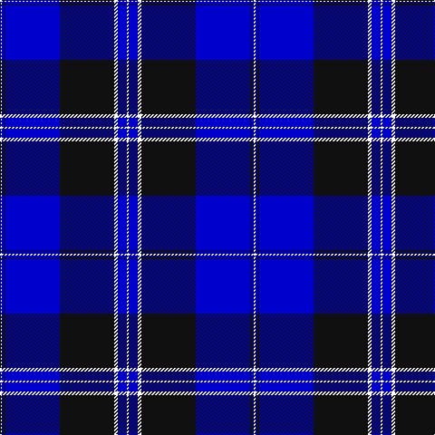

In pattern [KBKBKWBK](/patterns/kbkbkwbk/).

This was sourced from house-of-tartan.  It is a [8 stripes tartan](/stripes/stripes8/).

Original link http://www.house-of-tartan.scotland.net/house/TartanViewjs.asp?colr=Def&tnam=10728

## Thread count
G/2 B2 K2 B60 K60 W4 B10 Y/2

## Palette
Each colour and its ΔE from the base-6 reference it is a variant of.

| Colour | Shade | Base | ΔE (OKLab) |
|---|---|---|---|
| B | <code style="background-color:#0000CD;">#0000CD</code> `#0000CD` | B <code style="background-color:#2A418A;">#2A418A</code> | 0.14 |
| K | <code style="background-color:#101010;">#101010</code> `#101010` | K <code style="background-color:#000000;">#000000</code> | 0.17 |
| LG | <code style="background-color:#86C67C;">#86C67C</code> `#86C67C` | Y <code style="background-color:#F2BF00;">#F2BF00</code> | 0.15 |
| W | <code style="background-color:#FFFFFF;">#FFFFFF</code> `#FFFFFF` | W <code style="background-color:#F7F7F7;">#F7F7F7</code> | 0.02 |

# Sample pattern

## Nearest tartans

The nearest existing variants by ΔTartan distance.

1. [Binder Wedding (Personal)](/setts/s8/g1b1k1b30k30w2b5y1x2~b3850c8-g289c18-k101010-we0e0e0-ydc943c/) — ΔT 1.08
1. [Raith Rovers F.C.](/setts/s8/b6w2g2w3b24r1ba35r2x2~b000050-ba304080-g30a010-rc00000-we0e0e0/) — ΔT 1.29
1. [Chestico](/setts/s7/b20r1b1r1g8k1w3x2~b000080-g005020-k101010-r98481c-wffffff/) — ΔT 1.50
1. [Blue Rust](/setts/s8/b21ba2w1ba2b1r2b1ra6x4~b000088-ba606060-r880000-ra886024-wffffff/) — ΔT 1.51
1. [MacLaurin of Broich (Clan)](/setts/s7/b36k8g3r3g6k1y2x2~b200088-g006818-k101010-r880000-yd09800/) — ΔT 1.58
1. [Wcwm 1105](/setts/s12/b84r3k16y4k4w4k4g20b8k4b8w4~b00008c-g004c00-k000000-r8c0000-wc8c8c8-yc89800/) — ΔT 1.63
1. [Blue Rust (Corporate)](/setts/s8/b21ba2y1ba2b1r2b1ra6x4~b000088-ba606060-r880000-ra886024-yacacac/) — ΔT 1.65
1. [Grahame Laurie Band (Corporate)](/setts/s7/k8y2b6y2k36ba84w7~b780078-ba2c2c80-k101010-we0e0e0-yfccc00/) — ΔT 1.65
1. [NHS Grampian](/setts/s7/b4ba36k16w1b2w1k4x2~b2888c4-ba2c2c80-k101010-wfcfcfc/) — ΔT 1.71
1. [Gemmell Blue (2001) (Personal)](/setts/s10/k5w2k2b5ba48w7bb6w2r2w2x2~b2474e8-ba1c0070-bb3850c8-k101010-r880000-wc0c0c0/) — ΔT 1.72

## Neighbour map

Every grey dot is one of 15726 variants placed by the first two principal components of the ΔTartan feature space (44% of its variance). Red is this tartan; blue dots are its nearest — click one to open its page.

<svg viewBox="0 0 640 380" role="img" style="max-width:100%;height:auto;border:1px solid #e0e0e0;border-radius:4px;display:block" xmlns="http://www.w3.org/2000/svg"><image href="/nn/cloud.v1.png" width="640" height="380"/><a href="/setts/s8/g1b1k1b30k30w2b5y1x2~b3850c8-g289c18-k101010-we0e0e0-ydc943c/"><circle cx="336.8" cy="116.8" r="4" fill="#3465a4"><title>Binder Wedding (Personal)</title></circle></a><a href="/setts/s8/b6w2g2w3b24r1ba35r2x2~b000050-ba304080-g30a010-rc00000-we0e0e0/"><circle cx="311.4" cy="119.2" r="4" fill="#3465a4"><title>Raith Rovers F.C.</title></circle></a><a href="/setts/s7/b20r1b1r1g8k1w3x2~b000080-g005020-k101010-r98481c-wffffff/"><circle cx="328.0" cy="138.8" r="4" fill="#3465a4"><title>Chestico</title></circle></a><a href="/setts/s8/b21ba2w1ba2b1r2b1ra6x4~b000088-ba606060-r880000-ra886024-wffffff/"><circle cx="380.2" cy="132.5" r="4" fill="#3465a4"><title>Blue Rust</title></circle></a><a href="/setts/s7/b36k8g3r3g6k1y2x2~b200088-g006818-k101010-r880000-yd09800/"><circle cx="396.9" cy="129.6" r="4" fill="#3465a4"><title>MacLaurin of Broich (Clan)</title></circle></a><a href="/setts/s12/b84r3k16y4k4w4k4g20b8k4b8w4~b00008c-g004c00-k000000-r8c0000-wc8c8c8-yc89800/"><circle cx="339.4" cy="80.7" r="4" fill="#3465a4"><title>Wcwm 1105</title></circle></a><a href="/setts/s8/b21ba2y1ba2b1r2b1ra6x4~b000088-ba606060-r880000-ra886024-yacacac/"><circle cx="393.1" cy="137.8" r="4" fill="#3465a4"><title>Blue Rust (Corporate)</title></circle></a><a href="/setts/s7/k8y2b6y2k36ba84w7~b780078-ba2c2c80-k101010-we0e0e0-yfccc00/"><circle cx="384.4" cy="116.9" r="4" fill="#3465a4"><title>Grahame Laurie Band (Corporate)</title></circle></a><a href="/setts/s7/b4ba36k16w1b2w1k4x2~b2888c4-ba2c2c80-k101010-wfcfcfc/"><circle cx="392.5" cy="145.3" r="4" fill="#3465a4"><title>NHS Grampian</title></circle></a><a href="/setts/s10/k5w2k2b5ba48w7bb6w2r2w2x2~b2474e8-ba1c0070-bb3850c8-k101010-r880000-wc0c0c0/"><circle cx="321.7" cy="81.6" r="4" fill="#3465a4"><title>Gemmell Blue (2001) (Personal)</title></circle></a><circle cx="337.6" cy="123.9" r="5" fill="#c00000"/></svg>

ID: /setts/s8/k1b5w2ka30b30ka1b1k1x2~b0000cd-k000000-ka101010-wffffff/
