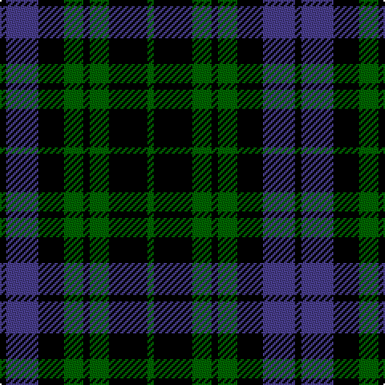

**Bands:** [KBKGKGKG](/stripes/kbkgkgkg/) · **Stripes:** [K DB K G K G K G](/stripes/stripes8/) K DB K G K G K G

This was sourced from register-of-tartans.  It is a [8 band tartan](/bands/bands8/).

Original link https://www.tartanregister.gov.uk/tartanDetails.aspx?ref=10011

## Also known as

This cloth is also recorded under:

- McCormick, Keith
- McCormick, Keith Canadian Personal

## Attestations

This cloth appears in 3 source records; the oldest owns this page.

- 10/02/2009 — Keith McCormick (Personal) (register-of-tartans, [record](https://www.tartanregister.gov.uk/tartanDetails.aspx?ref=10011))
- Apr. 2009 — McCormick, Keith (Personal) (tartans-authority, [record](http://www.tartansauthority.com/tartan-ferret/display/10011/))
- undated — McCormick, Keith (Personal) Canadian Personal Tartan Tartan Number: 10011. Earliest known date: Apr. 2009 A personal tartan for Keith McCormick and his family. Blue represents the Nashwaak River, a well known salmon river in New Brunswick; green is for the forest through which the river flows and since the designer is a retired barrister, his gown is represented by the black. This tartan is for the use of Keith McCormick, his immediate family and those with his permission during his lifetime. After Keith McCormick's death, this tartan can be worn by any of the name McCormick or its variants. This tartan should only be woven by permission of Keith McCormick during his lifetime. After Keith McCormick's death, it may be woven by anyone. See products available Copyright © Blair Urquhart, Comrie, 2015 (house-of-tartan, [record](http://www.house-of-tartan.scotland.net/house/TartanViewjs.asp?colr=Def&tnam=10011))

## Register references

External register numbers recorded for this tartan.

- Scottish Register of Tartans: [10011](https://www.tartanregister.gov.uk/tartanDetails.aspx?ref=10011)

## Thread count
K/4 B20 K16 G12 K4 G12 K24 G/4

## Palette
Each colour and its ΔE from the base-6 reference it is a variant of.

| Colour | Shade | Base | ΔE (OKLab) |
|---|---|---|---|
| B | <code style="background-color:#483D8B;">#483D8B</code> `#483D8B` | B <code style="background-color:#2A418A;">#2A418A</code> | 0.04 |
| G | <code style="background-color:#006400;">#006400</code> `#006400` | G <code style="background-color:#006100;">#006100</code> | 0.01 |
| K | <code style="background-color:#000000;">#000000</code> `#000000` | K <code style="background-color:#000000;">#000000</code> | 0.00 |

# Sample pattern

## Nearest tartans

The nearest existing variants by ΔTartan distance.

1. [Strathspey](/setts/s7/k1g5k5db5k1db1k1~x4/) — ΔT 1.08
1. [Forbes Ancient](/setts/s7/db1k6db6k6g6k1w1~x2/) — ΔT 1.11
1. [Forbes LC](/setts/s7/db1k6db6k6dg6k1lb1/) — ΔT 1.20
1. [MacCallum](/setts/s7/dg8k2lb1dg4k6db6k1~x2/) — ΔT 1.34
1. [Murray](/setts/s6/t3k16g16k16db3t3~x2/) — ΔT 1.39
1. [Campbell, the 42nd](/setts/s6/db6k6db18k18g22k5/) — ΔT 1.40
1. [Wilson's, No 108](/setts/s8/k7g7k1g7k7t1p7k1~x4/) — ΔT 1.40
1. [Forbes LC](/setts/s7/db1k6db6k6dg6k1lr1~x2/) — ΔT 1.40
1. [Forbes LC](/setts/s7/db1k6db6k6dg6k1lr1/) — ΔT 1.40
1. [Sackett (Name)](/setts/s10/k8dg8k1dg8lr1k8o8k1o8k8~x4/) — ΔT 1.40

## Neighbour map

Every grey dot is one of 14299 variants placed by the first two principal components of the ΔTartan feature space (44% of its variance). Red is this tartan; blue dots are its nearest — click one to open its page.

<svg viewBox="0 0 640 380" role="img" style="max-width:100%;height:auto;border:1px solid #e0e0e0;border-radius:4px;display:block" xmlns="http://www.w3.org/2000/svg"><image href="/nn/cloud.v1.png" width="640" height="380"/><a href="/setts/s7/k1g5k5db5k1db1k1~x4/"><circle cx="189.0" cy="257.4" r="4" fill="#3465a4"><title>Strathspey</title></circle></a><a href="/setts/s7/db1k6db6k6g6k1w1~x2/"><circle cx="184.4" cy="240.8" r="4" fill="#3465a4"><title>Forbes Ancient</title></circle></a><a href="/setts/s7/db1k6db6k6dg6k1lb1/"><circle cx="212.6" cy="258.9" r="4" fill="#3465a4"><title>Forbes LC</title></circle></a><a href="/setts/s7/dg8k2lb1dg4k6db6k1~x2/"><circle cx="194.4" cy="245.0" r="4" fill="#3465a4"><title>MacCallum</title></circle></a><a href="/setts/s6/t3k16g16k16db3t3~x2/"><circle cx="234.4" cy="250.9" r="4" fill="#3465a4"><title>Murray</title></circle></a><a href="/setts/s6/db6k6db18k18g22k5/"><circle cx="154.6" cy="285.3" r="4" fill="#3465a4"><title>Campbell, the 42nd</title></circle></a><a href="/setts/s8/k7g7k1g7k7t1p7k1~x4/"><circle cx="163.8" cy="228.5" r="4" fill="#3465a4"><title>Wilson's, No 108</title></circle></a><a href="/setts/s7/db1k6db6k6dg6k1lr1~x2/"><circle cx="222.9" cy="263.8" r="4" fill="#3465a4"><title>Forbes LC</title></circle></a><a href="/setts/s7/db1k6db6k6dg6k1lr1/"><circle cx="222.9" cy="263.8" r="4" fill="#3465a4"><title>Forbes LC</title></circle></a><a href="/setts/s10/k8dg8k1dg8lr1k8o8k1o8k8~x4/"><circle cx="172.6" cy="227.4" r="4" fill="#3465a4"><title>Sackett (Name)</title></circle></a><circle cx="226.3" cy="263.8" r="5" fill="#c00000"/></svg>

ID: /setts/s8/k1db5k4g3k1g3k6g1~x4/
