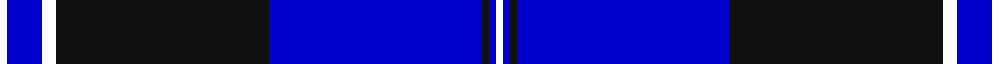

This page is one **sett** — a single exact thread-count. It belongs to the [tartan](/tartans/y1b5w2k30b30k1b1g1/)
(the same proportion at any scale), whose colour order is pattern [KBKBKWBK](/stripes/kbkbkwbk/).

Sourced from house-of-tartan.  It is a [8 stripe tartan](/stripes/stripes8/).

Original link http://www.house-of-tartan.scotland.net/house/TartanViewjs.asp?colr=Def&tnam=10728

## Thread count
Y/2 B10 W4 K60 B60 K2 B2 G/2

## Palette
Each colour and the base-6 reference it is a variant of.

| Colour | Shade | Base |
|---|---|---|
| B | <code style="background-color:#0000CD;">#0000CD</code> `oklch(38.3% 0.266 264.1)` <small>#0000CD</small> | B <code style="background-color:#2A418A;">#2A418A</code> |
| K | <code style="background-color:#101010;">#101010</code> `oklch(17.3% 0.000 89.9)` <small>#101010</small> | K <code style="background-color:#000000;">#000000</code> |
| LG | <code style="background-color:#86C67C;">#86C67C</code> `oklch(76.5% 0.122 141.1)` <small>#86C67C</small> | Y <code style="background-color:#F2BF00;">#F2BF00</code> |
| W | <code style="background-color:#FFFFFF;">#FFFFFF</code> `oklch(100.0% 0.000 89.9)` <small>#FFFFFF</small> | W <code style="background-color:#F7F7F7;">#F7F7F7</code> |

# Sample pattern

## Nearest tartans

The nearest existing variants by ΔTartan distance, with this tartan at the top so the swatches line up against it.

ΔTartan

Tartan

Sett

—

<a href="/ttd/edit/#slug=k1db5w2k30db30k1db1k1~x2">Binder Wedding (Personal) Name Tartan Tartan Number: 10728. Earliest known date: 1 November 2012 Designed to celebrate the wedding of Anna Binder and Michael Slozga and to found a family tartan for their descendants. Anna and Michael are both pipers; they met through a pipe band and share a passion for Scottish traditional pipe band music. Registrant details: Mr Michael Szolga, 252/5 Waldegg, Waldegg, , Austria, 2754 See products available Copyright © Blair Urquhart, Comrie, 2015</a> <a class="nn-out" href="/setts/s8/k1db5w2k30db30k1db1k1~x2/" title="open its dictionary page">↗</a>

1.08

<a href="/ttd/edit/#slug=g1b1k1b30k30w2b5lo1~x2">Binder Wedding (Personal)</a> <a class="nn-out" href="/setts/s8/g1b1k1b30k30w2b5lo1~x2/" title="open its dictionary page">↗</a>

1.29

<a href="/ttd/edit/#slug=db6w2g2w3db24r1db35r2~x2">Raith Rovers F.C.</a> <a class="nn-out" href="/setts/s8/db6w2g2w3db24r1db35r2~x2/" title="open its dictionary page">↗</a>

1.50

<a href="/ttd/edit/#slug=db20o1db1o1dg8k1w3~x2">Chestico</a> <a class="nn-out" href="/setts/s7/db20o1db1o1dg8k1w3~x2/" title="open its dictionary page">↗</a>

1.51

<a href="/ttd/edit/#slug=db21n2w1n2db1r2db1o6~x4">Blue Rust</a> <a class="nn-out" href="/setts/s8/db21n2w1n2db1r2db1o6~x4/" title="open its dictionary page">↗</a>

1.57

<a href="/ttd/edit/#slug=db36k8g3r3g6k1lo2~x2">MacLaurin of Broich (Clan)</a> <a class="nn-out" href="/setts/s7/db36k8g3r3g6k1lo2~x2/" title="open its dictionary page">↗</a>

1.63

<a href="/ttd/edit/#slug=db84r3k16ly4k4lb4k4dg20db8k4db8lb4">Wcwm 1105</a> <a class="nn-out" href="/setts/s12/db84r3k16ly4k4lb4k4dg20db8k4db8lb4/" title="open its dictionary page">↗</a>

1.64

<a href="/ttd/edit/#slug=db21n2lr1n2db1r2db1o6~x4">Blue Rust (Corporate)</a> <a class="nn-out" href="/setts/s8/db21n2lr1n2db1r2db1o6~x4/" title="open its dictionary page">↗</a>

1.65

<a href="/ttd/edit/#slug=k8ly2dp6ly2k36db84w7">Grahame Laurie Band (Corporate)</a> <a class="nn-out" href="/setts/s7/k8ly2dp6ly2k36db84w7/" title="open its dictionary page">↗</a>

1.71

<a href="/ttd/edit/#slug=k4w1t2w1k16db36t4~x2">NHS Grampian</a> <a class="nn-out" href="/setts/s7/k4w1t2w1k16db36t4~x2/" title="open its dictionary page">↗</a>

1.72

<a href="/ttd/edit/#slug=k5lb2k2b5db48lb7b6lb2r2lb2~x2">Gemmell Blue (2001) (Personal)</a> <a class="nn-out" href="/setts/s10/k5lb2k2b5db48lb7b6lb2r2lb2~x2/" title="open its dictionary page">↗</a>

## Neighbour map

Every grey dot is one of 14299 variants placed by the first two principal components of the ΔTartan feature space (44% of its variance). Red is this tartan; blue dots are its nearest — click one to open its page.

<svg viewBox="0 0 640 380" role="img" style="max-width:100%;height:auto;border:1px solid #e0e0e0;border-radius:4px;display:block" xmlns="http://www.w3.org/2000/svg"><image href="/nn/cloud.v1.png" width="640" height="380"/><a href="/setts/s8/g1b1k1b30k30w2b5lo1~x2/"><circle cx="340.4" cy="117.0" r="4" fill="#3465a4"><title>Binder Wedding (Personal)</title></circle></a><a href="/setts/s8/db6w2g2w3db24r1db35r2~x2/"><circle cx="315.0" cy="122.0" r="4" fill="#3465a4"><title>Raith Rovers F.C.</title></circle></a><a href="/setts/s7/db20o1db1o1dg8k1w3~x2/"><circle cx="331.9" cy="138.3" r="4" fill="#3465a4"><title>Chestico</title></circle></a><a href="/setts/s8/db21n2w1n2db1r2db1o6~x4/"><circle cx="383.4" cy="133.4" r="4" fill="#3465a4"><title>Blue Rust</title></circle></a><a href="/setts/s7/db36k8g3r3g6k1lo2~x2/"><circle cx="399.9" cy="132.5" r="4" fill="#3465a4"><title>MacLaurin of Broich (Clan)</title></circle></a><a href="/setts/s12/db84r3k16ly4k4lb4k4dg20db8k4db8lb4/"><circle cx="343.5" cy="82.5" r="4" fill="#3465a4"><title>Wcwm 1105</title></circle></a><a href="/setts/s8/db21n2lr1n2db1r2db1o6~x4/"><circle cx="396.2" cy="140.0" r="4" fill="#3465a4"><title>Blue Rust (Corporate)</title></circle></a><a href="/setts/s7/k8ly2dp6ly2k36db84w7/"><circle cx="387.2" cy="118.1" r="4" fill="#3465a4"><title>Grahame Laurie Band (Corporate)</title></circle></a><a href="/setts/s7/k4w1t2w1k16db36t4~x2/"><circle cx="395.5" cy="147.4" r="4" fill="#3465a4"><title>NHS Grampian</title></circle></a><a href="/setts/s10/k5lb2k2b5db48lb7b6lb2r2lb2~x2/"><circle cx="325.2" cy="82.4" r="4" fill="#3465a4"><title>Gemmell Blue (2001) (Personal)</title></circle></a><circle cx="341.9" cy="125.4" r="5" fill="#c00000"/></svg>

ID: /setts/s8/k1db5w2k30db30k1db1k1~x2/
