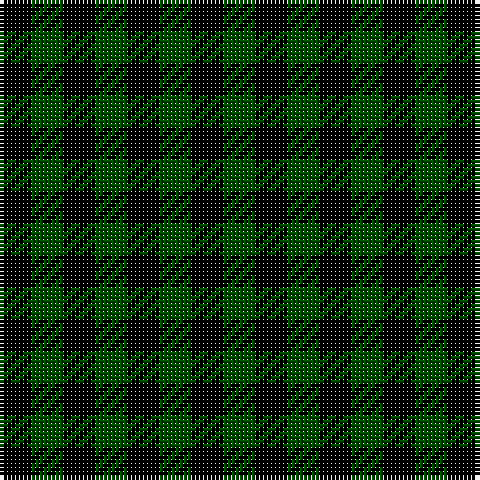

In pattern [GKGKGKGK](/stripes/gkgkgkgk/).

This was sourced from tartans-authority.  It is a [8 stripe tartan](/stripes/stripes8/).

Original link http://www.tartansauthority.com/tartan-ferret/display/3641/

## Thread count
K/8 G8 K8 G8 K8 G8 K8 Ga/8

## Palette
Each colour and the base-6 reference it is a variant of.

| Colour | Shade | Base |
|---|---|---|
| G | <code style="background-color:#004C00;">#004C00</code> `oklch(36.1% 0.123 142.5)` <small>#004C00</small> | G <code style="background-color:#006100;">#006100</code> |
| Ga | <code style="background-color:#004C00;">#004C00</code> `oklch(36.1% 0.123 142.5)` <small>#004C00</small> | G <code style="background-color:#006100;">#006100</code> |
| K | <code style="background-color:#000000;">#000000</code> `oklch(0.0% 0.000 0.0)` <small>#000000</small> | K <code style="background-color:#000000;">#000000</code> |

# Sample pattern

## Nearest tartans

The nearest existing variants by ΔTartan distance, with this tartan at the top so the swatches line up against it.

ΔTartan

Tartan

Sett

—

<a href="/ttd/edit/#slug=k1dg1~x8">Ballindalloch (Estate Check)</a> <a class="nn-out" href="/setts/s8/k1dg1~x8/" title="open its dictionary page">↗</a>

2.55

<a href="/setts/s4/k1g1r1~x8/">Wilson's No.187</a>

2.84

<a href="/ttd/edit/#slug=k1k1r1k1k1k1r1k1r1~x6">Dupplin (Estate Check)</a> <a class="nn-out" href="/setts/s9/k1k1r1k1k1k1r1k1r1~x6/" title="open its dictionary page">↗</a>

2.99

<a href="/ttd/edit/#slug=k8g7db8~x2">Glen Lyon</a> <a class="nn-out" href="/setts/s3/k8g7db8~x2/" title="open its dictionary page">↗</a>

3.03

<a href="/ttd/edit/#slug=dr1o1dr1o1dg1~x8">Ballindalloch Check</a> <a class="nn-out" href="/setts/s5/dr1o1dr1o1dg1~x8/" title="open its dictionary page">↗</a>

3.19

<a href="/ttd/edit/#slug=r1o1k1o1y1o1k1o1y1~x12">Seaforth (Estate Check)</a> <a class="nn-out" href="/setts/s9/r1o1k1o1y1o1k1o1y1~x12/" title="open its dictionary page">↗</a>

3.19

<a href="/ttd/edit/#slug=r1o1k1o1y1o1k1o1y1~x6">Seaforth Estate Check Estate Check Weavers Tartan Tartan Number: 5344. Earliest known date: pre 1990 No details. See products available Copyright © Blair Urquhart, Comrie, 2015</a> <a class="nn-out" href="/setts/s9/r1o1k1o1y1o1k1o1y1~x6/" title="open its dictionary page">↗</a>

3.31

<a href="/ttd/edit/#slug=k11g9dp10~x2">Wilson's No.185</a> <a class="nn-out" href="/setts/s3/k11g9dp10~x2/" title="open its dictionary page">↗</a>

3.31

<a href="/setts/s16/r1o1k1o1y1o1k1o1y1~x12/">Seaforth Estate Check</a>

3.35

<a href="/ttd/edit/#slug=k11p10g9~x2">Wilson's, No 185</a> <a class="nn-out" href="/setts/s3/k11p10g9~x2/" title="open its dictionary page">↗</a>

3.39

<a href="/ttd/edit/#slug=k1r1g1db1k1db1k1db1k1dp1~x10">Bell, Siobhan (Personal)</a> <a class="nn-out" href="/setts/s10/k1r1g1db1k1db1k1db1k1dp1~x10/" title="open its dictionary page">↗</a>

## Neighbour map

Every grey dot is one of 14299 variants placed by the first two principal components of the ΔTartan feature space (44% of its variance). Red is this tartan; blue dots are its nearest — click one to open its page.

<svg viewBox="0 0 640 380" role="img" style="max-width:100%;height:auto;border:1px solid #e0e0e0;border-radius:4px;display:block" xmlns="http://www.w3.org/2000/svg"><image href="/nn/cloud.v1.png" width="640" height="380"/><a href="/setts/s4/k1g1r1~x8/"><circle cx="90.0" cy="366.0" r="4" fill="#3465a4"><title>Wilson's No.187</title></circle></a><a href="/setts/s9/k1k1r1k1k1k1r1k1r1~x6/"><circle cx="14.0" cy="366.0" r="4" fill="#3465a4"><title>Dupplin (Estate Check)</title></circle></a><a href="/setts/s3/k8g7db8~x2/"><circle cx="23.0" cy="366.0" r="4" fill="#3465a4"><title>Glen Lyon</title></circle></a><a href="/setts/s5/dr1o1dr1o1dg1~x8/"><circle cx="67.6" cy="366.0" r="4" fill="#3465a4"><title>Ballindalloch Check</title></circle></a><a href="/setts/s9/r1o1k1o1y1o1k1o1y1~x12/"><circle cx="14.0" cy="366.0" r="4" fill="#3465a4"><title>Seaforth (Estate Check)</title></circle></a><a href="/setts/s9/r1o1k1o1y1o1k1o1y1~x6/"><circle cx="14.0" cy="366.0" r="4" fill="#3465a4"><title>Seaforth Estate Check Estate Check Weavers Tartan Tartan Number: 5344. Earliest known date: pre 1990 No details. See products available Copyright © Blair Urquhart, Comrie, 2015</title></circle></a><a href="/setts/s3/k11g9dp10~x2/"><circle cx="78.1" cy="366.0" r="4" fill="#3465a4"><title>Wilson's No.185</title></circle></a><a href="/setts/s16/r1o1k1o1y1o1k1o1y1~x12/"><circle cx="14.0" cy="363.4" r="4" fill="#3465a4"><title>Seaforth Estate Check</title></circle></a><a href="/setts/s3/k11p10g9~x2/"><circle cx="36.2" cy="366.0" r="4" fill="#3465a4"><title>Wilson's, No 185</title></circle></a><a href="/setts/s10/k1r1g1db1k1db1k1db1k1dp1~x10/"><circle cx="14.0" cy="366.0" r="4" fill="#3465a4"><title>Bell, Siobhan (Personal)</title></circle></a><circle cx="90.8" cy="366.0" r="5" fill="#c00000"/></svg>

ID: /setts/s8/k1dg1~x8/
