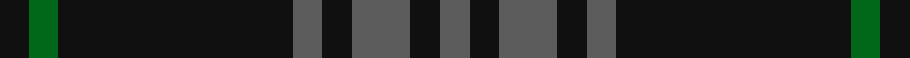

**Bands:** [KGKBKBKB](/stripes/kgkbkbkb/) · **Stripes:** [K G K N K N K N](/stripes/stripes8/) K G K N K N K N

This was sourced from tartans-authority.  It is a [8 band tartan](/bands/bands8/).

Original link http://www.tartansauthority.com/tartan-ferret/display/7796/

## Attestations

This cloth appears in 2 source records; the oldest owns this page.

- pre 2008 — Nightstalker (Corporate) (tartans-authority, [record](http://www.tartansauthority.com/tartan-ferret/display/7796/))
- undated — Nightstalker (register-of-tartans, [record](https://www.tartanregister.gov.uk/tartanDetails.aspx?ref=5760))

## Register references

External register numbers recorded for this tartan.

- Scottish Register of Tartans: [5760](https://www.tartanregister.gov.uk/tartanDetails.aspx?ref=5760)
- Scottish Tartans Authority (ITI): 7796

## Thread count
K/8 G8 K64 N8 K8 N16 K8 N/8

## Palette
Each colour and its ΔE from the base-6 reference it is a variant of.

| Colour | Shade | Base | ΔE (OKLab) |
|---|---|---|---|
| G | <code style="background-color:#006818;">#006818</code> `#006818` | G <code style="background-color:#006100;">#006100</code> | 0.02 |
| K | <code style="background-color:#101010;">#101010</code> `#101010` | K <code style="background-color:#000000;">#000000</code> | 0.17 |
| N | <code style="background-color:#5C5C5C;">#5C5C5C</code> `#5C5C5C` | B <code style="background-color:#2A418A;">#2A418A</code> | 0.15 |

# Sample pattern

## Nearest tartans

The nearest existing variants by ΔTartan distance.

1. [Holden Black (Corporate)](/setts/s7/n13k3n3k3n3k35r3~x2/) — ΔT 0.93
1. [Spirit of Glyndwr Gold (Fashion)](/setts/s8/k24n18k11n4k11n18k53r4/) — ΔT 1.26
1. [Spirit of Glyndwr Gold Welsh Fashion Tartan Tartan Number: 8351. Earliest known date: 25th May 2010 Ysbryd yr aur Glyndwr, a modern day plaid, designed and woven in Wales to commemorate Owain Glyn Dwr, crowned Welsh Prince 1406. Colours represent the slates and dark waters of Mid and North Wales, Glyndwrs homeland, with the added Gold yarn representing the gold colour in his standard (flag). Woven by the Cambrian Woollen Mill, Mid Wales exclusively for Wales Tartan Centres, Swansea. See products available Copyright © Blair Urquhart, Comrie, 2015](/setts/s8/k24n18k11n4k11n18k53lo4/) — ΔT 1.29
1. [MacLoughlin of Ardmarnoch (Personal)](/setts/s11/dg5k2dg2k2dg2k12r2k12dg6k2dg2~x2/) — ΔT 1.51
1. [Spirit of Glyndwr Grey (Fashion)](/setts/s8/k24n18k11n4k11n18k53n4/) — ΔT 1.52
1. [Witches' Blood, The](/setts/s10/k22n17k2n4k2n2k37n4k2r3~x2/) — ΔT 1.55
1. [The Caledonian Hotel](/setts/s8/k24k3k3k3k3k18dg20r4~x2/) — ΔT 1.61
1. [Menez Du](/setts/s9/db5k9g7k3g7k3g7k25g3~x2/) — ΔT 1.64
1. [Grey Spirit (Fashion)](/setts/s6/n6k17n6k17n45k4~x2/) — ΔT 1.72
1. [City Building (Glasgow) LLP](/setts/s10/k3n6k8lr2k8n3k5n36k2n3~x2/) — ΔT 1.75

## Neighbour map

Every grey dot is one of 14299 variants placed by the first two principal components of the ΔTartan feature space (44% of its variance). Red is this tartan; blue dots are its nearest — click one to open its page.

<svg viewBox="0 0 640 380" role="img" style="max-width:100%;height:auto;border:1px solid #e0e0e0;border-radius:4px;display:block" xmlns="http://www.w3.org/2000/svg"><image href="/nn/cloud.v1.png" width="640" height="380"/><a href="/setts/s7/n13k3n3k3n3k35r3~x2/"><circle cx="451.5" cy="215.0" r="4" fill="#3465a4"><title>Holden Black (Corporate)</title></circle></a><a href="/setts/s8/k24n18k11n4k11n18k53r4/"><circle cx="461.1" cy="239.3" r="4" fill="#3465a4"><title>Spirit of Glyndwr Gold (Fashion)</title></circle></a><a href="/setts/s8/k24n18k11n4k11n18k53lo4/"><circle cx="454.4" cy="236.6" r="4" fill="#3465a4"><title>Spirit of Glyndwr Gold Welsh Fashion Tartan Tartan Number: 8351. Earliest known date: 25th May 2010 Ysbryd yr aur Glyndwr, a modern day plaid, designed and woven in Wales to commemorate Owain Glyn Dwr, crowned Welsh Prince 1406. Colours represent the slates and dark waters of Mid and North Wales, Glyndwrs homeland, with the added Gold yarn representing the gold colour in his standard (flag). Woven by the Cambrian Woollen Mill, Mid Wales exclusively for Wales Tartan Centres, Swansea. See products available Copyright © Blair Urquhart, Comrie, 2015</title></circle></a><a href="/setts/s11/dg5k2dg2k2dg2k12r2k12dg6k2dg2~x2/"><circle cx="381.5" cy="255.1" r="4" fill="#3465a4"><title>MacLoughlin of Ardmarnoch (Personal)</title></circle></a><a href="/setts/s8/k24n18k11n4k11n18k53n4/"><circle cx="489.3" cy="258.8" r="4" fill="#3465a4"><title>Spirit of Glyndwr Grey (Fashion)</title></circle></a><a href="/setts/s10/k22n17k2n4k2n2k37n4k2r3~x2/"><circle cx="514.7" cy="206.5" r="4" fill="#3465a4"><title>Witches' Blood, The</title></circle></a><a href="/setts/s8/k24k3k3k3k3k18dg20r4~x2/"><circle cx="464.3" cy="274.1" r="4" fill="#3465a4"><title>The Caledonian Hotel</title></circle></a><a href="/setts/s9/db5k9g7k3g7k3g7k25g3~x2/"><circle cx="365.1" cy="251.1" r="4" fill="#3465a4"><title>Menez Du</title></circle></a><a href="/setts/s6/n6k17n6k17n45k4~x2/"><circle cx="433.7" cy="260.9" r="4" fill="#3465a4"><title>Grey Spirit (Fashion)</title></circle></a><a href="/setts/s10/k3n6k8lr2k8n3k5n36k2n3~x2/"><circle cx="452.9" cy="179.3" r="4" fill="#3465a4"><title>City Building (Glasgow) LLP</title></circle></a><circle cx="459.8" cy="237.8" r="5" fill="#c00000"/></svg>

ID: /setts/s8/k1g1k8n1k1n2k1n1~x8/
