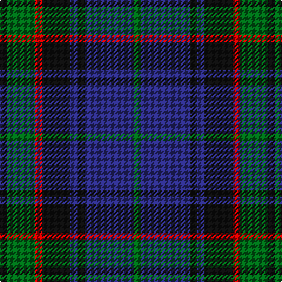

In pattern [GBKBKRGK](/stripes/gbkbkrgk/).

This was sourced from register-of-tartans.  It is a [8 stripe tartan](/stripes/stripes8/).

Original link https://www.tartanregister.gov.uk/tartanDetails.aspx?ref=329

## Attestations

This cloth appears in 3 source records; the oldest owns this page.

- 03/02/1999 — Brabender (register-of-tartans, [record](https://www.tartanregister.gov.uk/tartanDetails.aspx?ref=329))
- February 1999 — Brabender (Name) (tartans-authority, [record](http://www.tartansauthority.com/tartan-ferret/display/2639/))
- undated — Brabender (weddslist, [record](http://www.weddslist.com/cgi-bin/tartans/pg.pl?source=sts))

## Register references

External register numbers recorded for this tartan.

- Scottish Register of Tartans: [329](https://www.tartanregister.gov.uk/tartanDetails.aspx?ref=329)
- Scottish Tartans Authority (ITI): 2639
- Scottish Tartans World Register: 2639

## Thread count
K/6 G24 R6 K24 DB6 K6 DB42 G/6

## Palette
Each colour and the base-6 reference it is a variant of.

| Colour | Shade | Base |
|---|---|---|
| DB | <code style="background-color:#2C2C80;">#2C2C80</code> `oklch(35.0% 0.138 276.6)` <small>#2C2C80</small> | B <code style="background-color:#2A418A;">#2A418A</code> |
| G | <code style="background-color:#006818;">#006818</code> `oklch(45.0% 0.142 145.0)` <small>#006818</small> | G <code style="background-color:#006100;">#006100</code> |
| K | <code style="background-color:#101010;">#101010</code> `oklch(17.3% 0.000 89.9)` <small>#101010</small> | K <code style="background-color:#000000;">#000000</code> |
| R | <code style="background-color:#C80000;">#C80000</code> `oklch(52.3% 0.215 29.2)` <small>#C80000</small> | R <code style="background-color:#CC0000;">#CC0000</code> |

# Sample pattern

## Nearest tartans

The nearest existing variants by ΔTartan distance.

1. [Forbes #3](/setts/s9/db8k2db2k2db2k8dg7k1w1~x2/) — ΔT 0.51
1. [Renfrew](/setts/s7/db6k2db18k18g18k3r2~x2/) — ΔT 0.66
1. [Forbes #4](/setts/s7/db1k1db6k6dg6k1w1~x2/) — ΔT 0.68
1. [Forbes #5](/setts/s9/db28k3db6k3db6k20dy28k3w6~x2/) — ΔT 0.76
1. [Alexander Hunting (Name)](/setts/s9/db12r2db4r4k15db4g4db2g12~x2/) — ΔT 0.77
1. [Lamont](/setts/s8/db10k1db1k1db2k8dg10w1~x4/) — ΔT 0.79
1. [Reid and Taylor](/setts/s7/k2g10k9db9r1k1db2~x2/) — ΔT 0.79
1. [Swallow Hotels (Corporate)](/setts/s9/k4g21k10r2k10db21k4db4k4~x2/) — ΔT 0.80
1. [Inneryne (Personal)](/setts/s7/db4k3db16k14g14r3g3~x2/) — ΔT 0.88
1. [Graham of Menteith](/setts/s6/g8b1g1k6db6k1~x4/) — ΔT 0.90

## Neighbour map

Every grey dot is one of 14299 variants placed by the first two principal components of the ΔTartan feature space (44% of its variance). Red is this tartan; blue dots are its nearest — click one to open its page.

<svg viewBox="0 0 640 380" role="img" style="max-width:100%;height:auto;border:1px solid #e0e0e0;border-radius:4px;display:block" xmlns="http://www.w3.org/2000/svg"><image href="/nn/cloud.v1.png" width="640" height="380"/><a href="/setts/s9/db8k2db2k2db2k8dg7k1w1~x2/"><circle cx="226.4" cy="233.2" r="4" fill="#3465a4"><title>Forbes #3</title></circle></a><a href="/setts/s7/db6k2db18k18g18k3r2~x2/"><circle cx="219.3" cy="238.9" r="4" fill="#3465a4"><title>Renfrew</title></circle></a><a href="/setts/s7/db1k1db6k6dg6k1w1~x2/"><circle cx="191.9" cy="246.8" r="4" fill="#3465a4"><title>Forbes #4</title></circle></a><a href="/setts/s9/db28k3db6k3db6k20dy28k3w6~x2/"><circle cx="219.0" cy="207.5" r="4" fill="#3465a4"><title>Forbes #5</title></circle></a><a href="/setts/s9/db12r2db4r4k15db4g4db2g12~x2/"><circle cx="184.9" cy="229.7" r="4" fill="#3465a4"><title>Alexander Hunting (Name)</title></circle></a><a href="/setts/s8/db10k1db1k1db2k8dg10w1~x4/"><circle cx="244.0" cy="219.3" r="4" fill="#3465a4"><title>Lamont</title></circle></a><a href="/setts/s7/k2g10k9db9r1k1db2~x2/"><circle cx="221.3" cy="231.7" r="4" fill="#3465a4"><title>Reid and Taylor</title></circle></a><a href="/setts/s9/k4g21k10r2k10db21k4db4k4~x2/"><circle cx="224.8" cy="213.8" r="4" fill="#3465a4"><title>Swallow Hotels (Corporate)</title></circle></a><a href="/setts/s7/db4k3db16k14g14r3g3~x2/"><circle cx="179.6" cy="259.6" r="4" fill="#3465a4"><title>Inneryne (Personal)</title></circle></a><a href="/setts/s6/g8b1g1k6db6k1~x4/"><circle cx="220.4" cy="250.2" r="4" fill="#3465a4"><title>Graham of Menteith</title></circle></a><circle cx="223.5" cy="233.1" r="5" fill="#c00000"/></svg>

ID: /setts/s8/k1g4r1k4db1k1db7g1~x6/
