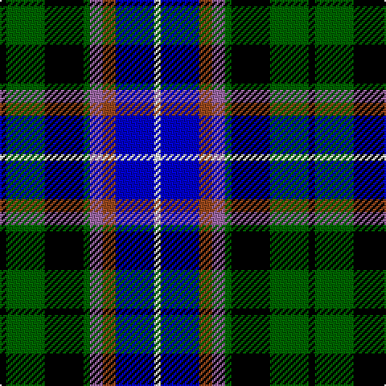

In pattern [KGKGRRBW](/patterns/kgkgrrbw/).

This was sourced from register-of-tartans.  It is a [8 stripes tartan](/stripes/stripes8/).

Original link https://www.tartanregister.gov.uk/tartanDetails.aspx?ref=11620

## Register references

External register numbers recorded for this tartan.

- Scottish Register of Tartans: [11620](https://www.tartanregister.gov.uk/tartanDetails.aspx?ref=11620)

## Thread count
K/4 G24 K24 G4 LP8 T8 B24 W/4

## Palette
Each colour and its ΔE from the base-6 reference it is a variant of.

| Colour | Shade | Base | ΔE (OKLab) |
|---|---|---|---|
| B | <code style="background-color:#0000C8;">#0000C8</code> `#0000C8` | B <code style="background-color:#2A418A;">#2A418A</code> | 0.14 |
| G | <code style="background-color:#006400;">#006400</code> `#006400` | G <code style="background-color:#006100;">#006100</code> | 0.01 |
| K | <code style="background-color:#000000;">#000000</code> `#000000` | K <code style="background-color:#000000;">#000000</code> | 0.00 |
| LP | <code style="background-color:#9C68A4;">#9C68A4</code> `#9C68A4` | R <code style="background-color:#CC0000;">#CC0000</code> | 0.21 |
| T | <code style="background-color:#98481C;">#98481C</code> `#98481C` | R <code style="background-color:#CC0000;">#CC0000</code> | 0.11 |
| W | <code style="background-color:#FCFCFC;">#FCFCFC</code> `#FCFCFC` | W <code style="background-color:#F7F7F7;">#F7F7F7</code> | 0.01 |

# Sample pattern

## Nearest tartans

The nearest existing variants by ΔTartan distance.

1. [Business Air](/setts/s8/b4y2b10k12g10w3g2w4~b00008c-g004c00-k000000-wc8c8c8-y3cc83c~x2/) — ΔT 0.95
1. [Kagame (Personal)](/setts/s10/k5w14ka3k7g3ka3g7ka6b24wa3~b1c1c50-g289c18-k000000-ka101010-w98c8e8-wae0e0e0~x2/) — ΔT 0.96
1. [Cowan of Inveresk (Personal)](/setts/s8/r4g16w2k15b15k2b2y2~b2c2c80-g004c00-k000000-rc80000-wfcfcfc-ye8c000~x2/) — ΔT 1.07
1. [Gracey (2013)](/setts/s7/b3k3ba17k20g20bb8bc3~b688cc0-ba040498-bb3c104c-bc880078-g00643c-k000000~x2/) — ΔT 1.12
1. [Hogarth, of Firhill](/setts/s7/b2g6y1k6ba6k1ba1~b8080d0-ba304080-g008000-k000000-yf0c000~x2/) — ΔT 1.13
1. [Smithers](/setts/s11/b3ba13g2ba4w2ba8k13ga10k2ga8b3~b800080-ba304080-g808080-ga008000-k000000-we0e0e0~x2/) — ΔT 1.15
1. [Ayrshire](/setts/s7/b11ba2bb4ba21k16g19y4~b800080-ba304080-bb5480b0-g008000-k000000-yf0c000~x2/) — ΔT 1.15
1. [Scottish Economics Society 'Adam Smith'](/setts/s11/b2k1ba8k7g8y2g8k7ba8k1r2~b0000cd-ba000080-g008b00-k101010-rff0000-yffe600~x4/) — ΔT 1.16
1. [Veere](/setts/s11/w7k11wa3b9g19y3k22b9wa3k3b6~b2c2c80-g006818-k000000-wc8c8c8-wa82cffd-yc88c00~x2/) — ΔT 1.17
1. [Huntly Gordon](/setts/s6/r2b3ba12k11g11y2~b102040-ba606090-g004010-k000000-rc00000-yf0c000~x2/) — ΔT 1.17

## Neighbour map

Every grey dot is one of 15726 variants placed by the first two principal components of the ΔTartan feature space (44% of its variance). Red is this tartan; blue dots are its nearest — click one to open its page.

<svg viewBox="0 0 640 380" role="img" style="max-width:100%;height:auto;border:1px solid #e0e0e0;border-radius:4px;display:block" xmlns="http://www.w3.org/2000/svg"><image href="/nn/cloud.v1.png" width="640" height="380"/><a href="/setts/s8/b4y2b10k12g10w3g2w4~b00008c-g004c00-k000000-wc8c8c8-y3cc83c~x2/"><circle cx="53.5" cy="209.4" r="4" fill="#3465a4"><title>Business Air</title></circle></a><a href="/setts/s10/k5w14ka3k7g3ka3g7ka6b24wa3~b1c1c50-g289c18-k000000-ka101010-w98c8e8-wae0e0e0~x2/"><circle cx="53.7" cy="149.1" r="4" fill="#3465a4"><title>Kagame (Personal)</title></circle></a><a href="/setts/s8/r4g16w2k15b15k2b2y2~b2c2c80-g004c00-k000000-rc80000-wfcfcfc-ye8c000~x2/"><circle cx="84.3" cy="165.6" r="4" fill="#3465a4"><title>Cowan of Inveresk (Personal)</title></circle></a><a href="/setts/s7/b3k3ba17k20g20bb8bc3~b688cc0-ba040498-bb3c104c-bc880078-g00643c-k000000~x2/"><circle cx="80.0" cy="200.6" r="4" fill="#3465a4"><title>Gracey (2013)</title></circle></a><a href="/setts/s7/b2g6y1k6ba6k1ba1~b8080d0-ba304080-g008000-k000000-yf0c000~x2/"><circle cx="78.9" cy="209.0" r="4" fill="#3465a4"><title>Hogarth, of Firhill</title></circle></a><a href="/setts/s11/b3ba13g2ba4w2ba8k13ga10k2ga8b3~b800080-ba304080-g808080-ga008000-k000000-we0e0e0~x2/"><circle cx="80.8" cy="177.4" r="4" fill="#3465a4"><title>Smithers</title></circle></a><a href="/setts/s7/b11ba2bb4ba21k16g19y4~b800080-ba304080-bb5480b0-g008000-k000000-yf0c000~x2/"><circle cx="66.0" cy="176.4" r="4" fill="#3465a4"><title>Ayrshire</title></circle></a><a href="/setts/s11/b2k1ba8k7g8y2g8k7ba8k1r2~b0000cd-ba000080-g008b00-k101010-rff0000-yffe600~x4/"><circle cx="57.9" cy="177.1" r="4" fill="#3465a4"><title>Scottish Economics Society 'Adam Smith'</title></circle></a><a href="/setts/s11/w7k11wa3b9g19y3k22b9wa3k3b6~b2c2c80-g006818-k000000-wc8c8c8-wa82cffd-yc88c00~x2/"><circle cx="78.7" cy="165.5" r="4" fill="#3465a4"><title>Veere</title></circle></a><a href="/setts/s6/r2b3ba12k11g11y2~b102040-ba606090-g004010-k000000-rc00000-yf0c000~x2/"><circle cx="62.2" cy="207.5" r="4" fill="#3465a4"><title>Huntly Gordon</title></circle></a><circle cx="36.3" cy="184.8" r="5" fill="#c00000"/></svg>

ID: /setts/s8/k1g6k6g1r2ra2b6w1~b0000c8-g006400-k000000-r9c68a4-ra98481c-wfcfcfc~x4/
