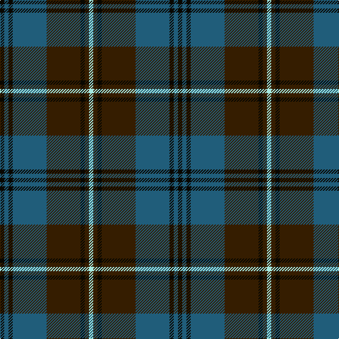

In pattern [KBKBGKGW](/stripes/kbkbgkgw/).

This was sourced from house-of-tartan.  It is a [8 stripe tartan](/stripes/stripes8/).

Original link http://www.house-of-tartan.scotland.net/house/TartanViewjs.asp?colr=Def&tnam=2400

## Thread count
K/6 B6 K6 B48 Ka48 K6 Ka6 LB/6

## Palette
Each colour and the base-6 reference it is a variant of.

| Colour | Shade | Base |
|---|---|---|
| B | <code style="background-color:#205D7A;">#205D7A</code> `oklch(45.3% 0.077 232.9)` <small>#205D7A</small> | B <code style="background-color:#2A418A;">#2A418A</code> |
| K | <code style="background-color:#090700;">#090700</code> `oklch(12.8% 0.027 100.7)` <small>#090700</small> | K <code style="background-color:#000000;">#000000</code> |
| Ka | <code style="background-color:#351D00;">#351D00</code> `oklch(25.7% 0.057 67.4)` <small>#351D00</small> | G <code style="background-color:#006100;">#006100</code> |
| LB | <code style="background-color:#A7EAE1;">#A7EAE1</code> `oklch(89.0% 0.068 185.6)` <small>#A7EAE1</small> | W <code style="background-color:#F7F7F7;">#F7F7F7</code> |

# Sample pattern

## Nearest tartans

The nearest existing variants by ΔTartan distance, with this tartan at the top so the swatches line up against it.

ΔTartan

Tartan

Sett

—

<a href="/ttd/edit/#slug=k1n1k1n8dy8k1dy1lt1~x6">Auld Lang Syne Burns Commemorative Tartan Tartan Number: 2400. Earliest known date: 01/01/2002 Launched on the 25th January at a the Beach Ballroom Aberdeen, to celebrate the birth of Robert Burns 2002./Threadcount and colours aren't 100% original. Generated manually./ See products available Copyright © Blair Urquhart, Comrie, 2015</a> <a class="nn-out" href="/setts/s8/k1n1k1n8dy8k1dy1lt1~x6/" title="open its dictionary page">↗</a>

0.73

<a href="/ttd/edit/#slug=k1n1k1n7dy7k1dy1lt1~x6">Auld Lang Syne</a> <a class="nn-out" href="/setts/s8/k1n1k1n7dy7k1dy1lt1~x6/" title="open its dictionary page">↗</a>

0.79

<a href="/ttd/edit/#slug=db12r1db1r1db1r4g12ly1g2~x4">Durie (Clan)</a> <a class="nn-out" href="/setts/s9/db12r1db1r1db1r4g12ly1g2~x4/" title="open its dictionary page">↗</a>

0.85

<a href="/ttd/edit/#slug=n3o3k16n2k2n16k3n2lr2~x2">Chinzei Keiai Senior High School</a> <a class="nn-out" href="/setts/s9/n3o3k16n2k2n16k3n2lr2~x2/" title="open its dictionary page">↗</a>

0.86

<a href="/ttd/edit/#slug=n3dp3k16n2o2n16k3n2o2~x2">Chinzei Keiai Junior High School</a> <a class="nn-out" href="/setts/s9/n3dp3k16n2o2n16k3n2o2~x2/" title="open its dictionary page">↗</a>

0.89

<a href="/ttd/edit/#slug=n3lp3k16n2k2n16k3n2n2~x2">Chinzei Keiai Junior High School</a> <a class="nn-out" href="/setts/s9/n3lp3k16n2k2n16k3n2n2~x2/" title="open its dictionary page">↗</a>

0.91

<a href="/ttd/edit/#slug=k7r3k27dg27ly3dg3ly3dg3~x2">Brunton (Personal)</a> <a class="nn-out" href="/setts/s8/k7r3k27dg27ly3dg3ly3dg3~x2/" title="open its dictionary page">↗</a>

0.94

<a href="/ttd/edit/#slug=n3o3k16n2k2n16k3n2lb2~x2">Chinzei Keiai Senior High School</a> <a class="nn-out" href="/setts/s9/n3o3k16n2k2n16k3n2lb2~x2/" title="open its dictionary page">↗</a>

0.95

<a href="/ttd/edit/#slug=g2k1db9k7g1k1g1k1g9r1db1~x4">Princess Louise (Royal)</a> <a class="nn-out" href="/setts/s11/g2k1db9k7g1k1g1k1g9r1db1~x4/" title="open its dictionary page">↗</a>

1.04

<a href="/ttd/edit/#slug=db3r2db22k11g22r2g3~x2">Gammell (1978) (Personal)</a> <a class="nn-out" href="/setts/s7/db3r2db22k11g22r2g3~x2/" title="open its dictionary page">↗</a>

1.05

<a href="/ttd/edit/#slug=g8r3g3r5g26db7t3db28r3db6~x2">Stewart of Appin Htg (error)</a> <a class="nn-out" href="/setts/s10/g8r3g3r5g26db7t3db28r3db6~x2/" title="open its dictionary page">↗</a>

## Neighbour map

Every grey dot is one of 14299 variants placed by the first two principal components of the ΔTartan feature space (44% of its variance). Red is this tartan; blue dots are its nearest — click one to open its page.

<svg viewBox="0 0 640 380" role="img" style="max-width:100%;height:auto;border:1px solid #e0e0e0;border-radius:4px;display:block" xmlns="http://www.w3.org/2000/svg"><image href="/nn/cloud.v1.png" width="640" height="380"/><a href="/setts/s8/k1n1k1n7dy7k1dy1lt1~x6/"><circle cx="243.9" cy="216.0" r="4" fill="#3465a4"><title>Auld Lang Syne</title></circle></a><a href="/setts/s9/db12r1db1r1db1r4g12ly1g2~x4/"><circle cx="267.4" cy="182.6" r="4" fill="#3465a4"><title>Durie (Clan)</title></circle></a><a href="/setts/s9/n3o3k16n2k2n16k3n2lr2~x2/"><circle cx="295.3" cy="206.4" r="4" fill="#3465a4"><title>Chinzei Keiai Senior High School</title></circle></a><a href="/setts/s9/n3dp3k16n2o2n16k3n2o2~x2/"><circle cx="285.9" cy="203.7" r="4" fill="#3465a4"><title>Chinzei Keiai Junior High School</title></circle></a><a href="/setts/s9/n3lp3k16n2k2n16k3n2n2~x2/"><circle cx="297.2" cy="207.1" r="4" fill="#3465a4"><title>Chinzei Keiai Junior High School</title></circle></a><a href="/setts/s8/k7r3k27dg27ly3dg3ly3dg3~x2/"><circle cx="290.8" cy="211.0" r="4" fill="#3465a4"><title>Brunton (Personal)</title></circle></a><a href="/setts/s9/n3o3k16n2k2n16k3n2lb2~x2/"><circle cx="281.2" cy="198.0" r="4" fill="#3465a4"><title>Chinzei Keiai Senior High School</title></circle></a><a href="/setts/s11/g2k1db9k7g1k1g1k1g9r1db1~x4/"><circle cx="233.6" cy="196.3" r="4" fill="#3465a4"><title>Princess Louise (Royal)</title></circle></a><a href="/setts/s7/db3r2db22k11g22r2g3~x2/"><circle cx="231.6" cy="210.5" r="4" fill="#3465a4"><title>Gammell (1978) (Personal)</title></circle></a><a href="/setts/s10/g8r3g3r5g26db7t3db28r3db6~x2/"><circle cx="271.5" cy="198.4" r="4" fill="#3465a4"><title>Stewart of Appin Htg (error)</title></circle></a><circle cx="255.4" cy="205.3" r="5" fill="#c00000"/></svg>

ID: /setts/s8/k1n1k1n8dy8k1dy1lt1~x6/
