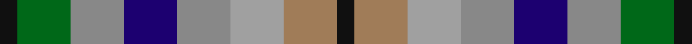
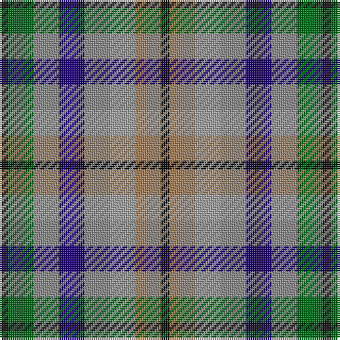

In pattern [KGRBRYRK](/stripes/kgrbryrk/).

This was sourced from tartans-authority.  It is a [8 stripe tartan](/stripes/stripes8/).

Original link http://www.tartansauthority.com/tartan-ferret/display/2367/

## Thread count
K/4 G12 Na12 DB12 Na12 N12 LT12 K/4

## Palette
Each colour and the base-6 reference it is a variant of.

| Colour | Shade | Base |
|---|---|---|
| DB | <code style="background-color:#1C0070;">#1C0070</code> `oklch(26.3% 0.162 277.1)` <small>#1C0070</small> | B <code style="background-color:#2A418A;">#2A418A</code> |
| G | <code style="background-color:#006818;">#006818</code> `oklch(45.0% 0.142 145.0)` <small>#006818</small> | G <code style="background-color:#006100;">#006100</code> |
| K | <code style="background-color:#101010;">#101010</code> `oklch(17.3% 0.000 89.9)` <small>#101010</small> | K <code style="background-color:#000000;">#000000</code> |
| LT | <code style="background-color:#A07C58;">#A07C58</code> `oklch(61.2% 0.067 66.0)` <small>#A07C58</small> | R <code style="background-color:#CC0000;">#CC0000</code> |
| N | <code style="background-color:#A0A0A0;">#A0A0A0</code> `oklch(70.6% 0.000 89.9)` <small>#A0A0A0</small> | Y <code style="background-color:#F2BF00;">#F2BF00</code> |
| Na | <code style="background-color:#888888;">#888888</code> `oklch(62.7% 0.000 89.9)` <small>#888888</small> | R <code style="background-color:#CC0000;">#CC0000</code> |

# Sample pattern

## Nearest tartans

The nearest existing variants by ΔTartan distance.

1. [Stewarton (Personal)](/setts/s14/o3lr3o3db3o3g3k1g3o3db3o3lr3o3k1~x4/) — ΔT 1.34
1. [DunBroch](/setts/s11/db4t8k2t5lb2t5dg8dr7dg2dr7dg3~x2/) — ΔT 1.40
1. [Roscommon County Crest (Fashion)](/setts/s11/g11k5lo7w5lo7k5g7lo11db16lo7ly5~x2/) — ΔT 1.46
1. [New York City](/setts/s7/b2db3k1db3o3g4r1~x8/) — ΔT 1.49
1. [Blackdown Hills Corporate Tartan Tartan Number: 6711. Earliest known date: 1991 The Blackdown Hills on the Devon/Somerset border were designated as an Area of Outstanding Natural Beauty (AONB) in 1991 and this tartan was designed to celebrate that occasion. Designed at Coldharbour Mill at Cullompton in Devon. See products available Copyright © Blair Urquhart, Comrie, 2015](/setts/s7/k4n4lo1n4r4db4w1~x8/) — ΔT 1.53
1. [Belwade](/setts/s11/db4g4db4w1db1w1m4lo4w1g4m4~x4/) — ΔT 1.56
1. [Stanners (Personal)](/setts/s13/lr4k4n4k4g4w1g4w1n3r4n3r4w1~x4/) — ΔT 1.56
1. [Redgate (Name)](/setts/s13/t10r3t10k7lo5w2lo5w2lo5k7g10r3g7~x2/) — ΔT 1.60
1. [Stanners (Personal)](/setts/s13/lr4k4dt4k4g4w1g4w1dt3r4dt3r4w1~x4/) — ΔT 1.65
1. [Devon Companion](/setts/s7/o5db4ly1db4k4dy4w1~x4/) — ΔT 1.66

## Neighbour map

Every grey dot is one of 14299 variants placed by the first two principal components of the ΔTartan feature space (44% of its variance). Red is this tartan; blue dots are its nearest — click one to open its page.

<svg viewBox="0 0 640 380" role="img" style="max-width:100%;height:auto;border:1px solid #e0e0e0;border-radius:4px;display:block" xmlns="http://www.w3.org/2000/svg"><image href="/nn/cloud.v1.png" width="640" height="380"/><a href="/setts/s14/o3lr3o3db3o3g3k1g3o3db3o3lr3o3k1~x4/"><circle cx="14.0" cy="258.4" r="4" fill="#3465a4"><title>Stewarton (Personal)</title></circle></a><a href="/setts/s11/db4t8k2t5lb2t5dg8dr7dg2dr7dg3~x2/"><circle cx="55.6" cy="222.2" r="4" fill="#3465a4"><title>DunBroch</title></circle></a><a href="/setts/s11/g11k5lo7w5lo7k5g7lo11db16lo7ly5~x2/"><circle cx="27.8" cy="227.0" r="4" fill="#3465a4"><title>Roscommon County Crest (Fashion)</title></circle></a><a href="/setts/s7/b2db3k1db3o3g4r1~x8/"><circle cx="76.4" cy="263.7" r="4" fill="#3465a4"><title>New York City</title></circle></a><a href="/setts/s7/k4n4lo1n4r4db4w1~x8/"><circle cx="59.1" cy="244.9" r="4" fill="#3465a4"><title>Blackdown Hills Corporate Tartan Tartan Number: 6711. Earliest known date: 1991 The Blackdown Hills on the Devon/Somerset border were designated as an Area of Outstanding Natural Beauty (AONB) in 1991 and this tartan was designed to celebrate that occasion. Designed at Coldharbour Mill at Cullompton in Devon. See products available Copyright © Blair Urquhart, Comrie, 2015</title></circle></a><a href="/setts/s11/db4g4db4w1db1w1m4lo4w1g4m4~x4/"><circle cx="14.0" cy="205.4" r="4" fill="#3465a4"><title>Belwade</title></circle></a><a href="/setts/s13/lr4k4n4k4g4w1g4w1n3r4n3r4w1~x4/"><circle cx="14.0" cy="215.9" r="4" fill="#3465a4"><title>Stanners (Personal)</title></circle></a><a href="/setts/s13/t10r3t10k7lo5w2lo5w2lo5k7g10r3g7~x2/"><circle cx="14.0" cy="202.8" r="4" fill="#3465a4"><title>Redgate (Name)</title></circle></a><a href="/setts/s13/lr4k4dt4k4g4w1g4w1dt3r4dt3r4w1~x4/"><circle cx="14.0" cy="215.6" r="4" fill="#3465a4"><title>Stanners (Personal)</title></circle></a><a href="/setts/s7/o5db4ly1db4k4dy4w1~x4/"><circle cx="53.1" cy="230.2" r="4" fill="#3465a4"><title>Devon Companion</title></circle></a><circle cx="14.0" cy="263.0" r="5" fill="#c00000"/></svg>

ID: /setts/s8/k1o3lr3o3db3o3g3k1~x4/
