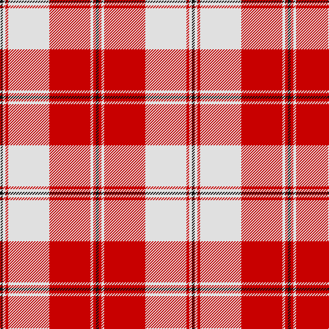

In pattern [KRWRWRWK](/patterns/krwrwrwk/).

This was sourced from tartans-authority.  It is a [8 stripes tartan](/stripes/stripes8/).

Original link http://www.tartansauthority.com/tartan-ferret/display/8263/

## Thread count
K/4 LN4 R4 LN60 R60 LN4 R4 K/4

## Palette
Each colour and its ΔE from the base-6 reference it is a variant of.

| Colour | Shade | Base | ΔE (OKLab) |
|---|---|---|---|
| K | <code style="background-color:#101010;">#101010</code> `#101010` | K <code style="background-color:#000000;">#000000</code> | 0.17 |
| LN | <code style="background-color:#E0E0E0;">#E0E0E0</code> `#E0E0E0` | W <code style="background-color:#F7F7F7;">#F7F7F7</code> | 0.07 |
| R | <code style="background-color:#C80000;">#C80000</code> `#C80000` | R <code style="background-color:#CC0000;">#CC0000</code> | 0.01 |

# Sample pattern

## Nearest tartans

The nearest existing variants by ΔTartan distance.

1. [Hose](/setts/s10/r2g2w2r23w2g2w23g2r2w2~g005020-rdc0000-we0e0e0~x2/) — ΔT 0.76
1. [Hose Artifact Tartan Tartan Number: 1548. Earliest known date: 1819 New sett for 22 red. (Wilson's of Bannockburn) See products available Copyright © Blair Urquhart, Comrie, 2015](/setts/s10/r2g2w2r23w2g2w23g2r2w2~g006818-rc80000-we0e0e0~x2/) — ΔT 0.81
1. [Swiss Red](/setts/s10/w18r9w1r1w2r1w1r9b3r4~b2c2c80-rc80000-we0e0e0~x4/) — ΔT 0.87
1. [Hose](/setts/s10/r2g2w2r23w2g2w23g2r2w2~g008000-rc00000-we0e0e0~x2/) — ΔT 0.87
1. [Masai Shuka 14 (Artefact)](/setts/s8/r40w40k5w2k6w2k5w6~k101010-rc80000-wf8d0d0~x2/) — ΔT 0.93
1. [Cunningham Dress Clan Tartan Tartan Number: 563. Earliest known date: c.1980 One of a number of dress tartans produced by Hugh Macpherson, a kiltmaker in Edinburgh, intended for dancing and other informal occassions. The 'dress' version of clan tartan is usually created by substituting white for one of the 'ground' colours. See products available Copyright © Blair Urquhart, Comrie, 2015](/setts/s7/w5r2w34r34k2r2b4~b2c2c80-k101010-rc80000-we0e0e0~x2/) — ΔT 1.00
1. [Cunningham, Burgundy dress](/setts/s7/w5r2w34r34k2r2y4~k000000-rc00000-we0e0e0-yf0c000~x2/) — ΔT 1.00
1. [Cunningham, dress](/setts/s7/w5r2w34r34k2r2b4~b304080-k000000-rc00000-we0e0e0~x2/) — ΔT 1.01
1. [Torridon, Cherry (Dance)](/setts/s7/r3ra2b2ra30w30b2w3~b1c1c50-r880000-rab80000-wf0e0c8~x2/) — ΔT 1.02
1. [Cunningham Burgandy Dress Clan Tartan Tartan Number: 1873. Earliest known date: pre 2003 One of a number of dress tartans produced by Hugh Macpherson, a kiltmaker in Edinburgh, intended for dancing and other informal occassions. The 'dress' version of clan tartan is usually created by substituting white for one of the 'ground' colours. See products available Copyright © Blair Urquhart, Comrie, 2015](/setts/s7/w5r2w34r34k2r2y4~k101010-rc80000-we0e0e0-ye8c000~x2/) — ΔT 1.04

## Neighbour map

Every grey dot is one of 15726 variants placed by the first two principal components of the ΔTartan feature space (44% of its variance). Red is this tartan; blue dots are its nearest — click one to open its page.

<svg viewBox="0 0 640 380" role="img" style="max-width:100%;height:auto;border:1px solid #e0e0e0;border-radius:4px;display:block" xmlns="http://www.w3.org/2000/svg"><image href="/nn/cloud.v1.png" width="640" height="380"/><a href="/setts/s10/r2g2w2r23w2g2w23g2r2w2~g005020-rdc0000-we0e0e0~x2/"><circle cx="300.3" cy="136.7" r="4" fill="#3465a4"><title>Hose</title></circle></a><a href="/setts/s10/r2g2w2r23w2g2w23g2r2w2~g006818-rc80000-we0e0e0~x2/"><circle cx="299.0" cy="138.0" r="4" fill="#3465a4"><title>Hose Artifact Tartan Tartan Number: 1548. Earliest known date: 1819 New sett for 22 red. (Wilson's of Bannockburn) See products available Copyright © Blair Urquhart, Comrie, 2015</title></circle></a><a href="/setts/s10/w18r9w1r1w2r1w1r9b3r4~b2c2c80-rc80000-we0e0e0~x4/"><circle cx="319.6" cy="137.8" r="4" fill="#3465a4"><title>Swiss Red</title></circle></a><a href="/setts/s10/r2g2w2r23w2g2w23g2r2w2~g008000-rc00000-we0e0e0~x2/"><circle cx="298.2" cy="138.4" r="4" fill="#3465a4"><title>Hose</title></circle></a><a href="/setts/s8/r40w40k5w2k6w2k5w6~k101010-rc80000-wf8d0d0~x2/"><circle cx="295.7" cy="133.3" r="4" fill="#3465a4"><title>Masai Shuka 14 (Artefact)</title></circle></a><a href="/setts/s7/w5r2w34r34k2r2b4~b2c2c80-k101010-rc80000-we0e0e0~x2/"><circle cx="299.2" cy="131.4" r="4" fill="#3465a4"><title>Cunningham Dress Clan Tartan Tartan Number: 563. Earliest known date: c.1980 One of a number of dress tartans produced by Hugh Macpherson, a kiltmaker in Edinburgh, intended for dancing and other informal occassions. The 'dress' version of clan tartan is usually created by substituting white for one of the 'ground' colours. See products available Copyright © Blair Urquhart, Comrie, 2015</title></circle></a><a href="/setts/s7/w5r2w34r34k2r2y4~k000000-rc00000-we0e0e0-yf0c000~x2/"><circle cx="298.1" cy="130.6" r="4" fill="#3465a4"><title>Cunningham, Burgundy dress</title></circle></a><a href="/setts/s7/w5r2w34r34k2r2b4~b304080-k000000-rc00000-we0e0e0~x2/"><circle cx="295.9" cy="131.2" r="4" fill="#3465a4"><title>Cunningham, dress</title></circle></a><a href="/setts/s7/r3ra2b2ra30w30b2w3~b1c1c50-r880000-rab80000-wf0e0c8~x2/"><circle cx="284.5" cy="133.1" r="4" fill="#3465a4"><title>Torridon, Cherry (Dance)</title></circle></a><a href="/setts/s7/w5r2w34r34k2r2y4~k101010-rc80000-we0e0e0-ye8c000~x2/"><circle cx="303.3" cy="131.7" r="4" fill="#3465a4"><title>Cunningham Burgandy Dress Clan Tartan Tartan Number: 1873. Earliest known date: pre 2003 One of a number of dress tartans produced by Hugh Macpherson, a kiltmaker in Edinburgh, intended for dancing and other informal occassions. The 'dress' version of clan tartan is usually created by substituting white for one of the 'ground' colours. See products available Copyright © Blair Urquhart, Comrie, 2015</title></circle></a><circle cx="323.4" cy="136.9" r="5" fill="#c00000"/></svg>

ID: /setts/s8/k1r1w1r15w15r1w1k1~k101010-rc80000-we0e0e0~x4/
