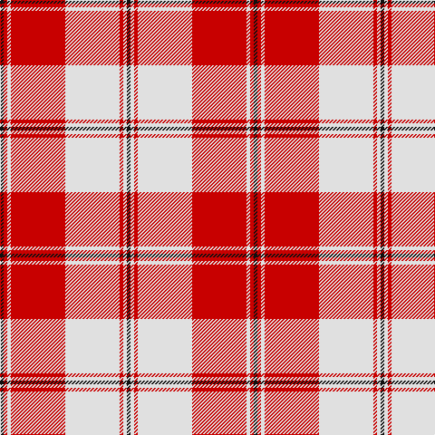

This page is one **sett** — a single exact thread-count. It belongs to the [tartan](/tartans/k1r1ln1r15ln15r1ln1k1/)
(the same proportion at any scale), whose colour order is pattern [KRWRWRWK](/stripes/krwrwrwk/).

Sourced from tartans-authority.  It is a [8 stripe tartan](/stripes/stripes8/).

Original link http://www.tartansauthority.com/tartan-ferret/display/8263/

## Thread count
K/4 R4 LN4 R60 LN60 R4 LN4 K/4

## Palette
Each colour and the base-6 reference it is a variant of.

| Colour | Shade | Base |
|---|---|---|
| K | <code style="background-color:#101010;">#101010</code> `oklch(17.3% 0.000 89.9)` <small>#101010</small> | K <code style="background-color:#000000;">#000000</code> |
| LN | <code style="background-color:#E0E0E0;">#E0E0E0</code> `oklch(90.7% 0.000 89.9)` <small>#E0E0E0</small> | W <code style="background-color:#F7F7F7;">#F7F7F7</code> |
| R | <code style="background-color:#C80000;">#C80000</code> `oklch(52.3% 0.215 29.2)` <small>#C80000</small> | R <code style="background-color:#CC0000;">#CC0000</code> |

# Sample pattern

## Nearest tartans

The nearest existing variants by ΔTartan distance, with this tartan at the top so the swatches line up against it.

ΔTartan

Tartan

Sett

—

<a href="/ttd/edit/#slug=k1r1w1r15w15r1w1k1~x4">Bundy, Dress Red (Personal Dance)</a> <a class="nn-out" href="/setts/s8/k1r1w1r15w15r1w1k1~x4/" title="open its dictionary page">↗</a>

0.76

<a href="/ttd/edit/#slug=r2dg2w2r23w2dg2w23dg2r2w2~x2">Hose</a> <a class="nn-out" href="/setts/s10/r2dg2w2r23w2dg2w23dg2r2w2~x2/" title="open its dictionary page">↗</a>

0.87

<a href="/ttd/edit/#slug=w18r9w1r1w2r1w1r9db3r4~x4">Swiss Red</a> <a class="nn-out" href="/setts/s10/w18r9w1r1w2r1w1r9db3r4~x4/" title="open its dictionary page">↗</a>

0.87

<a href="/ttd/edit/#slug=r2g2w2r23w2g2w23g2r2w2~x2">Hose</a> <a class="nn-out" href="/setts/s10/r2g2w2r23w2g2w23g2r2w2~x2/" title="open its dictionary page">↗</a>

0.93

<a href="/ttd/edit/#slug=r40w40k5w2k6w2k5w6~x2">Masai Shuka 14 (Artefact)</a> <a class="nn-out" href="/setts/s8/r40w40k5w2k6w2k5w6~x2/" title="open its dictionary page">↗</a>

1.03

<a href="/ttd/edit/#slug=r3r2db2r30w30db2w3~x2">Torridon, Cherry (Dance)</a> <a class="nn-out" href="/setts/s7/r3r2db2r30w30db2w3~x2/" title="open its dictionary page">↗</a>

1.09

<a href="/ttd/edit/#slug=w5r2w34r34k2r2db4~x2">Cunningham Dress</a> <a class="nn-out" href="/setts/s7/w5r2w34r34k2r2db4~x2/" title="open its dictionary page">↗</a>

1.21

<a href="/ttd/edit/#slug=w3lg2w30r30n2r2lg3~x2">Torridon, Burgundy (Dance)</a> <a class="nn-out" href="/setts/s7/w3lg2w30r30n2r2lg3~x2/" title="open its dictionary page">↗</a>

1.26

<a href="/ttd/edit/#slug=w4r1w2r3w24r5r3r1r1r1r20w2~x2">Menzies #3</a> <a class="nn-out" href="/setts/s12/w4r1w2r3w24r5r3r1r1r1r20w2~x2/" title="open its dictionary page">↗</a>

1.30

<a href="/ttd/edit/#slug=w5k2w30r24w3r8dt3~x2">Arduaine, Red (Dance)</a> <a class="nn-out" href="/setts/s7/w5k2w30r24w3r8dt3~x2/" title="open its dictionary page">↗</a>

1.30

<a href="/ttd/edit/#slug=w5r2w34r34k2r2ly4~x2">Cunningham Dress Burgundy (Dance)</a> <a class="nn-out" href="/setts/s7/w5r2w34r34k2r2ly4~x2/" title="open its dictionary page">↗</a>

## Neighbour map

Every grey dot is one of 14299 variants placed by the first two principal components of the ΔTartan feature space (44% of its variance). Red is this tartan; blue dots are its nearest — click one to open its page.

<svg viewBox="0 0 640 380" role="img" style="max-width:100%;height:auto;border:1px solid #e0e0e0;border-radius:4px;display:block" xmlns="http://www.w3.org/2000/svg"><image href="/nn/cloud.v1.png" width="640" height="380"/><a href="/setts/s10/r2dg2w2r23w2dg2w23dg2r2w2~x2/"><circle cx="300.5" cy="130.3" r="4" fill="#3465a4"><title>Hose</title></circle></a><a href="/setts/s10/w18r9w1r1w2r1w1r9db3r4~x4/"><circle cx="319.6" cy="130.9" r="4" fill="#3465a4"><title>Swiss Red</title></circle></a><a href="/setts/s10/r2g2w2r23w2g2w23g2r2w2~x2/"><circle cx="298.7" cy="132.4" r="4" fill="#3465a4"><title>Hose</title></circle></a><a href="/setts/s8/r40w40k5w2k6w2k5w6~x2/"><circle cx="296.1" cy="125.8" r="4" fill="#3465a4"><title>Masai Shuka 14 (Artefact)</title></circle></a><a href="/setts/s7/r3r2db2r30w30db2w3~x2/"><circle cx="284.7" cy="126.3" r="4" fill="#3465a4"><title>Torridon, Cherry (Dance)</title></circle></a><a href="/setts/s7/w5r2w34r34k2r2db4~x2/"><circle cx="287.7" cy="117.8" r="4" fill="#3465a4"><title>Cunningham Dress</title></circle></a><a href="/setts/s7/w3lg2w30r30n2r2lg3~x2/"><circle cx="276.3" cy="128.5" r="4" fill="#3465a4"><title>Torridon, Burgundy (Dance)</title></circle></a><a href="/setts/s12/w4r1w2r3w24r5r3r1r1r1r20w2~x2/"><circle cx="332.9" cy="97.4" r="4" fill="#3465a4"><title>Menzies #3</title></circle></a><a href="/setts/s7/w5k2w30r24w3r8dt3~x2/"><circle cx="296.8" cy="140.9" r="4" fill="#3465a4"><title>Arduaine, Red (Dance)</title></circle></a><a href="/setts/s7/w5r2w34r34k2r2ly4~x2/"><circle cx="280.9" cy="120.7" r="4" fill="#3465a4"><title>Cunningham Dress Burgundy (Dance)</title></circle></a><circle cx="323.6" cy="129.2" r="5" fill="#c00000"/></svg>

ID: /setts/s8/k1r1w1r15w15r1w1k1~x4/
