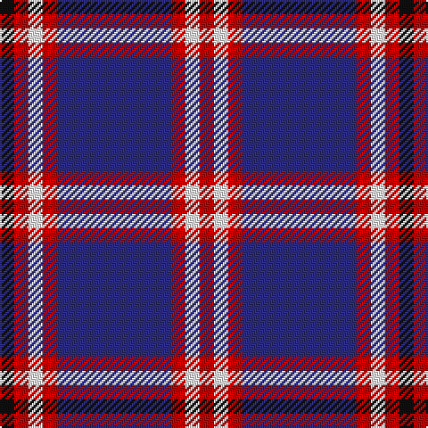

**Bands:** [KRWRBRWR](/stripes/krwrbrwr/) · **Stripes:** [K R W R DB R W R](/stripes/stripes8/) K R W R DB R W R

This was sourced from register-of-tartans.  It is a [8 band tartan](/bands/bands8/).

Original link https://www.tartanregister.gov.uk/tartanDetails.aspx?ref=2028

## Register references

External register numbers recorded for this tartan.

- Scottish Register of Tartans: [2028](https://www.tartanregister.gov.uk/tartanDetails.aspx?ref=2028)
- Scottish Tartans Authority (ITI): 2544
- Scottish Tartans World Register: 2544

## Thread count
K/8 R8 W8 R8 DB64 R8 W8 R/8

## Palette
Each colour and its ΔE from the base-6 reference it is a variant of.

| Colour | Shade | Base | ΔE (OKLab) |
|---|---|---|---|
| DB | <code style="background-color:#2C2C80;">#2C2C80</code> `#2C2C80` | B <code style="background-color:#2A418A;">#2A418A</code> | 0.06 |
| K | <code style="background-color:#101010;">#101010</code> `#101010` | K <code style="background-color:#000000;">#000000</code> | 0.17 |
| R | <code style="background-color:#C80000;">#C80000</code> `#C80000` | R <code style="background-color:#CC0000;">#CC0000</code> | 0.01 |
| W | <code style="background-color:#FCFCFC;">#FCFCFC</code> `#FCFCFC` | W <code style="background-color:#F7F7F7;">#F7F7F7</code> | 0.01 |

# Sample pattern

## Nearest tartans

The nearest existing variants by ΔTartan distance.

1. [Yudo (Corporate)](/setts/s9/k2r9w2db2w4db2w2db20w2~x4/) — ΔT 0.72
1. [Laing of Archiestown Clan/Family Tartan Tartan Number: 2544. Earliest known date: 1783 Said to have been woven in 1783 in Knockando Morayshire, by William Donald Laing of Queensland, Australia who donated a sample to the Tartans Society in 1996. The dark line in the centre of the red band is either blue or black. Apparently William Laing acquired the piece of tartan in 1961 from a Mr Jack Garden whose g.g. grandfather was John Laing (dob 1767) who wove the tartan. In the 1810 census he lived in his shop in the Square at Archiestown. See products available Copyright © Blair Urquhart, Comrie, 2015](/setts/s8/k1r1k1r1b8r1k1r1~x8/) — ΔT 0.91
1. [Clemens and August (Personal)](/setts/s8/w32db3r4db3r8db32w3db4~x2/) — ΔT 1.27
1. [Good Morning America (Corporate)](/setts/s11/db2w2r2w2r2db2r2db12ly1db2w2~x4/) — ΔT 1.28
1. [Regan](/setts/s10/dp1k1w1dp10ly1db2k1db2w1ly1~x8/) — ΔT 1.32
1. [Western Illinois University](/setts/s8/k2w3dp5lo4w3lo4dp25lo2~x2/) — ΔT 1.41
1. [Loughborough Sport](/setts/s7/k15n3w10n7dp40w3dp6~x2/) — ΔT 1.42
1. [Wolverines (Corporate)](/setts/s6/lo8w3db40k12w3lo3~x2/) — ΔT 1.45
1. [Largs (1981) (District)](/setts/s13/db4r4db44w6db5o4db3o8db3o16db4r24w4/) — ΔT 1.46
1. [Ainslie](/setts/s9/db12k3db2r2db2r12w2k1w2~x4/) — ΔT 1.48

## Neighbour map

Every grey dot is one of 14313 variants placed by the first two principal components of the ΔTartan feature space (44% of its variance). Red is this tartan; blue dots are its nearest — click one to open its page.

<svg viewBox="0 0 640 380" role="img" style="max-width:100%;height:auto;border:1px solid #e0e0e0;border-radius:4px;display:block" xmlns="http://www.w3.org/2000/svg"><image href="/nn/cloud.v1.png" width="640" height="380"/><a href="/setts/s9/k2r9w2db2w4db2w2db20w2~x4/"><circle cx="259.5" cy="147.2" r="4" fill="#3465a4"><title>Yudo (Corporate)</title></circle></a><a href="/setts/s8/k1r1k1r1b8r1k1r1~x8/"><circle cx="273.2" cy="168.8" r="4" fill="#3465a4"><title>Laing of Archiestown Clan/Family Tartan Tartan Number: 2544. Earliest known date: 1783 Said to have been woven in 1783 in Knockando Morayshire, by William Donald Laing of Queensland, Australia who donated a sample to the Tartans Society in 1996. The dark line in the centre of the red band is either blue or black. Apparently William Laing acquired the piece of tartan in 1961 from a Mr Jack Garden whose g.g. grandfather was John Laing (dob 1767) who wove the tartan. In the 1810 census he lived in his shop in the Square at Archiestown. See products available Copyright © Blair Urquhart, Comrie, 2015</title></circle></a><a href="/setts/s8/w32db3r4db3r8db32w3db4~x2/"><circle cx="229.0" cy="148.3" r="4" fill="#3465a4"><title>Clemens and August (Personal)</title></circle></a><a href="/setts/s11/db2w2r2w2r2db2r2db12ly1db2w2~x4/"><circle cx="286.5" cy="142.1" r="4" fill="#3465a4"><title>Good Morning America (Corporate)</title></circle></a><a href="/setts/s10/dp1k1w1dp10ly1db2k1db2w1ly1~x8/"><circle cx="253.8" cy="127.2" r="4" fill="#3465a4"><title>Regan</title></circle></a><a href="/setts/s8/k2w3dp5lo4w3lo4dp25lo2~x2/"><circle cx="337.1" cy="140.9" r="4" fill="#3465a4"><title>Western Illinois University</title></circle></a><a href="/setts/s7/k15n3w10n7dp40w3dp6~x2/"><circle cx="270.5" cy="160.8" r="4" fill="#3465a4"><title>Loughborough Sport</title></circle></a><a href="/setts/s6/lo8w3db40k12w3lo3~x2/"><circle cx="307.0" cy="166.8" r="4" fill="#3465a4"><title>Wolverines (Corporate)</title></circle></a><a href="/setts/s13/db4r4db44w6db5o4db3o8db3o16db4r24w4/"><circle cx="251.3" cy="123.4" r="4" fill="#3465a4"><title>Largs (1981) (District)</title></circle></a><a href="/setts/s9/db12k3db2r2db2r12w2k1w2~x4/"><circle cx="222.2" cy="153.3" r="4" fill="#3465a4"><title>Ainslie</title></circle></a><circle cx="270.4" cy="159.5" r="5" fill="#c00000"/></svg>

ID: /setts/s8/k1r1w1r1db8r1w1r1~x8/
