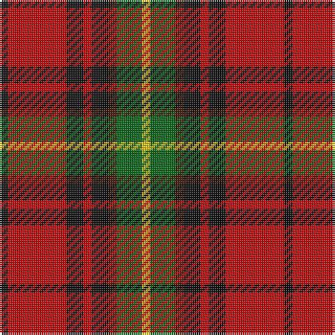

In pattern [KRKRKBGY](/stripes/krkrkbgy/).

This was sourced from tartans-authority.  It is a [8 stripe tartan](/stripes/stripes8/).

Original link http://www.tartansauthority.com/tartan-ferret/display/8087/

## Thread count
K/4 R28 K8 R4 K8 DR4 G12 Y/4

## Palette
Each colour and its ΔE from the base-6 reference it is a variant of.

| Colour | Shade | Base | ΔE (OKLab) |
|---|---|---|---|
| DR | <code style="background-color:#441800;">#441800</code> `#441800` | B <code style="background-color:#2A418A;">#2A418A</code> | 0.23 |
| G | <code style="background-color:#006818;">#006818</code> `#006818` | G <code style="background-color:#006100;">#006100</code> | 0.02 |
| K | <code style="background-color:#101010;">#101010</code> `#101010` | K <code style="background-color:#000000;">#000000</code> | 0.17 |
| R | <code style="background-color:#C80000;">#C80000</code> `#C80000` | R <code style="background-color:#CC0000;">#CC0000</code> | 0.01 |
| Y | <code style="background-color:#E8C000;">#E8C000</code> `#E8C000` | Y <code style="background-color:#F2BF00;">#F2BF00</code> | 0.02 |

# Sample pattern

## Nearest tartans

The nearest existing variants by ΔTartan distance.

1. [Carlow County Crest (Fashion)](/setts/s10/w15g8k12g14r64k12r16k10ly8k14/) — ΔT 0.85
1. [Caledonian Brewery Corporate Tartan Tartan Number: 2315. Earliest known date: pre 1997 Designed by Kinloch Anderson Ltd to commemorate the opening of the new Caledonian Brewery Malting Building. See products available Copyright © Blair Urquhart, Comrie, 2015](/setts/s7/lb4k13g6r16lb2r2g2~x2/) — ΔT 1.07
1. [Graham of Montrose Red](/setts/s9/lb1k1r10g10k5lb5r10k1lb1~x4/) — ΔT 1.09
1. [Tinkler (Corporate)](/setts/s9/g2lo9do6r3do2r3do2r10w2~x4/) — ΔT 1.12
1. [Castle Stewart (District)](/setts/s9/lo7k3db4k3r21k2r4k2w4~x2/) — ΔT 1.13
1. [Connolly Dress (Name)](/setts/s10/g6k2g3k2g6db8r20ly2r3g2~x2/) — ΔT 1.13
1. [Montrose (Graham)](/setts/s9/y1k1r8dg8k6y4r8k1y1~x8/) — ΔT 1.15
1. [Earle's Flame](/setts/s8/k10y24r3y3r24dg3y6k6~x2/) — ΔT 1.15
1. [Caledonian Brewery (Corporate)](/setts/s7/w4dg20dg10r25b2r2dg2~x2/) — ΔT 1.16
1. [Hoffman Texas German](/setts/s7/k23r27db3r5w3k14ly6~x2/) — ΔT 1.19

## Neighbour map

Every grey dot is one of 14299 variants placed by the first two principal components of the ΔTartan feature space (44% of its variance). Red is this tartan; blue dots are its nearest — click one to open its page.

<svg viewBox="0 0 640 380" role="img" style="max-width:100%;height:auto;border:1px solid #e0e0e0;border-radius:4px;display:block" xmlns="http://www.w3.org/2000/svg"><image href="/nn/cloud.v1.png" width="640" height="380"/><a href="/setts/s10/w15g8k12g14r64k12r16k10ly8k14/"><circle cx="189.9" cy="150.0" r="4" fill="#3465a4"><title>Carlow County Crest (Fashion)</title></circle></a><a href="/setts/s7/lb4k13g6r16lb2r2g2~x2/"><circle cx="172.2" cy="188.2" r="4" fill="#3465a4"><title>Caledonian Brewery Corporate Tartan Tartan Number: 2315. Earliest known date: pre 1997 Designed by Kinloch Anderson Ltd to commemorate the opening of the new Caledonian Brewery Malting Building. See products available Copyright © Blair Urquhart, Comrie, 2015</title></circle></a><a href="/setts/s9/lb1k1r10g10k5lb5r10k1lb1~x4/"><circle cx="198.9" cy="172.2" r="4" fill="#3465a4"><title>Graham of Montrose Red</title></circle></a><a href="/setts/s9/g2lo9do6r3do2r3do2r10w2~x4/"><circle cx="159.6" cy="205.4" r="4" fill="#3465a4"><title>Tinkler (Corporate)</title></circle></a><a href="/setts/s9/lo7k3db4k3r21k2r4k2w4~x2/"><circle cx="238.4" cy="145.9" r="4" fill="#3465a4"><title>Castle Stewart (District)</title></circle></a><a href="/setts/s10/g6k2g3k2g6db8r20ly2r3g2~x2/"><circle cx="209.9" cy="153.8" r="4" fill="#3465a4"><title>Connolly Dress (Name)</title></circle></a><a href="/setts/s9/y1k1r8dg8k6y4r8k1y1~x8/"><circle cx="192.3" cy="199.0" r="4" fill="#3465a4"><title>Montrose (Graham)</title></circle></a><a href="/setts/s8/k10y24r3y3r24dg3y6k6~x2/"><circle cx="225.7" cy="201.4" r="4" fill="#3465a4"><title>Earle's Flame</title></circle></a><a href="/setts/s7/w4dg20dg10r25b2r2dg2~x2/"><circle cx="203.0" cy="153.8" r="4" fill="#3465a4"><title>Caledonian Brewery (Corporate)</title></circle></a><a href="/setts/s7/k23r27db3r5w3k14ly6~x2/"><circle cx="207.4" cy="173.1" r="4" fill="#3465a4"><title>Hoffman Texas German</title></circle></a><circle cx="191.4" cy="178.8" r="5" fill="#c00000"/></svg>

ID: /setts/s8/k1r7k2r1k2do1g3ly1~x4/
