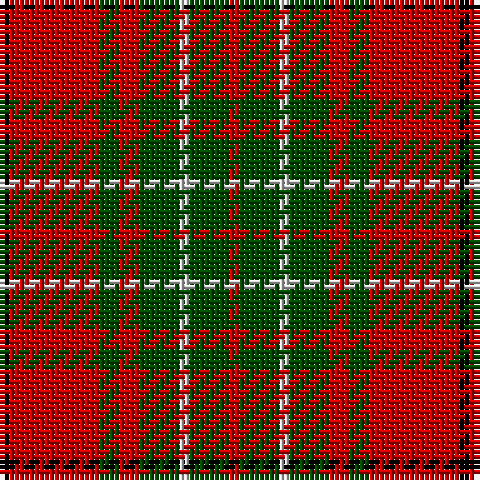

In pattern [KRGRGWGR](/stripes/krgrgwgr/).

This was sourced from weddslist.  It is a [8 stripe tartan](/stripes/stripes8/).

Original link http://www.weddslist.com/cgi-bin/tartans/pg.pl?source=rb

## Thread count
K/2 R18 G4 R4 G8 N2 G8 R/2

## Palette
Each colour and the base-6 reference it is a variant of.

| Colour | Shade | Base |
|---|---|---|
| G | <code style="background-color:#004C00;">#004C00</code> `oklch(36.1% 0.123 142.5)` <small>#004C00</small> | G <code style="background-color:#006100;">#006100</code> |
| K | <code style="background-color:#000000;">#000000</code> `oklch(0.0% 0.000 0.0)` <small>#000000</small> | K <code style="background-color:#000000;">#000000</code> |
| N | <code style="background-color:#D0D0D0;">#D0D0D0</code> `oklch(85.8% 0.000 89.9)` <small>#D0D0D0</small> | W <code style="background-color:#F7F7F7;">#F7F7F7</code> |
| R | <code style="background-color:#C80000;">#C80000</code> `oklch(52.3% 0.215 29.2)` <small>#C80000</small> | R <code style="background-color:#CC0000;">#CC0000</code> |

# Sample pattern

## Nearest tartans

The nearest existing variants by ΔTartan distance.

1. [Morrison](/setts/s9/g5w2g8r9k3r4k3r17g3~x2/) — ΔT 0.78
1. [Comyn](/setts/s8/k1r9dg2r2dg4lr1dg4r1~x2/) — ΔT 0.85
1. [Elgin District Tartan Tartan Number: 2196. Earliest known date: 1998 A sample of this tartan was recorded by the Scottish Tartans Society during the period 1970 to 1990. See products available Copyright © Blair Urquhart, Comrie, 2015](/setts/s7/do5lo4do26lo26do4lo3w5~x2/) — ΔT 0.90
1. [Morrison LC](/setts/s9/dg9lb4dg15r17k5r7k5r32dg5/) — ΔT 0.91
1. [Glenfinnan (Fashion)](/setts/s10/r5w2g3w2r10g10r2w1r2dg1~x4/) — ΔT 0.93
1. [Morrison LC](/setts/s9/dg9lr4dg15r17k5r7k5r32dg5~x2/) — ΔT 0.94
1. [Morrison LC](/setts/s9/dg9lr4dg15r17k5r7k5r32dg5/) — ΔT 0.94
1. [MacQuarrie, Ancient](/setts/s12/r2db1r10k4r2g8r2g8r7k1r2db1~x2/) — ΔT 0.98
1. [MacNab 6](/setts/s7/g28r7m7g14m7r48k4~x2/) — ΔT 0.99
1. [MacKinnon #10](/setts/s11/w2r4dg8r16t2r3dg16r4t2r4w2~x2/) — ΔT 1.00

## Neighbour map

Every grey dot is one of 14299 variants placed by the first two principal components of the ΔTartan feature space (44% of its variance). Red is this tartan; blue dots are its nearest — click one to open its page.

<svg viewBox="0 0 640 380" role="img" style="max-width:100%;height:auto;border:1px solid #e0e0e0;border-radius:4px;display:block" xmlns="http://www.w3.org/2000/svg"><image href="/nn/cloud.v1.png" width="640" height="380"/><a href="/setts/s9/g5w2g8r9k3r4k3r17g3~x2/"><circle cx="286.1" cy="194.9" r="4" fill="#3465a4"><title>Morrison</title></circle></a><a href="/setts/s8/k1r9dg2r2dg4lr1dg4r1~x2/"><circle cx="305.4" cy="206.2" r="4" fill="#3465a4"><title>Comyn</title></circle></a><a href="/setts/s7/do5lo4do26lo26do4lo3w5~x2/"><circle cx="263.2" cy="188.5" r="4" fill="#3465a4"><title>Elgin District Tartan Tartan Number: 2196. Earliest known date: 1998 A sample of this tartan was recorded by the Scottish Tartans Society during the period 1970 to 1990. See products available Copyright © Blair Urquhart, Comrie, 2015</title></circle></a><a href="/setts/s9/dg9lb4dg15r17k5r7k5r32dg5/"><circle cx="281.5" cy="188.7" r="4" fill="#3465a4"><title>Morrison LC</title></circle></a><a href="/setts/s10/r5w2g3w2r10g10r2w1r2dg1~x4/"><circle cx="261.9" cy="177.7" r="4" fill="#3465a4"><title>Glenfinnan (Fashion)</title></circle></a><a href="/setts/s9/dg9lr4dg15r17k5r7k5r32dg5~x2/"><circle cx="298.5" cy="201.1" r="4" fill="#3465a4"><title>Morrison LC</title></circle></a><a href="/setts/s9/dg9lr4dg15r17k5r7k5r32dg5/"><circle cx="298.5" cy="201.1" r="4" fill="#3465a4"><title>Morrison LC</title></circle></a><a href="/setts/s12/r2db1r10k4r2g8r2g8r7k1r2db1~x2/"><circle cx="258.9" cy="171.1" r="4" fill="#3465a4"><title>MacQuarrie, Ancient</title></circle></a><a href="/setts/s7/g28r7m7g14m7r48k4~x2/"><circle cx="289.3" cy="186.9" r="4" fill="#3465a4"><title>MacNab 6</title></circle></a><a href="/setts/s11/w2r4dg8r16t2r3dg16r4t2r4w2~x2/"><circle cx="259.9" cy="173.5" r="4" fill="#3465a4"><title>MacKinnon #10</title></circle></a><circle cx="283.3" cy="191.8" r="5" fill="#c00000"/></svg>

ID: /setts/s8/k1r9dg2r2dg4lb1dg4r1~x2/
