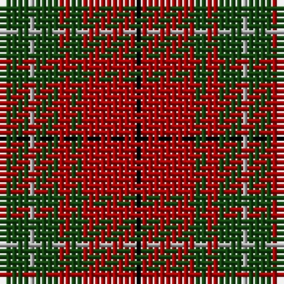

In pattern [KRGRGYGR](/patterns/krgrgygr/).

This was sourced from weddslist.  It is a [8 stripes tartan](/stripes/stripes8/).

Original link http://www.weddslist.com/cgi-bin/tartans/pg.pl?source=x

## Thread count
DR/1 DG4 N1 DG4 DR2 DG2 DR9 K/1

## Palette
Each colour and its ΔE from the base-6 reference it is a variant of.

| Colour | Shade | Base | ΔE (OKLab) |
|---|---|---|---|
| DG | <code style="background-color:#11450D;">#11450D</code> `#11450D` | G <code style="background-color:#006400;">#006400</code> | 0.10 |
| DR | <code style="background-color:#AA0000;">#AA0000</code> `#AA0000` | R <code style="background-color:#C80000;">#C80000</code> | 0.06 |
| K | <code style="background-color:#000000;">#000000</code> `#000000` | K <code style="background-color:#000000;">#000000</code> | 0.00 |
| N | <code style="background-color:#AAAAAA;">#AAAAAA</code> `#AAAAAA` | Y <code style="background-color:#E8C000;">#E8C000</code> | 0.19 |

# Sample pattern

## Nearest tartans

The nearest existing variants by ΔTartan distance.

1. [Comyn](/setts/s8/k2r18g4r4g8y2g8r2-g11450d-k000000-raa0000-yaaaaaa/) — ΔT 0.00
1. [Comyn](/setts/s8/k2r18g4r4g8w2g8r2-g004c00-k000000-rc80000-wd0d0d0/) — ΔT 0.84
1. [Morrison LC](/setts/s9/g18y8g30r34k10r14k10r64g10-g11450d-k000000-raa0000-yaaaaaa/) — ΔT 0.94
1. [Morrison LC](/setts/s9/g9y4g15r17k5r7k5r32g5-g11450d-k000000-raa0000-yaaaaaa/) — ΔT 0.94
1. [Burnett](/setts/s8/g8r58ga6r8ga28y6ga28r8-g789484-ga006818-rc80000-yd8b000/) — ΔT 1.03
1. [Bruce](/setts/s11/y2r16g4r4g12r2g12r4g4r16ya2-g11450d-raa0000-yaaaa00-yaaaaaaa/) — ΔT 1.03
1. [MacNab 6](/setts/s7/g56r14ra14g28ra14r96k8-g008000-k000000-rc00000-ra802040/) — ΔT 1.06
1. [MacNab (Crimson)](/setts/s7/g56r14ra14g28ra14r96k8-g005020-k101010-rdc0000-ra781c38/) — ΔT 1.06
1. [MacKinnon Hunting](/setts/s7/g2r16g16ra2g16r16w2-g004c00-ra52a2a-rac80000-wd0d0d0/) — ΔT 1.07
1. [MacAulay](/setts/s6/k4r32g12r6g16y2-g11450d-k000000-raa0000-yaaaaaa/) — ΔT 1.08

## Neighbour map

Every grey dot is one of 15726 variants placed by the first two principal components of the ΔTartan feature space (44% of its variance). Red is this tartan; blue dots are its nearest — click one to open its page.

<svg viewBox="0 0 640 380" role="img" style="max-width:100%;height:auto;border:1px solid #e0e0e0;border-radius:4px;display:block" xmlns="http://www.w3.org/2000/svg"><image href="/nn/cloud.v1.png" width="640" height="380"/><a href="/setts/s8/k2r18g4r4g8y2g8r2-g11450d-k000000-raa0000-yaaaaaa/"><circle cx="304.9" cy="205.1" r="4" fill="#3465a4"><title>Comyn</title></circle></a><a href="/setts/s8/k2r18g4r4g8w2g8r2-g004c00-k000000-rc80000-wd0d0d0/"><circle cx="283.2" cy="192.7" r="4" fill="#3465a4"><title>Comyn</title></circle></a><a href="/setts/s9/g18y8g30r34k10r14k10r64g10-g11450d-k000000-raa0000-yaaaaaa/"><circle cx="298.7" cy="201.5" r="4" fill="#3465a4"><title>Morrison LC</title></circle></a><a href="/setts/s9/g9y4g15r17k5r7k5r32g5-g11450d-k000000-raa0000-yaaaaaa/"><circle cx="298.7" cy="201.5" r="4" fill="#3465a4"><title>Morrison LC</title></circle></a><a href="/setts/s8/g8r58ga6r8ga28y6ga28r8-g789484-ga006818-rc80000-yd8b000/"><circle cx="308.4" cy="193.1" r="4" fill="#3465a4"><title>Burnett</title></circle></a><a href="/setts/s11/y2r16g4r4g12r2g12r4g4r16ya2-g11450d-raa0000-yaaaa00-yaaaaaaa/"><circle cx="327.4" cy="209.1" r="4" fill="#3465a4"><title>Bruce</title></circle></a><a href="/setts/s7/g56r14ra14g28ra14r96k8-g008000-k000000-rc00000-ra802040/"><circle cx="288.9" cy="186.7" r="4" fill="#3465a4"><title>MacNab 6</title></circle></a><a href="/setts/s7/g56r14ra14g28ra14r96k8-g005020-k101010-rdc0000-ra781c38/"><circle cx="297.9" cy="187.4" r="4" fill="#3465a4"><title>MacNab (Crimson)</title></circle></a><a href="/setts/s7/g2r16g16ra2g16r16w2-g004c00-ra52a2a-rac80000-wd0d0d0/"><circle cx="303.5" cy="238.0" r="4" fill="#3465a4"><title>MacKinnon Hunting</title></circle></a><a href="/setts/s6/k4r32g12r6g16y2-g11450d-k000000-raa0000-yaaaaaa/"><circle cx="342.8" cy="196.6" r="4" fill="#3465a4"><title>MacAulay</title></circle></a><circle cx="304.9" cy="205.1" r="5" fill="#c00000"/></svg>

ID: /setts/s8/k1r9g2r2g4y1g4r1-g11450d-k000000-raa0000-yaaaaaa/
