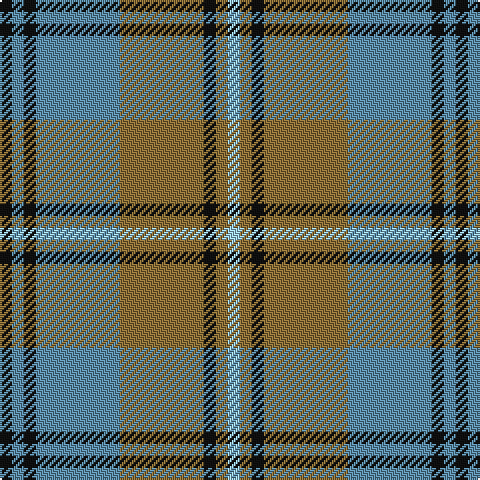

This page is one **sett** — a single exact thread-count. It belongs to the [tartan](/tartans/k1b1k1b7lt7k1lt1lb1/)
(the same proportion at any scale), whose colour order is pattern [KBKBGKGW](/stripes/kbkbgkgw/).

Sourced from register-of-tartans.  It is a [8 stripe tartan](/stripes/stripes8/).

Original link https://www.tartanregister.gov.uk/tartanDetails.aspx?ref=5313

## Register references

External register numbers recorded for this tartan.

- Scottish Register of Tartans: [5313](https://www.tartanregister.gov.uk/tartanDetails.aspx?ref=5313)
- Scottish Tartans Authority (ITI): 3580

## Thread count
K/6 B6 K6 B42 LT42 K6 LT6 LB/6

## Palette
Each colour and the base-6 reference it is a variant of.

| Colour | Shade | Base |
|---|---|---|
| B | <code style="background-color:#5C8CA8;">#5C8CA8</code> `oklch(61.7% 0.067 235.0)` <small>#5C8CA8</small> | B <code style="background-color:#2A418A;">#2A418A</code> |
| K | <code style="background-color:#101010;">#101010</code> `oklch(17.3% 0.000 89.9)` <small>#101010</small> | K <code style="background-color:#000000;">#000000</code> |
| LB | <code style="background-color:#98C8E8;">#98C8E8</code> `oklch(81.0% 0.068 237.9)` <small>#98C8E8</small> | W <code style="background-color:#F7F7F7;">#F7F7F7</code> |
| LT | <code style="background-color:#8C7038;">#8C7038</code> `oklch(56.0% 0.082 83.0)` <small>#8C7038</small> | G <code style="background-color:#006100;">#006100</code> |

# Sample pattern

## Nearest tartans

The nearest existing variants by ΔTartan distance, with this tartan at the top so the swatches line up against it.

ΔTartan

Tartan

Sett

—

<a href="/ttd/edit/#slug=k1t1k1t7y7k1y1lb1~x6">Auld Lang Syne (Philip King Tailoring)</a> <a class="nn-out" href="/setts/s8/k1t1k1t7y7k1y1lb1~x6/" title="open its dictionary page">↗</a>

0.43

<a href="/ttd/edit/#slug=r1o1m1o7dg7m1dg1m1~x6">Beck-McSorley</a> <a class="nn-out" href="/setts/s8/r1o1m1o7dg7m1dg1m1~x6/" title="open its dictionary page">↗</a>

1.03

<a href="/ttd/edit/#slug=r2ly1b8r1g7ly1r2~x6">Cercle de Fermieres de St-Elie . . .</a> <a class="nn-out" href="/setts/s7/r2ly1b8r1g7ly1r2~x6/" title="open its dictionary page">↗</a>

1.10

<a href="/ttd/edit/#slug=o19k2w4k2n5k2n5~x2">Kyle Tartan Tartan Number: 1288. Earliest known date: pre 1984 Seen in Service Station at Gretna Green in 1984 by Angela Nisbett MSTS . Berars no relation to the other two Kyles (3615 &amp; 3616). See products available Copyright © Blair Urquhart, Comrie, 2015</a> <a class="nn-out" href="/setts/s7/o19k2w4k2n5k2n5~x2/" title="open its dictionary page">↗</a>

1.11

<a href="/ttd/edit/#slug=db2r3g11r3db2t2db11r2g2~x2">Hebridean 1</a> <a class="nn-out" href="/setts/s9/db2r3g11r3db2t2db11r2g2~x2/" title="open its dictionary page">↗</a>

1.16

<a href="/ttd/edit/#slug=n32k3n3k3b5k8o21k4~x2">Speyside Blue (Fashion)</a> <a class="nn-out" href="/setts/s8/n32k3n3k3b5k8o21k4~x2/" title="open its dictionary page">↗</a>

1.17

<a href="/ttd/edit/#slug=y19k2w2k2n5k2n5~x4">Kyle</a> <a class="nn-out" href="/setts/s7/y19k2w2k2n5k2n5~x4/" title="open its dictionary page">↗</a>

1.18

<a href="/ttd/edit/#slug=k1n1k1n7dy7k1dy1lt1~x6">Auld Lang Syne</a> <a class="nn-out" href="/setts/s8/k1n1k1n7dy7k1dy1lt1~x6/" title="open its dictionary page">↗</a>

1.20

<a href="/ttd/edit/#slug=n32k3n3k3o5k8o21k4~x2">Speyside Grey (Fashion)</a> <a class="nn-out" href="/setts/s8/n32k3n3k3o5k8o21k4~x2/" title="open its dictionary page">↗</a>

1.20

<a href="/ttd/edit/#slug=p11o2p2o2p2o11g14w2~x2">Lamont</a> <a class="nn-out" href="/setts/s8/p11o2p2o2p2o11g14w2~x2/" title="open its dictionary page">↗</a>

1.27

<a href="/ttd/edit/#slug=k2t2k2t15g15k2g2w2~x4">Ben Lomond (Fashion)</a> <a class="nn-out" href="/setts/s8/k2t2k2t15g15k2g2w2~x4/" title="open its dictionary page">↗</a>

## Neighbour map

Every grey dot is one of 14299 variants placed by the first two principal components of the ΔTartan feature space (44% of its variance). Red is this tartan; blue dots are its nearest — click one to open its page.

<svg viewBox="0 0 640 380" role="img" style="max-width:100%;height:auto;border:1px solid #e0e0e0;border-radius:4px;display:block" xmlns="http://www.w3.org/2000/svg"><image href="/nn/cloud.v1.png" width="640" height="380"/><a href="/setts/s8/r1o1m1o7dg7m1dg1m1~x6/"><circle cx="235.7" cy="203.5" r="4" fill="#3465a4"><title>Beck-McSorley</title></circle></a><a href="/setts/s7/r2ly1b8r1g7ly1r2~x6/"><circle cx="185.4" cy="203.4" r="4" fill="#3465a4"><title>Cercle de Fermieres de St-Elie . . .</title></circle></a><a href="/setts/s7/o19k2w4k2n5k2n5~x2/"><circle cx="255.7" cy="188.3" r="4" fill="#3465a4"><title>Kyle Tartan Tartan Number: 1288. Earliest known date: pre 1984 Seen in Service Station at Gretna Green in 1984 by Angela Nisbett MSTS . Berars no relation to the other two Kyles (3615 &amp; 3616). See products available Copyright © Blair Urquhart, Comrie, 2015</title></circle></a><a href="/setts/s9/db2r3g11r3db2t2db11r2g2~x2/"><circle cx="212.3" cy="228.9" r="4" fill="#3465a4"><title>Hebridean 1</title></circle></a><a href="/setts/s8/n32k3n3k3b5k8o21k4~x2/"><circle cx="267.1" cy="197.7" r="4" fill="#3465a4"><title>Speyside Blue (Fashion)</title></circle></a><a href="/setts/s7/y19k2w2k2n5k2n5~x4/"><circle cx="292.9" cy="192.6" r="4" fill="#3465a4"><title>Kyle</title></circle></a><a href="/setts/s8/k1n1k1n7dy7k1dy1lt1~x6/"><circle cx="243.9" cy="216.0" r="4" fill="#3465a4"><title>Auld Lang Syne</title></circle></a><a href="/setts/s8/n32k3n3k3o5k8o21k4~x2/"><circle cx="270.3" cy="197.1" r="4" fill="#3465a4"><title>Speyside Grey (Fashion)</title></circle></a><a href="/setts/s8/p11o2p2o2p2o11g14w2~x2/"><circle cx="187.2" cy="211.2" r="4" fill="#3465a4"><title>Lamont</title></circle></a><a href="/setts/s8/k2t2k2t15g15k2g2w2~x4/"><circle cx="233.1" cy="203.8" r="4" fill="#3465a4"><title>Ben Lomond (Fashion)</title></circle></a><circle cx="234.4" cy="202.6" r="5" fill="#c00000"/></svg>

ID: /setts/s8/k1t1k1t7y7k1y1lb1~x6/
