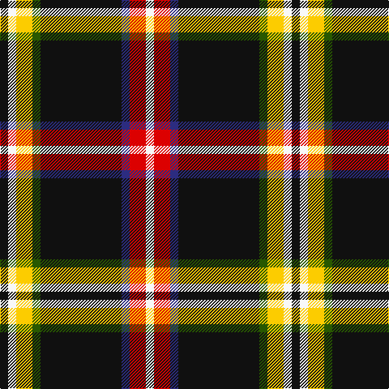

In pattern [KWYGKBRW](/patterns/kwygkbrw/).

This was sourced from register-of-tartans.  It is a [8 stripes tartan](/stripes/stripes8/).

Original link https://www.tartanregister.gov.uk/tartanDetails.aspx?ref=11313

## Register references

External register numbers recorded for this tartan.

- Scottish Register of Tartans: [11313](https://www.tartanregister.gov.uk/tartanDetails.aspx?ref=11313)

## Thread count
K/10 W10 Y20 G10 K100 DB10 R20 W/10

## Palette
Each colour and its ΔE from the base-6 reference it is a variant of.

| Colour | Shade | Base | ΔE (OKLab) |
|---|---|---|---|
| DB | <code style="background-color:#2C2C80;">#2C2C80</code> `#2C2C80` | B <code style="background-color:#2A418A;">#2A418A</code> | 0.06 |
| G | <code style="background-color:#285800;">#285800</code> `#285800` | G <code style="background-color:#006100;">#006100</code> | 0.03 |
| K | <code style="background-color:#101010;">#101010</code> `#101010` | K <code style="background-color:#000000;">#000000</code> | 0.17 |
| R | <code style="background-color:#DC0000;">#DC0000</code> `#DC0000` | R <code style="background-color:#CC0000;">#CC0000</code> | 0.03 |
| W | <code style="background-color:#F8F8F8;">#F8F8F8</code> `#F8F8F8` | W <code style="background-color:#F7F7F7;">#F7F7F7</code> | 0.00 |
| Y | <code style="background-color:#FCCC00;">#FCCC00</code> `#FCCC00` | Y <code style="background-color:#F2BF00;">#F2BF00</code> | 0.04 |

# Sample pattern

## Nearest tartans

The nearest existing variants by ΔTartan distance.

1. [Care Leaver](/setts/s9/w15k50wa4r18k5b5k15y10k4~b38409c-k101010-r980044-w98c8e8-wac0c0c0-yfccc00~x2/) — ΔT 0.97
1. [Care Leaver](/setts/s9/y15k50w4r18k5b5k15ya10k4~b2474eb-k101010-ra00048-we0e0e0-y48a4c0-yafccc00~x2/) — ΔT 1.02
1. [Bird Family (Personal)](/setts/s10/y4k28y2b7w3r9g2w4g2k2~b2c2c80-g289c18-k101010-r901c38-wfcfcfc-yfccc00~x2/) — ΔT 1.39
1. [Legion of Frontiersmen](/setts/s8/b62y7g7r3w3ba13w3r5~b441800-ba000048-g008b00-rc80000-wffffff-yffd700~x2/) — ΔT 1.42
1. [Westin Kierland](/setts/s8/r2k37ra10b3ra5y4ra3w2~b2c2c80-k101010-rb84c00-rac80000-wfcfcfc-ye8c000~x2/) — ΔT 1.42
1. [Braddock Family (Northumberland) (Personal)](/setts/s11/w5k4b2k5y2r2y2k30g3w7k4~b2c2c80-g649848-k101010-rca2625-we0e0e0-ye8c000~x2/) — ΔT 1.44
1. [Bird Family (Wales) (Personal)](/setts/s10/y4k28y2b7w3ka9g2w4g2k2~b433a5a-g649848-k1c1714-ka000000-we5e0d2-ye0a126~x2/) — ΔT 1.45
1. [Westin Kierland](/setts/s8/r2k37ra10b3ra5y4ra3w2~b00008c-k101010-rb84c00-rac8002c-wffffff-yd09800~x2/) — ΔT 1.50
1. [Coalfields Regeneration Trust, The](/setts/s7/k2r1y1g8k15g2b1~b780078-g789484-k101010-ra00000-ye8c000~x4/) — ΔT 1.51
1. [Legion of Frontiersmen (Corporate)](/setts/s8/k45y10g7r3w4b13w9r6~b202060-g006818-k101010-rc80000-we0e0e0-ybc8c00~x2/) — ΔT 1.55

## Neighbour map

Every grey dot is one of 15726 variants placed by the first two principal components of the ΔTartan feature space (44% of its variance). Red is this tartan; blue dots are its nearest — click one to open its page.

<svg viewBox="0 0 640 380" role="img" style="max-width:100%;height:auto;border:1px solid #e0e0e0;border-radius:4px;display:block" xmlns="http://www.w3.org/2000/svg"><image href="/nn/cloud.v1.png" width="640" height="380"/><a href="/setts/s9/w15k50wa4r18k5b5k15y10k4~b38409c-k101010-r980044-w98c8e8-wac0c0c0-yfccc00~x2/"><circle cx="247.7" cy="134.3" r="4" fill="#3465a4"><title>Care Leaver</title></circle></a><a href="/setts/s9/y15k50w4r18k5b5k15ya10k4~b2474eb-k101010-ra00048-we0e0e0-y48a4c0-yafccc00~x2/"><circle cx="249.1" cy="135.9" r="4" fill="#3465a4"><title>Care Leaver</title></circle></a><a href="/setts/s10/y4k28y2b7w3r9g2w4g2k2~b2c2c80-g289c18-k101010-r901c38-wfcfcfc-yfccc00~x2/"><circle cx="181.3" cy="102.1" r="4" fill="#3465a4"><title>Bird Family (Personal)</title></circle></a><a href="/setts/s8/b62y7g7r3w3ba13w3r5~b441800-ba000048-g008b00-rc80000-wffffff-yffd700~x2/"><circle cx="314.3" cy="94.2" r="4" fill="#3465a4"><title>Legion of Frontiersmen</title></circle></a><a href="/setts/s8/r2k37ra10b3ra5y4ra3w2~b2c2c80-k101010-rb84c00-rac80000-wfcfcfc-ye8c000~x2/"><circle cx="295.7" cy="103.4" r="4" fill="#3465a4"><title>Westin Kierland</title></circle></a><a href="/setts/s11/w5k4b2k5y2r2y2k30g3w7k4~b2c2c80-g649848-k101010-rca2625-we0e0e0-ye8c000~x2/"><circle cx="309.6" cy="102.6" r="4" fill="#3465a4"><title>Braddock Family (Northumberland) (Personal)</title></circle></a><a href="/setts/s10/y4k28y2b7w3ka9g2w4g2k2~b433a5a-g649848-k1c1714-ka000000-we5e0d2-ye0a126~x2/"><circle cx="187.1" cy="108.5" r="4" fill="#3465a4"><title>Bird Family (Wales) (Personal)</title></circle></a><a href="/setts/s8/r2k37ra10b3ra5y4ra3w2~b00008c-k101010-rb84c00-rac8002c-wffffff-yd09800~x2/"><circle cx="298.6" cy="104.8" r="4" fill="#3465a4"><title>Westin Kierland</title></circle></a><a href="/setts/s7/k2r1y1g8k15g2b1~b780078-g789484-k101010-ra00000-ye8c000~x4/"><circle cx="308.2" cy="151.9" r="4" fill="#3465a4"><title>Coalfields Regeneration Trust, The</title></circle></a><a href="/setts/s8/k45y10g7r3w4b13w9r6~b202060-g006818-k101010-rc80000-we0e0e0-ybc8c00~x2/"><circle cx="180.0" cy="122.2" r="4" fill="#3465a4"><title>Legion of Frontiersmen (Corporate)</title></circle></a><circle cx="242.0" cy="126.7" r="5" fill="#c00000"/></svg>

ID: /setts/s8/k1w1y2g1k10b1r2w1~b2c2c80-g285800-k101010-rdc0000-wf8f8f8-yfccc00~x10/
