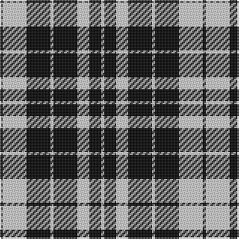

In pattern [KWKWKWKW](/patterns/kwkwkwkw/).

This was sourced from weddslist.  It is a [8 stripes tartan](/stripes/stripes8/).

Original link http://www.weddslist.com/cgi-bin/tartans/pg.pl?source=rb

## Thread count
K/2 N16 K16 N2 K16 N8 K8 N/2

## Palette
Each colour and its ΔE from the base-6 reference it is a variant of.

| Colour | Shade | Base | ΔE (OKLab) |
|---|---|---|---|
| K | <code style="background-color:#000000;">#000000</code> `#000000` | K <code style="background-color:#000000;">#000000</code> | 0.00 |
| N | <code style="background-color:#D0D0D0;">#D0D0D0</code> `#D0D0D0` | W <code style="background-color:#F7F7F7;">#F7F7F7</code> | 0.12 |

# Sample pattern

## Nearest tartans

The nearest existing variants by ΔTartan distance.

1. [MacLean, Black & White](/setts/s11/w20k6w9k6w6k12w6k48w8k16w16~k000000-we0e0e0/) — ΔT 0.95
1. [Douglas, Grey Clan/Family Tartan Tartan Number: 7211. Earliest known date: 01/01/1842 The design comes from the Vestiarium Scoticum (1842). The authors, the Sobieski Stuart brothers, enjoyed a popular following among the Scottish gentry in the early Victorian era, and in the spirit of the times, added mystery, romance and some spurious historical documentation to the subject of tartan. Of the better known tartans, the book offers some minor variation, but in other cases it provides the only recorded version of many tartans in use today. (Estimated threadcount; Original STA ref: 1127) See products available Copyright © Blair Urquhart, Comrie, 2015](/setts/s8/k9y1k2y1k4y9k1y2~k000000-y909090~x4/) — ΔT 0.98
1. [Coppa Romana (Corporate)](/setts/s10/k17y2k2y2k9w11k2w11k20y2~k101010-wc0c0c0-yfccc00~x2/) — ΔT 1.38
1. [Coppa Romana (Switzerland)](/setts/s10/k17y2k2y2k9w11k2w11k20y2~k101010-wdfd9ca-yf9bc17~x2/) — ΔT 1.45
1. [MacLean B & W (Clan)](/setts/s11/w20k6w9k6w6k12w6k48w8k16w16~k101010-we0e0e0~x2/) — ΔT 1.49
1. [Erskine, or Ramsay](/setts/s6/k2w1k9w9k1w2~k000000-we0e0e0~x6/) — ΔT 1.54
1. [Douglas, Grey (Vestiarium Scoticum)](/setts/s8/k10r1k2r1k4r10k1r2~k101010-r888888~x4/) — ΔT 1.55
1. [Royal Stuart / Stewart](/setts/s11/k14w4k14w19k4w4k4g4k16g11k8~g808080-k000000-we0e0e0/) — ΔT 1.60
1. [Bute Heather, Black](/setts/s10/k6g20k6g4k4g8g2k8g2k5~g808080-k101010~x2/) — ΔT 1.62
1. [Burberry Black](/setts/s5/y3k3y3k10r1~k000000-rc80000-yb0b0b0~x6/) — ΔT 1.62

## Neighbour map

Every grey dot is one of 15726 variants placed by the first two principal components of the ΔTartan feature space (44% of its variance). Red is this tartan; blue dots are its nearest — click one to open its page.

<svg viewBox="0 0 640 380" role="img" style="max-width:100%;height:auto;border:1px solid #e0e0e0;border-radius:4px;display:block" xmlns="http://www.w3.org/2000/svg"><image href="/nn/cloud.v1.png" width="640" height="380"/><a href="/setts/s11/w20k6w9k6w6k12w6k48w8k16w16~k000000-we0e0e0/"><circle cx="306.4" cy="215.8" r="4" fill="#3465a4"><title>MacLean, Black &amp; White</title></circle></a><a href="/setts/s8/k9y1k2y1k4y9k1y2~k000000-y909090~x4/"><circle cx="324.3" cy="229.8" r="4" fill="#3465a4"><title>Douglas, Grey Clan/Family Tartan Tartan Number: 7211. Earliest known date: 01/01/1842 The design comes from the Vestiarium Scoticum (1842). The authors, the Sobieski Stuart brothers, enjoyed a popular following among the Scottish gentry in the early Victorian era, and in the spirit of the times, added mystery, romance and some spurious historical documentation to the subject of tartan. Of the better known tartans, the book offers some minor variation, but in other cases it provides the only recorded version of many tartans in use today. (Estimated threadcount; Original STA ref: 1127) See products available Copyright © Blair Urquhart, Comrie, 2015</title></circle></a><a href="/setts/s10/k17y2k2y2k9w11k2w11k20y2~k101010-wc0c0c0-yfccc00~x2/"><circle cx="324.6" cy="199.0" r="4" fill="#3465a4"><title>Coppa Romana (Corporate)</title></circle></a><a href="/setts/s10/k17y2k2y2k9w11k2w11k20y2~k101010-wdfd9ca-yf9bc17~x2/"><circle cx="320.9" cy="196.4" r="4" fill="#3465a4"><title>Coppa Romana (Switzerland)</title></circle></a><a href="/setts/s11/w20k6w9k6w6k12w6k48w8k16w16~k101010-we0e0e0~x2/"><circle cx="307.5" cy="211.6" r="4" fill="#3465a4"><title>MacLean B &amp; W (Clan)</title></circle></a><a href="/setts/s6/k2w1k9w9k1w2~k000000-we0e0e0~x6/"><circle cx="295.4" cy="229.1" r="4" fill="#3465a4"><title>Erskine, or Ramsay</title></circle></a><a href="/setts/s8/k10r1k2r1k4r10k1r2~k101010-r888888~x4/"><circle cx="351.1" cy="225.9" r="4" fill="#3465a4"><title>Douglas, Grey (Vestiarium Scoticum)</title></circle></a><a href="/setts/s11/k14w4k14w19k4w4k4g4k16g11k8~g808080-k000000-we0e0e0/"><circle cx="226.5" cy="243.3" r="4" fill="#3465a4"><title>Royal Stuart / Stewart</title></circle></a><a href="/setts/s10/k6g20k6g4k4g8g2k8g2k5~g808080-k101010~x2/"><circle cx="338.5" cy="232.0" r="4" fill="#3465a4"><title>Bute Heather, Black</title></circle></a><a href="/setts/s5/y3k3y3k10r1~k000000-rc80000-yb0b0b0~x6/"><circle cx="346.2" cy="241.6" r="4" fill="#3465a4"><title>Burberry Black</title></circle></a><circle cx="313.8" cy="246.5" r="5" fill="#c00000"/></svg>

ID: /setts/s8/k1w8k8w1k8w4k4w1~k000000-wd0d0d0~x2/
