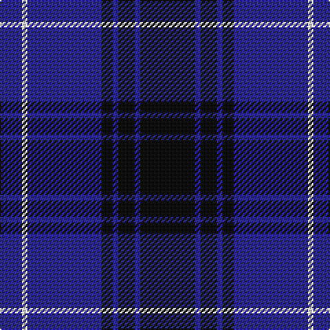

In pattern [BWBKBKBK](/patterns/bwbkbkbk/).

This was sourced from tartans-authority.  It is a [8 stripes tartan](/stripes/stripes8/).

Original link http://www.tartansauthority.com/tartan-ferret/display/11282/

## Thread count
DB/16 W4 DB54 K8 DB4 K12 DB4 K/40

## Palette
Each colour and its ΔE from the base-6 reference it is a variant of.

| Colour | Shade | Base | ΔE (OKLab) |
|---|---|---|---|
| DB | <code style="background-color:#2C2C80;">#2C2C80</code> `#2C2C80` | B <code style="background-color:#2A418A;">#2A418A</code> | 0.06 |
| K | <code style="background-color:#101010;">#101010</code> `#101010` | K <code style="background-color:#000000;">#000000</code> | 0.17 |
| W | <code style="background-color:#FCFCFC;">#FCFCFC</code> `#FCFCFC` | W <code style="background-color:#F7F7F7;">#F7F7F7</code> | 0.01 |

# Sample pattern

## Nearest tartans

The nearest existing variants by ΔTartan distance.

1. [Pride of Kinross](/setts/s8/k20b2k6b2k4b27w2b8x2~b2c2c80-k101010-wffffff/) — ΔT 0.03
1. [Argentina](/setts/s7/b5w3b33k3b3k36b3x2~b304080-k000030-we0e0e0/) — ΔT 0.92
1. [Argentina](/setts/s7/b5w3b33k3b3k36b3x2~b2c2c80-k00002c-we0e0e0/) — ΔT 0.99
1. [Auckland (Fashion)](/setts/s8/g3k3b2k16b2k2b24w2x2~b2c2c80-g003820-k101010-wc0c0c0/) — ΔT 1.25
1. [Royal Scotsman Train (Corporate)](/setts/s6/b5k2b14k14b2y2x2~b2c2c80-k101010-yb8b4b8/) — ΔT 1.29
1. [Marchmont (Personal)](/setts/s7/g1b12k12g1k12b12k1x4~b2c2c80-g289c18-k101010/) — ΔT 1.34
1. [Oban](/setts/s8/b6k10b1k1b1k10ba10k6x4~b3850c8-ba2c2c80-k101010/) — ΔT 1.35
1. [St. Georges, Edgbaston](/setts/s7/r4k21w2k20b21k2b2x2~b304080-k000030-rc00000-we0e0e0/) — ΔT 1.37
1. [Murdoch Celebration (Personal)](/setts/s8/b30r2b2r4b9k26w2k4x2~b2c4084-k101010-rdc0000-we0e0e0/) — ΔT 1.37
1. [Slanj Dress (Corporate)](/setts/s8/k4b36k4b4k34ba3k3w4x2~b202060-ba3850c8-k101010-we0e0e0/) — ΔT 1.37

## Neighbour map

Every grey dot is one of 15726 variants placed by the first two principal components of the ΔTartan feature space (44% of its variance). Red is this tartan; blue dots are its nearest — click one to open its page.

<svg viewBox="0 0 640 380" role="img" style="max-width:100%;height:auto;border:1px solid #e0e0e0;border-radius:4px;display:block" xmlns="http://www.w3.org/2000/svg"><image href="/nn/cloud.v1.png" width="640" height="380"/><a href="/setts/s8/k20b2k6b2k4b27w2b8x2~b2c2c80-k101010-wffffff/"><circle cx="387.2" cy="219.2" r="4" fill="#3465a4"><title>Pride of Kinross</title></circle></a><a href="/setts/s7/b5w3b33k3b3k36b3x2~b304080-k000030-we0e0e0/"><circle cx="366.3" cy="216.2" r="4" fill="#3465a4"><title>Argentina</title></circle></a><a href="/setts/s7/b5w3b33k3b3k36b3x2~b2c2c80-k00002c-we0e0e0/"><circle cx="376.0" cy="220.8" r="4" fill="#3465a4"><title>Argentina</title></circle></a><a href="/setts/s8/g3k3b2k16b2k2b24w2x2~b2c2c80-g003820-k101010-wc0c0c0/"><circle cx="359.4" cy="199.3" r="4" fill="#3465a4"><title>Auckland (Fashion)</title></circle></a><a href="/setts/s6/b5k2b14k14b2y2x2~b2c2c80-k101010-yb8b4b8/"><circle cx="350.4" cy="267.7" r="4" fill="#3465a4"><title>Royal Scotsman Train (Corporate)</title></circle></a><a href="/setts/s7/g1b12k12g1k12b12k1x4~b2c2c80-g289c18-k101010/"><circle cx="364.4" cy="258.8" r="4" fill="#3465a4"><title>Marchmont (Personal)</title></circle></a><a href="/setts/s8/b6k10b1k1b1k10ba10k6x4~b3850c8-ba2c2c80-k101010/"><circle cx="365.2" cy="259.6" r="4" fill="#3465a4"><title>Oban</title></circle></a><a href="/setts/s7/r4k21w2k20b21k2b2x2~b304080-k000030-rc00000-we0e0e0/"><circle cx="344.7" cy="221.0" r="4" fill="#3465a4"><title>St. Georges, Edgbaston</title></circle></a><a href="/setts/s8/b30r2b2r4b9k26w2k4x2~b2c4084-k101010-rdc0000-we0e0e0/"><circle cx="331.8" cy="180.6" r="4" fill="#3465a4"><title>Murdoch Celebration (Personal)</title></circle></a><a href="/setts/s8/k4b36k4b4k34ba3k3w4x2~b202060-ba3850c8-k101010-we0e0e0/"><circle cx="345.5" cy="197.4" r="4" fill="#3465a4"><title>Slanj Dress (Corporate)</title></circle></a><circle cx="388.1" cy="219.6" r="5" fill="#c00000"/></svg>

ID: /setts/s8/k20b2k6b2k4b27w2b8x2~b2c2c80-k101010-wfcfcfc/
