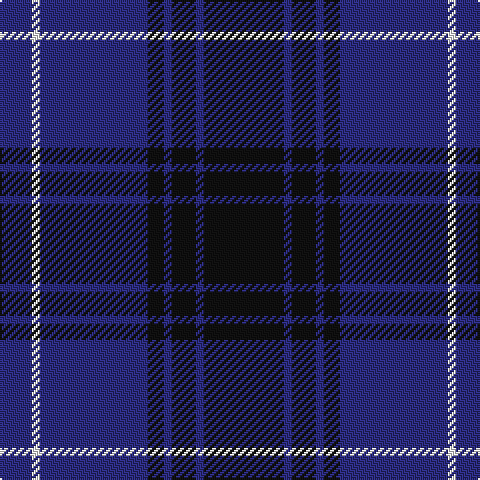

This page is one **sett** — a single exact thread-count. It belongs to the [tartan](/tartans/k20db2k6db2k4db27w2db8/)
(the same proportion at any scale), whose colour order is pattern [BWBKBKBK](/stripes/bwbkbkbk/).

Sourced from register-of-tartans.  It is a [8 stripe tartan](/stripes/stripes8/).

Original link https://www.tartanregister.gov.uk/tartanDetails.aspx?ref=11282

2 attestations — the source records this cloth was collapsed from (oldest owns this page)

<ul>
<li>08/10/2014 — Pride of Kinross (register-of-tartans, <a href="https://www.tartanregister.gov.uk/tartanDetails.aspx?ref=11282">record</a>)</li>
<li>2015 — Pride of Kinross (tartans-authority, <a href="http://www.tartansauthority.com/tartan-ferret/display/11282/">record</a>)</li>
</ul>

## Register references

External register numbers recorded for this tartan.

- Scottish Register of Tartans: [11282](https://www.tartanregister.gov.uk/tartanDetails.aspx?ref=11282)

## Thread count
K/40 DB4 K12 DB4 K8 DB54 W4 DB/16

## Palette
Each colour and the base-6 reference it is a variant of.

| Colour | Shade | Base |
|---|---|---|
| DB | <code style="background-color:#2C2C80;">#2C2C80</code> `oklch(35.0% 0.138 276.6)` <small>#2C2C80</small> | B <code style="background-color:#2A418A;">#2A418A</code> |
| K | <code style="background-color:#101010;">#101010</code> `oklch(17.3% 0.000 89.9)` <small>#101010</small> | K <code style="background-color:#000000;">#000000</code> |
| W | <code style="background-color:#FFFFFF;">#FFFFFF</code> `oklch(100.0% 0.000 89.9)` <small>#FFFFFF</small> | W <code style="background-color:#F7F7F7;">#F7F7F7</code> |

# Sample pattern

## Nearest tartans

The nearest existing variants by ΔTartan distance, with this tartan at the top so the swatches line up against it.

ΔTartan

Tartan

Sett

—

<a href="/ttd/edit/#slug=k20db2k6db2k4db27w2db8~x2">Pride of Kinross</a> <a class="nn-out" href="/setts/s8/k20db2k6db2k4db27w2db8~x2/" title="open its dictionary page">↗</a>

0.99

<a href="/ttd/edit/#slug=db5w3db33k3db3k36db3~x2">Argentina</a> <a class="nn-out" href="/setts/s7/db5w3db33k3db3k36db3~x2/" title="open its dictionary page">↗</a>

1.26

<a href="/ttd/edit/#slug=dg3k3db2k16db2k2db24lb2~x2">Auckland (Fashion)</a> <a class="nn-out" href="/setts/s8/dg3k3db2k16db2k2db24lb2~x2/" title="open its dictionary page">↗</a>

1.29

<a href="/ttd/edit/#slug=db5k2db14k14db2lr2~x2">Royal Scotsman Train (Corporate)</a> <a class="nn-out" href="/setts/s6/db5k2db14k14db2lr2~x2/" title="open its dictionary page">↗</a>

1.35

<a href="/ttd/edit/#slug=k1db12k12g1k12db12g1~x4">Marchmont (Personal)</a> <a class="nn-out" href="/setts/s7/k1db12k12g1k12db12g1~x4/" title="open its dictionary page">↗</a>

1.35

<a href="/ttd/edit/#slug=r4k21w2k20db21k2db2~x2">St. Georges, Edgbaston</a> <a class="nn-out" href="/setts/s7/r4k21w2k20db21k2db2~x2/" title="open its dictionary page">↗</a>

1.36

<a href="/ttd/edit/#slug=db30r2db2r4db9k26w2k4~x2">Murdoch Celebration (Personal)</a> <a class="nn-out" href="/setts/s8/db30r2db2r4db9k26w2k4~x2/" title="open its dictionary page">↗</a>

1.36

<a href="/ttd/edit/#slug=k6db10k10b1k1b1k10b6~x4">Oban</a> <a class="nn-out" href="/setts/s8/k6db10k10b1k1b1k10b6~x4/" title="open its dictionary page">↗</a>

1.37

<a href="/ttd/edit/#slug=k4db36k4db4k34b3k3w4~x2">Slanj Dress (Corporate)</a> <a class="nn-out" href="/setts/s8/k4db36k4db4k34b3k3w4~x2/" title="open its dictionary page">↗</a>

1.40

<a href="/ttd/edit/#slug=db24n13db4n4w2~x2">Gallaecia - Galicia National</a> <a class="nn-out" href="/setts/s5/db24n13db4n4w2~x2/" title="open its dictionary page">↗</a>

1.40

<a href="/ttd/edit/#slug=k21db8r4db2r2db23k4w2~x2">Murdoch Clebration (Personal)</a> <a class="nn-out" href="/setts/s8/k21db8r4db2r2db23k4w2~x2/" title="open its dictionary page">↗</a>

## Neighbour map

Every grey dot is one of 14299 variants placed by the first two principal components of the ΔTartan feature space (44% of its variance). Red is this tartan; blue dots are its nearest — click one to open its page.

<svg viewBox="0 0 640 380" role="img" style="max-width:100%;height:auto;border:1px solid #e0e0e0;border-radius:4px;display:block" xmlns="http://www.w3.org/2000/svg"><image href="/nn/cloud.v1.png" width="640" height="380"/><a href="/setts/s7/db5w3db33k3db3k36db3~x2/"><circle cx="379.4" cy="224.0" r="4" fill="#3465a4"><title>Argentina</title></circle></a><a href="/setts/s8/dg3k3db2k16db2k2db24lb2~x2/"><circle cx="362.1" cy="205.0" r="4" fill="#3465a4"><title>Auckland (Fashion)</title></circle></a><a href="/setts/s6/db5k2db14k14db2lr2~x2/"><circle cx="353.1" cy="270.6" r="4" fill="#3465a4"><title>Royal Scotsman Train (Corporate)</title></circle></a><a href="/setts/s7/k1db12k12g1k12db12g1~x4/"><circle cx="366.9" cy="264.5" r="4" fill="#3465a4"><title>Marchmont (Personal)</title></circle></a><a href="/setts/s7/r4k21w2k20db21k2db2~x2/"><circle cx="347.8" cy="222.1" r="4" fill="#3465a4"><title>St. Georges, Edgbaston</title></circle></a><a href="/setts/s8/db30r2db2r4db9k26w2k4~x2/"><circle cx="334.5" cy="182.2" r="4" fill="#3465a4"><title>Murdoch Celebration (Personal)</title></circle></a><a href="/setts/s8/k6db10k10b1k1b1k10b6~x4/"><circle cx="367.7" cy="263.7" r="4" fill="#3465a4"><title>Oban</title></circle></a><a href="/setts/s8/k4db36k4db4k34b3k3w4~x2/"><circle cx="348.3" cy="202.5" r="4" fill="#3465a4"><title>Slanj Dress (Corporate)</title></circle></a><a href="/setts/s5/db24n13db4n4w2~x2/"><circle cx="397.4" cy="254.0" r="4" fill="#3465a4"><title>Gallaecia - Galicia National</title></circle></a><a href="/setts/s8/k21db8r4db2r2db23k4w2~x2/"><circle cx="308.9" cy="198.5" r="4" fill="#3465a4"><title>Murdoch Clebration (Personal)</title></circle></a><circle cx="389.9" cy="221.9" r="5" fill="#c00000"/></svg>

ID: /setts/s8/k20db2k6db2k4db27w2db8~x2/
