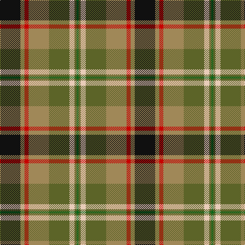

In pattern [GGWGYRYK](/stripes/ggwgyryk/).

This was sourced from tartans-authority.  It is a [8 stripe tartan](/stripes/stripes8/).

Original link http://www.tartansauthority.com/tartan-ferret/display/10783/

## Thread count
K/40 LT8 R8 LT40 Ga40 LR10 Ga4 G/4

## Palette
Each colour and the base-6 reference it is a variant of.

| Colour | Shade | Base |
|---|---|---|
| G | <code style="background-color:#006818;">#006818</code> `oklch(45.0% 0.142 145.0)` <small>#006818</small> | G <code style="background-color:#006100;">#006100</code> |
| Ga | <code style="background-color:#5C6428;">#5C6428</code> `oklch(48.3% 0.084 116.0)` <small>#5C6428</small> | G <code style="background-color:#006100;">#006100</code> |
| K | <code style="background-color:#101010;">#101010</code> `oklch(17.3% 0.000 89.9)` <small>#101010</small> | K <code style="background-color:#000000;">#000000</code> |
| LR | <code style="background-color:#E8CCB8;">#E8CCB8</code> `oklch(86.3% 0.042 57.7)` <small>#E8CCB8</small> | W <code style="background-color:#F7F7F7;">#F7F7F7</code> |
| LT | <code style="background-color:#A08858;">#A08858</code> `oklch(63.7% 0.071 84.0)` <small>#A08858</small> | Y <code style="background-color:#F2BF00;">#F2BF00</code> |
| R | <code style="background-color:#C80000;">#C80000</code> `oklch(52.3% 0.215 29.2)` <small>#C80000</small> | R <code style="background-color:#CC0000;">#CC0000</code> |

# Sample pattern

## Nearest tartans

The nearest existing variants by ΔTartan distance, with this tartan at the top so the swatches line up against it.

ΔTartan

Tartan

Sett

—

<a href="/ttd/edit/#slug=k20lo4r4lo20y20lb5y2g2~x2">Hackett Hunting (Personal)</a> <a class="nn-out" href="/setts/s8/k20lo4r4lo20y20lb5y2g2~x2/" title="open its dictionary page">↗</a>

0.86

<a href="/ttd/edit/#slug=g22w3k2ly3k19r18db4~x2">Scotch House 2000 Dress</a> <a class="nn-out" href="/setts/s7/g22w3k2ly3k19r18db4~x2/" title="open its dictionary page">↗</a>

0.90

<a href="/ttd/edit/#slug=t4dy27lr8k4lr8k4lr8r11ly3~x2">Brittany Hunting French Fancy Tartan Tartan Number: 5977. Earliest known date: 2003 For Richard and Anne-Marie Duclos of Le Coudray-Montceaux, France. Based on the Breton National at 3902. The term Randonnée (Walking) is used in the sense of the Scottish category, Hunting. See products available Copyright © Blair Urquhart, Comrie, 2015</a> <a class="nn-out" href="/setts/s9/t4dy27lr8k4lr8k4lr8r11ly3~x2/" title="open its dictionary page">↗</a>

0.91

<a href="/ttd/edit/#slug=r22t6db10ly4r4w4g22db8ly3">Unnamed No 14</a> <a class="nn-out" href="/setts/s9/r22t6db10ly4r4w4g22db8ly3/" title="open its dictionary page">↗</a>

0.95

<a href="/ttd/edit/#slug=r3g18r4lb3r4k13r3lg18g2ly3~x2">Stirling and Bannockburn</a> <a class="nn-out" href="/setts/s10/r3g18r4lb3r4k13r3lg18g2ly3~x2/" title="open its dictionary page">↗</a>

1.01

<a href="/ttd/edit/#slug=w6g10r22db16g2g4g5~x2">Nicolson of Taransay (Personal)</a> <a class="nn-out" href="/setts/s7/w6g10r22db16g2g4g5~x2/" title="open its dictionary page">↗</a>

1.04

<a href="/ttd/edit/#slug=dy3o2dg19o6dg2o6lo14r4w2~x2">Royal Pharmaceutical Society</a> <a class="nn-out" href="/setts/s9/dy3o2dg19o6dg2o6lo14r4w2~x2/" title="open its dictionary page">↗</a>

1.04

<a href="/ttd/edit/#slug=k20ly4r4ly20g20w5g2lg2~x2">Hackett William (Coatbridge) Hunting (Personal)</a> <a class="nn-out" href="/setts/s8/k20ly4r4ly20g20w5g2lg2~x2/" title="open its dictionary page">↗</a>

1.05

<a href="/ttd/edit/#slug=r4w1r4dg10ly1k10t4k2t4~x4">Comyn/Cumming</a> <a class="nn-out" href="/setts/s9/r4w1r4dg10ly1k10t4k2t4~x4/" title="open its dictionary page">↗</a>

1.05

<a href="/ttd/edit/#slug=t4p3g1g9w1r8k1~x4">Wilson's, No 121</a> <a class="nn-out" href="/setts/s7/t4p3g1g9w1r8k1~x4/" title="open its dictionary page">↗</a>

1.05

<a href="/ttd/edit/#slug=dy2o2dg19o6dg2o6lo14r4w2~x2">Royal Pharmaceutical Society (Corp)</a> <a class="nn-out" href="/setts/s9/dy2o2dg19o6dg2o6lo14r4w2~x2/" title="open its dictionary page">↗</a>

## Neighbour map

Every grey dot is one of 14299 variants placed by the first two principal components of the ΔTartan feature space (44% of its variance). Red is this tartan; blue dots are its nearest — click one to open its page.

<svg viewBox="0 0 640 380" role="img" style="max-width:100%;height:auto;border:1px solid #e0e0e0;border-radius:4px;display:block" xmlns="http://www.w3.org/2000/svg"><image href="/nn/cloud.v1.png" width="640" height="380"/><a href="/setts/s7/g22w3k2ly3k19r18db4~x2/"><circle cx="112.8" cy="158.2" r="4" fill="#3465a4"><title>Scotch House 2000 Dress</title></circle></a><a href="/setts/s9/t4dy27lr8k4lr8k4lr8r11ly3~x2/"><circle cx="119.5" cy="150.5" r="4" fill="#3465a4"><title>Brittany Hunting French Fancy Tartan Tartan Number: 5977. Earliest known date: 2003 For Richard and Anne-Marie Duclos of Le Coudray-Montceaux, France. Based on the Breton National at 3902. The term Randonnée (Walking) is used in the sense of the Scottish category, Hunting. See products available Copyright © Blair Urquhart, Comrie, 2015</title></circle></a><a href="/setts/s9/r22t6db10ly4r4w4g22db8ly3/"><circle cx="89.6" cy="163.7" r="4" fill="#3465a4"><title>Unnamed No 14</title></circle></a><a href="/setts/s10/r3g18r4lb3r4k13r3lg18g2ly3~x2/"><circle cx="75.4" cy="145.0" r="4" fill="#3465a4"><title>Stirling and Bannockburn</title></circle></a><a href="/setts/s7/w6g10r22db16g2g4g5~x2/"><circle cx="105.7" cy="161.2" r="4" fill="#3465a4"><title>Nicolson of Taransay (Personal)</title></circle></a><a href="/setts/s9/dy3o2dg19o6dg2o6lo14r4w2~x2/"><circle cx="151.8" cy="164.6" r="4" fill="#3465a4"><title>Royal Pharmaceutical Society</title></circle></a><a href="/setts/s8/k20ly4r4ly20g20w5g2lg2~x2/"><circle cx="88.5" cy="143.4" r="4" fill="#3465a4"><title>Hackett William (Coatbridge) Hunting (Personal)</title></circle></a><a href="/setts/s9/r4w1r4dg10ly1k10t4k2t4~x4/"><circle cx="86.2" cy="162.6" r="4" fill="#3465a4"><title>Comyn/Cumming</title></circle></a><a href="/setts/s7/t4p3g1g9w1r8k1~x4/"><circle cx="97.4" cy="150.0" r="4" fill="#3465a4"><title>Wilson's, No 121</title></circle></a><a href="/setts/s9/dy2o2dg19o6dg2o6lo14r4w2~x2/"><circle cx="157.6" cy="162.1" r="4" fill="#3465a4"><title>Royal Pharmaceutical Society (Corp)</title></circle></a><circle cx="117.6" cy="159.1" r="5" fill="#c00000"/></svg>

ID: /setts/s8/k20lo4r4lo20y20lb5y2g2~x2/
