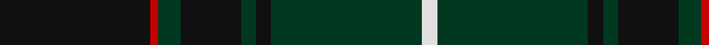

In pattern [KRGKGKGW](/patterns/krgkgkgw/).

This was sourced from tartans-authority.  It is a [8 stripes tartan](/stripes/stripes8/).

Original link http://www.tartansauthority.com/tartan-ferret/display/3978/

## Thread count
K/40 R2 DG6 K16 DG4 K4 DG40 LN/4

## Palette
Each colour and its ΔE from the base-6 reference it is a variant of.

| Colour | Shade | Base | ΔE (OKLab) |
|---|---|---|---|
| DG | <code style="background-color:#003820;">#003820</code> `#003820` | G <code style="background-color:#006100;">#006100</code> | 0.15 |
| K | <code style="background-color:#101010;">#101010</code> `#101010` | K <code style="background-color:#000000;">#000000</code> | 0.17 |
| LN | <code style="background-color:#E0E0E0;">#E0E0E0</code> `#E0E0E0` | W <code style="background-color:#F7F7F7;">#F7F7F7</code> | 0.07 |
| R | <code style="background-color:#C80000;">#C80000</code> `#C80000` | R <code style="background-color:#CC0000;">#CC0000</code> | 0.01 |

# Sample pattern

## Nearest tartans

The nearest existing variants by ΔTartan distance.

1. [Patriot, The (Fashion)](/setts/s7/k10b4k34ba2k2ba30w3~b1c0070-ba2c3c44-k101010-we0e0e0~x2/) — ΔT 0.88
1. [Pride of Scotland, Dark (Fashion)](/setts/s11/b8k2r2b2k13b2k2y1b14k26y2~b343434-k101010-ra07c58-yd0b480~x2/) — ΔT 1.13
1. [Unidentified, Toy Bear](/setts/s8/g47y2g5y2g4k15b19r2~b141e46-g003c14-k101010-rdc0000-ye8c000~x2/) — ΔT 1.30
1. [Peter of Lee](/setts/s8/r4g3k2g38b30k3b3k3~b000050-g003000-k000000-rc00000~x2/) — ΔT 1.33
1. [Pride of Scotland, Muted (Fashion)](/setts/s10/b8k2b2k14b2k2y1b19k27y2~b343434-k101010-yd0d0a8~x2/) — ΔT 1.34
1. [McGeorge (Personal)](/setts/s6/r4g3ga39g40r2y4~g002814-ga005020-rdc0000-yc89600~x2/) — ΔT 1.44
1. [Harley (Leslie), Robert](/setts/s8/g2k3y1k3g2b8g16k1~b000048-g005020-k101010-yffe600~x4/) — ΔT 1.46
1. [Cork, County (District)](/setts/s9/g28r12g4k20y2k3y2k3g7~g003820-k1c0034-r880000-ybc8c00~x2/) — ΔT 1.48
1. [Green Swamp Youth Campers](/setts/s6/k8r2k13y2g48b6~b2c2c80-g003820-k101010-rc80000-ye8c000~x2/) — ΔT 1.49
1. [Hardie](/setts/s10/g9w2g24b37r3b37g24w2g9ra4~b202044-g003820-rc80000-rab468ac-we0e0e0~x2/) — ΔT 1.51

## Neighbour map

Every grey dot is one of 15726 variants placed by the first two principal components of the ΔTartan feature space (44% of its variance). Red is this tartan; blue dots are its nearest — click one to open its page.

<svg viewBox="0 0 640 380" role="img" style="max-width:100%;height:auto;border:1px solid #e0e0e0;border-radius:4px;display:block" xmlns="http://www.w3.org/2000/svg"><image href="/nn/cloud.v1.png" width="640" height="380"/><a href="/setts/s7/k10b4k34ba2k2ba30w3~b1c0070-ba2c3c44-k101010-we0e0e0~x2/"><circle cx="386.5" cy="204.8" r="4" fill="#3465a4"><title>Patriot, The (Fashion)</title></circle></a><a href="/setts/s11/b8k2r2b2k13b2k2y1b14k26y2~b343434-k101010-ra07c58-yd0b480~x2/"><circle cx="427.9" cy="169.0" r="4" fill="#3465a4"><title>Pride of Scotland, Dark (Fashion)</title></circle></a><a href="/setts/s8/g47y2g5y2g4k15b19r2~b141e46-g003c14-k101010-rdc0000-ye8c000~x2/"><circle cx="389.7" cy="164.1" r="4" fill="#3465a4"><title>Unidentified, Toy Bear</title></circle></a><a href="/setts/s8/r4g3k2g38b30k3b3k3~b000050-g003000-k000000-rc00000~x2/"><circle cx="355.4" cy="183.5" r="4" fill="#3465a4"><title>Peter of Lee</title></circle></a><a href="/setts/s10/b8k2b2k14b2k2y1b19k27y2~b343434-k101010-yd0d0a8~x2/"><circle cx="457.3" cy="195.0" r="4" fill="#3465a4"><title>Pride of Scotland, Muted (Fashion)</title></circle></a><a href="/setts/s6/r4g3ga39g40r2y4~g002814-ga005020-rdc0000-yc89600~x2/"><circle cx="365.5" cy="202.6" r="4" fill="#3465a4"><title>McGeorge (Personal)</title></circle></a><a href="/setts/s8/g2k3y1k3g2b8g16k1~b000048-g005020-k101010-yffe600~x4/"><circle cx="343.2" cy="191.6" r="4" fill="#3465a4"><title>Harley (Leslie), Robert</title></circle></a><a href="/setts/s9/g28r12g4k20y2k3y2k3g7~g003820-k1c0034-r880000-ybc8c00~x2/"><circle cx="317.0" cy="196.9" r="4" fill="#3465a4"><title>Cork, County (District)</title></circle></a><a href="/setts/s6/k8r2k13y2g48b6~b2c2c80-g003820-k101010-rc80000-ye8c000~x2/"><circle cx="436.3" cy="183.9" r="4" fill="#3465a4"><title>Green Swamp Youth Campers</title></circle></a><a href="/setts/s10/g9w2g24b37r3b37g24w2g9ra4~b202044-g003820-rc80000-rab468ac-we0e0e0~x2/"><circle cx="351.3" cy="189.8" r="4" fill="#3465a4"><title>Hardie</title></circle></a><circle cx="390.9" cy="198.5" r="5" fill="#c00000"/></svg>

ID: /setts/s8/k20r1g3k8g2k2g20w2~g003820-k101010-rc80000-we0e0e0~x2/
