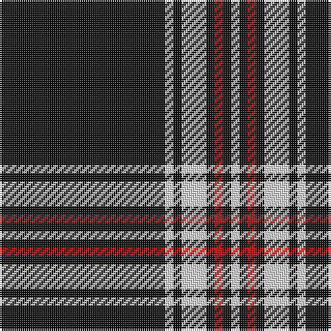

This page is one **sett** — a single exact thread-count. It belongs to the [tartan](/tartans/k20ln1k1ln3k1r1k1ln1/)
(the same proportion at any scale), whose colour order is pattern [KWKWKRKW](/stripes/kwkwkrkw/).

Sourced from tartans-authority.  It is a [8 stripe tartan](/stripes/stripes8/).

Original link http://www.tartansauthority.com/tartan-ferret/display/7931/

## Thread count
K/80 LN4 K4 LN12 K4 R4 K4 LN/4

## Palette
Each colour and the base-6 reference it is a variant of.

| Colour | Shade | Base |
|---|---|---|
| K | <code style="background-color:#101010;">#101010</code> `oklch(17.3% 0.000 89.9)` <small>#101010</small> | K <code style="background-color:#000000;">#000000</code> |
| LN | <code style="background-color:#E0E0E0;">#E0E0E0</code> `oklch(90.7% 0.000 89.9)` <small>#E0E0E0</small> | W <code style="background-color:#F7F7F7;">#F7F7F7</code> |
| R | <code style="background-color:#C80000;">#C80000</code> `oklch(52.3% 0.215 29.2)` <small>#C80000</small> | R <code style="background-color:#CC0000;">#CC0000</code> |

# Sample pattern

## Nearest tartans

The nearest existing variants by ΔTartan distance, with this tartan at the top so the swatches line up against it.

ΔTartan

Tartan

Sett

—

<a href="/ttd/edit/#slug=k20w1k1w3k1r1k1w1~x4">Volkswagen Black Trim (Fashion)</a> <a class="nn-out" href="/setts/s8/k20w1k1w3k1r1k1w1~x4/" title="open its dictionary page">↗</a>

0.98

<a href="/ttd/edit/#slug=k21r1k1ly1k1r1k3w3~x6">Black Country (District)</a> <a class="nn-out" href="/setts/s8/k21r1k1ly1k1r1k3w3~x6/" title="open its dictionary page">↗</a>

1.16

<a href="/ttd/edit/#slug=k38lo1w7lo1k4lo2k3lo2~x2">Erck, Georges van (Personal),</a> <a class="nn-out" href="/setts/s8/k38lo1w7lo1k4lo2k3lo2~x2/" title="open its dictionary page">↗</a>

1.19

<a href="/ttd/edit/#slug=k50w3k3r4w3r3w5r3k3~x2">Tweedside Variation (silk sample)</a> <a class="nn-out" href="/setts/s9/k50w3k3r4w3r3w5r3k3~x2/" title="open its dictionary page">↗</a>

1.23

<a href="/ttd/edit/#slug=k27w2k2w2k2w2k2w2k4r5~x4">Reiver Check</a> <a class="nn-out" href="/setts/s10/k27w2k2w2k2w2k2w2k4r5~x4/" title="open its dictionary page">↗</a>

1.34

<a href="/ttd/edit/#slug=k10lr2w5lr4k50b2~x2">London Fog Black</a> <a class="nn-out" href="/setts/s6/k10lr2w5lr4k50b2~x2/" title="open its dictionary page">↗</a>

1.37

<a href="/ttd/edit/#slug=k75lb6k5lb18k2lb2k3~x2">Bargain Booze</a> <a class="nn-out" href="/setts/s7/k75lb6k5lb18k2lb2k3~x2/" title="open its dictionary page">↗</a>

1.40

<a href="/ttd/edit/#slug=k2w1k2r6k6r3k28w2~x2">Brockton</a> <a class="nn-out" href="/setts/s8/k2w1k2r6k6r3k28w2~x2/" title="open its dictionary page">↗</a>

1.43

<a href="/ttd/edit/#slug=k50w4k10r2k2w2r2k14r11k2r4w2~x2">Knights Templar Dress (Corporate)</a> <a class="nn-out" href="/setts/s12/k50w4k10r2k2w2r2k14r11k2r4w2~x2/" title="open its dictionary page">↗</a>

1.44

<a href="/ttd/edit/#slug=k31w1k2w2dt3k2t4w2~x4">Capco</a> <a class="nn-out" href="/setts/s8/k31w1k2w2dt3k2t4w2~x4/" title="open its dictionary page">↗</a>

1.44

<a href="/ttd/edit/#slug=r2k1r2k14w1k1w1~x8">White Stripes Hunting</a> <a class="nn-out" href="/setts/s7/r2k1r2k14w1k1w1~x8/" title="open its dictionary page">↗</a>

## Neighbour map

Every grey dot is one of 14299 variants placed by the first two principal components of the ΔTartan feature space (44% of its variance). Red is this tartan; blue dots are its nearest — click one to open its page.

<svg viewBox="0 0 640 380" role="img" style="max-width:100%;height:auto;border:1px solid #e0e0e0;border-radius:4px;display:block" xmlns="http://www.w3.org/2000/svg"><image href="/nn/cloud.v1.png" width="640" height="380"/><a href="/setts/s8/k21r1k1ly1k1r1k3w3~x6/"><circle cx="528.7" cy="133.7" r="4" fill="#3465a4"><title>Black Country (District)</title></circle></a><a href="/setts/s8/k38lo1w7lo1k4lo2k3lo2~x2/"><circle cx="530.8" cy="120.2" r="4" fill="#3465a4"><title>Erck, Georges van (Personal),</title></circle></a><a href="/setts/s9/k50w3k3r4w3r3w5r3k3~x2/"><circle cx="458.9" cy="134.4" r="4" fill="#3465a4"><title>Tweedside Variation (silk sample)</title></circle></a><a href="/setts/s10/k27w2k2w2k2w2k2w2k4r5~x4/"><circle cx="453.0" cy="150.7" r="4" fill="#3465a4"><title>Reiver Check</title></circle></a><a href="/setts/s6/k10lr2w5lr4k50b2~x2/"><circle cx="539.5" cy="152.5" r="4" fill="#3465a4"><title>London Fog Black</title></circle></a><a href="/setts/s7/k75lb6k5lb18k2lb2k3~x2/"><circle cx="548.3" cy="148.0" r="4" fill="#3465a4"><title>Bargain Booze</title></circle></a><a href="/setts/s8/k2w1k2r6k6r3k28w2~x2/"><circle cx="521.9" cy="156.1" r="4" fill="#3465a4"><title>Brockton</title></circle></a><a href="/setts/s12/k50w4k10r2k2w2r2k14r11k2r4w2~x2/"><circle cx="487.5" cy="124.5" r="4" fill="#3465a4"><title>Knights Templar Dress (Corporate)</title></circle></a><a href="/setts/s8/k31w1k2w2dt3k2t4w2~x4/"><circle cx="484.1" cy="117.0" r="4" fill="#3465a4"><title>Capco</title></circle></a><a href="/setts/s7/r2k1r2k14w1k1w1~x8/"><circle cx="456.3" cy="167.2" r="4" fill="#3465a4"><title>White Stripes Hunting</title></circle></a><circle cx="526.3" cy="141.9" r="5" fill="#c00000"/></svg>

ID: /setts/s8/k20w1k1w3k1r1k1w1~x4/
